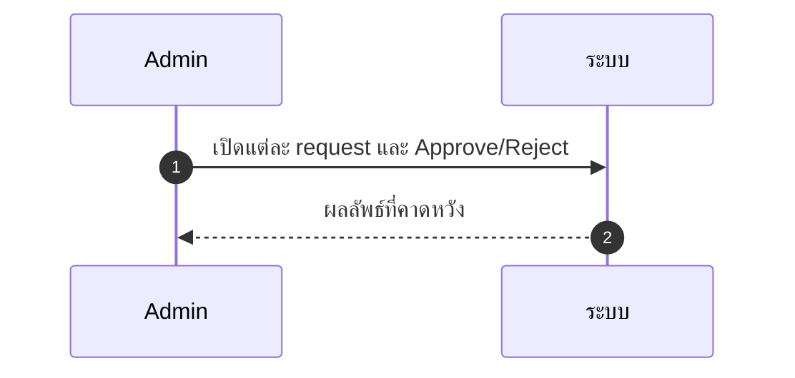
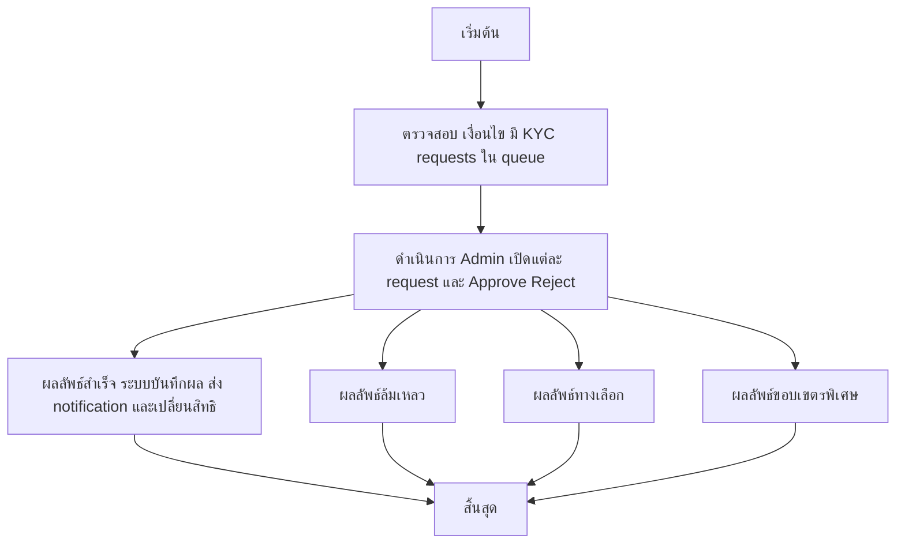

# ASYS007 - อนุมัติ/ปฏิเสธ KYC KYC Review

## 👤 บทบาท
- ผู้ดูแลระบบ

## 🎯 เป้าหมายของเคส
- ในฐานะ Admin
- ตรวจสอบเอกสาร KYC และเปลี่ยนสถานะ
- เพื่อให้ provider สามารถรับ payout ได้หรือถูกจำกัด

## ⚙️ เงื่อนไขก่อนเริ่ม (Precondition)
- มี KYC requests ใน queue

## 🧭 ผลลัพธ์และสถานการณ์
- ✅ ผลลัพธ์ที่คาดหวัง (Success Flow): ระบบบันทึกผล, ส่ง notification, เปลี่ยนสิทธิการใช้งานตามผล
- ❌ ผลลัพธ์ที่ Failure:
  - ระบบบันทึกผลลัพธ์การอนุมัติ/ปฏิเสธลงฐานข้อมูลล้มเหลว ทำให้สถานะ KYC ไม่เปลี่ยนตามการกระทำของ Admin
  - การส่ง notification ถึง provider ล้มเหลว หรือไม่ถึงปลายทางภายใน SLA
  - ไฟล์ preview หรือ checklist ไม่สามารถโหลดได้ เนื่องจากข้อมูลเอกสารเสียหายหรือหาย
  - สถานะ KYC ในระบบไม่สอดคล้องกับการกระทำของ Admin inconsistent state
- 🔄 ผลลัพธ์ทางเลือก:
  - อนุมัติแบบเงื่อนไข Approved-Conditional: เปลี่ยนสถานะเป็น Approved-Conditional และรอเอกสาร/เงื่อนไขเพิ่มเติมก่อน payout
  - ปฏิเสธพร้อมให้ provider อัปโหลดเอกสารใหม่ Rejected with Resubmission: สถานะเปลี่ยนเป็น ReSubmit และระบบแจ้งรายการเอกสารที่ต้องแก้
  - risk review pending: รอการตรวจทานเพิ่มเติมจากทีมความเสี่ยงก่อนยืนยันการ payout
- ⚠️ ผลลัพธ์ขอบเขตพิเศษ:
  - อนุมัติแบบเงื่อนไข Approved-Conditional: เปลี่ยนสถานะเป็น Approved-Conditional และรอเอกสาร/เงื่อนไขเพิ่มเติมก่อน payout
  - ปฏิเสธพร้อมให้ provider อัปโหลดเอกสารใหม่ Rejected with Resubmission: สถานะเปลี่ยนเป็น ReSubmit และระบบแจ้งรายการเอกสารที่ต้องแก้
  - risk review pending: รอการตรวจทานเพิ่มเติมจากทีมความเสี่ยงก่อนยืนยันการ payout

## ✅ เกณฑ์การยอมรับ (Acceptance Criteria)
- File preview, checklist items, notification to provider, SLA for review tracking

## ⏱ ลำดับความสำคัญ / SLA
- Priority: P0
- SLA: =48h

---

## 🔁 Sequence Diagram  
> แสดงลำดับเหตุการณ์ระหว่าง "ผู้ใช้" กับ "ระบบ"

---

## 🧭 Flowchart Diagram
> แสดงขั้นตอนการทำงานของระบบอย่างเข้าใจง่าย

