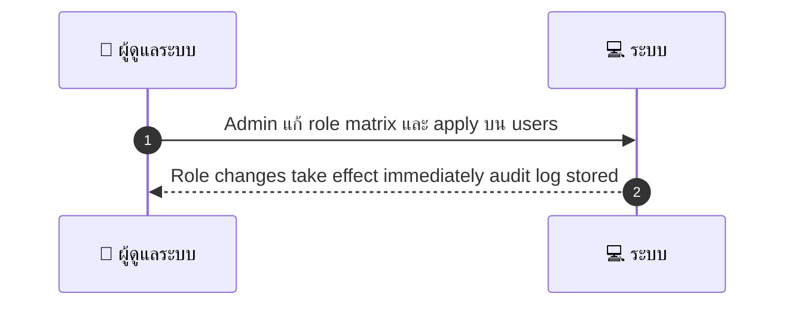
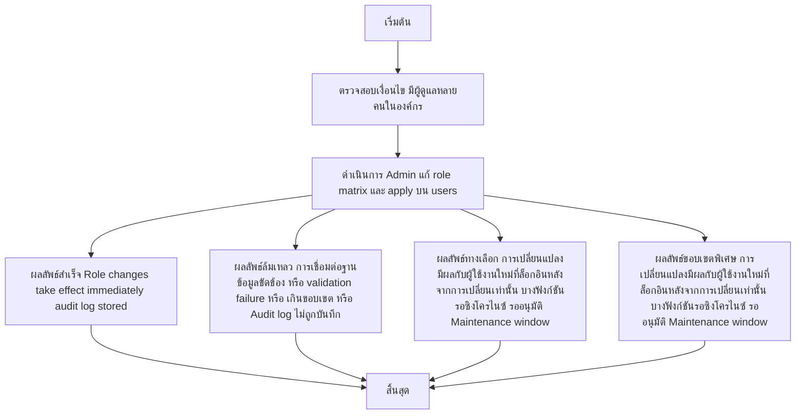

# ASYS014 - จัดการ role & permissions RBAC

## 👤 บทบาท
- ผู้ดูแลระบบ

## 🎯 เป้าหมายของเคส
- ในฐานะ Admin
- ต้องการ สร้าง แก้ไข roles และมอบสิทธิ์ให้ทีมงาน
- เพื่อ ควบคุมการเข้าถึงฟังก์ชันที่ละเอียดอ่อน

## ⚙️ เงื่อนไขก่อนเริ่ม (Precondition)
- มีผู้ดูแลหลายคนในองค์กร

## 🧭 ผลลัพธ์และสถานการณ์
- ✅ ผลลัพธ์ที่คาดหวัง (Success Flow): Role changes take effect immediately audit log stored
- ❌ ผลลัพธ์ที่ Failure:
  - การเปลี่ยนแปลง role ถูกบันทึกล้มเหลวเนื่องจากการเชื่อมต่อฐานข้อมูลขัดข้อง ทำให้การปรับสิทธิ์ไม่ถูกนำไปใช้
  - Validation failure ชื่อ role หรือสิทธิ์ที่กำหนดไม่ถูกต้อง ทำให้การบันทึกถูกปฏิเสธ
  - การมอบสิทธิ์เกินขอบเขตนโยบายองค์กร ทำให้การเปลี่ยนถูกระงับด้วยข้อความเตือนและต้องทบทวน
  - Audit log ไม่ถูกบันทึก หรือบันทึกไม่ครบถ้วน ทำให้ไม่สามารถติดตามการเปลี่ยนแปลงได้
- 🔄 ผลลัพธ์ทางเลือก:
  - การเปลี่ยนแปลงมีผลกับผู้ใช้งานใหม่ที่ล็อกอินหลังจากการเปลี่ยนเท่านั้น ผู้ใช้งานที่ใช้งานอยู่ก่อนจะยังคงเห็นสิทธิเดิมจนกว่าจะออกจากระบบ
  - บางฟังก์ชันถูกปรับเรียบร้อยแล้ว แต่ฟังก์ชันที่เหลือรอการซิงโครไนซ์ระหว่างระบบ
  - สถานะ change pending ระหว่างระบบกำกับดูแล และการแจ้งเตือนผู้ดูแลในระบบจะแสดงเป็น รออนุมัติ
  - Maintenance window changes applyได้เฉพาะเมื่อรันรอบถัดไป
- ⚠️ ผลลัพธ์ขอบเขตพิเศษ:
  - การเปลี่ยนแปลงมีผลกับผู้ใช้งานใหม่ที่ล็อกอินหลังจากการเปลี่ยนเท่านั้น ผู้ใช้งานที่ใช้งานอยู่ก่อนจะยังคงเห็นสิทธิเดิมจนกว่าจะออกจากระบบ
  - บางฟังก์ชันถูกปรับเรียบร้อยแล้ว แต่ฟังก์ชันที่เหลือรอการซิงโครไนซ์ระหว่างระบบ
  - สถานะ change pending ระหว่างระบบกำกับดูแล และการแจ้งเตือนผู้ดูแลในระบบจะแสดงเป็น รออนุมัติ
  - Maintenance window changes applyได้เฉพาะเมื่อรันรอบถัดไป

## ✅ เกณฑ์การยอมรับ (Acceptance Criteria)
- ตารางบทบาทสามารถแก้ไขได้
- มาตรการป้องกันการยกระดับสิทธิ์

## ⏱ ลำดับความสำคัญ / SLA
- Priority: P0
- SLA: change immediate

---

## 🔁 Sequence Diagram  
> แสดงลำดับเหตุการณ์ระหว่าง "ผู้ดูแลระบบ" กับ "ระบบ"

---

## 🧭 Flowchart Diagram
> แสดงขั้นตอนการทำงานของระบบอย่างเข้าใจง่าย

