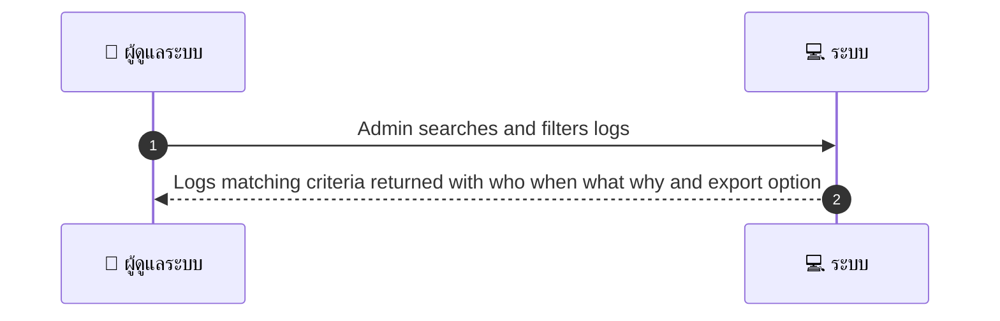
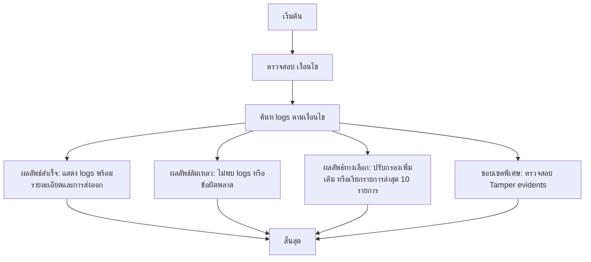

# ASYS015 - ดู audit logs แบบรวม Audit Log Viewer

## 👤 บทบาท
- ผู้ดูแลระบบ

## 🎯 เป้าหมายของเคส
- ในฐานะ Admin
- ต้องการ เข้าถึง logs ของ actions สำคัญ refund payout KYC เพื่อการตรวจสอบ
- เพื่อ เพื่อรองรับ PDPA และการสืบสวน

## ⚙️ เงื่อนไขก่อนเริ่ม (Precondition)
- Actions ถูกบันทึกใน audit system

## 🧭 ผลลัพธ์และสถานการณ์
- ✅ ผลลัพธ์ที่คาดหวัง (Success Flow): ระบบแสดง logs ที่ไม่สามารถดัดแปลงได้ พร้อมระบุผู้ใช้งาน เวลา เหตุผล และมีตัวเลือกการส่งออก
- ❌ ผลลัพธ์ที่ Failure:
  - ไม่พบ logs ตามเงื่อนไขการค้นหา
  - เกิดข้อผิดพลาดในการดึงข้อมูล logs จากระบบ audit
  - การส่งออกไฟล์ logs ล้มเหลว เนื่องจากปัญหาเครือข่ายหรือสิทธิ์เข้าถึง
  - สิทธิ์เข้าถึงถูกปฏิเสธเมื่อ Admin พยายามดู logs
  - Tamper evidend mechanism ตรวจพบการดัดแปรข้อมูล ทำให้ไม่สามารถยืนยันความถูกต้องของ logs
- 🔄 ผลลัพธ์ทางเลือก:
  - แสดงผลเป็นสรุปสถิติ (count ของแต่ละ action: refund payout KYC) พร้อมกรองขั้นสูง
  - แสดงรายการล่าสุด 10 รายการ พร้อมปุ่มดูรายละเอียด
  - รองรับการส่งออกในหลายรูปแบบ (CSV/JSON/XML) ตามความต้องการผู้ใช้งาน
  - แจ้งเตือนเมื่อไม่มีข้อมูลสำหรับเงื่อนไขที่เลือก และเสนอตัวกรองเพิ่มเติม
- ⚠️ ผลลัพธ์ขอบเขตพิเศษ:
  - แสดงผลเป็นสรุปสถิติ (count ของแต่ละ action: refund payout KYC) พร้อมกรองขั้นสูง
  - แสดงรายการล่าสุด 10 รายการ พร้อมปุ่มดูรายละเอียด
  - รองรับการส่งออกในหลายรูปแบบ (CSV/JSON/XML) ตามความต้องการผู้ใช้งาน
  - แจ้งเตือนเมื่อไม่มีข้อมูลสำหรับเงื่อนไขที่เลือก และเสนอตัวกรองเพิ่มเติม
  - แสดงข้อมูลแบบ pagination และให้ผู้ใช้เลือกแสดงรายการต่อหน้า

## ✅ เกณฑ์การยอมรับ (Acceptance Criteria)
- Tamper evident logs
- retention policy applied
- search & filters

## ⏱ ลำดับความสำคัญ / SLA
- Priority: P0
- SLA: under 5 seconds for search response

---

## 🔁 Sequence Diagram  
> แสดงลำดับเหตุการณ์ระหว่าง "ผู้ใช้" กับ "ระบบ"

---

## 🧭 Flowchart Diagram
> แสดงขั้นตอนการทำงานของระบบอย่างเข้าใจง่าย

