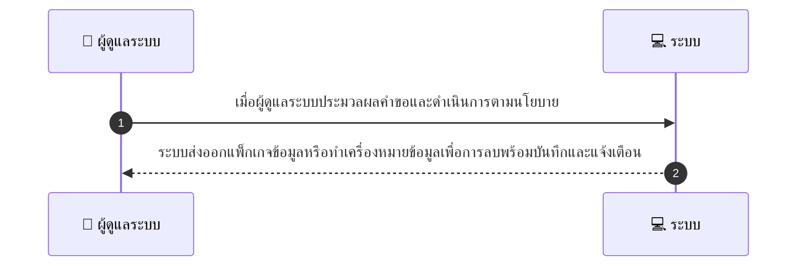
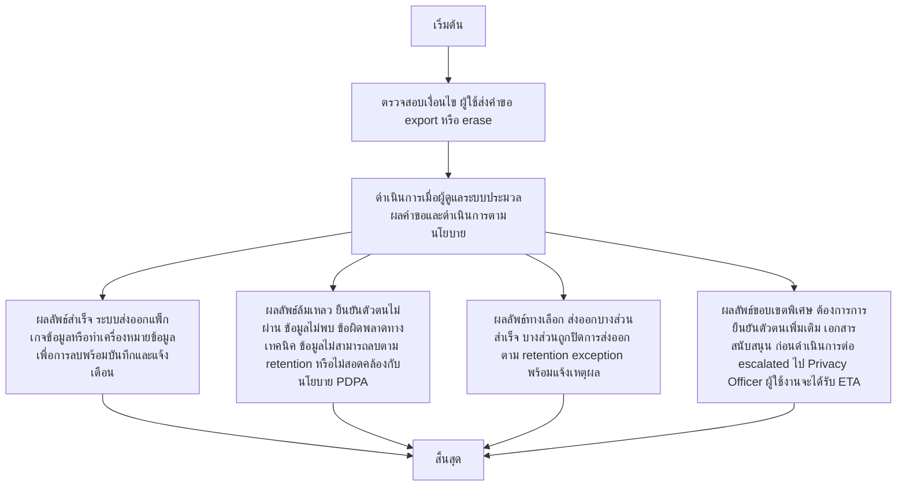

# ASYS016 - จัดการ PDPA / Data Subject Requests

## 👤 บทบาท
- ผู้ดูแลระบบ

## 🎯 เป้าหมายของเคส
- ในฐานะ Admin/Privacy Officer
- ต้องการ ดำเนินการ data export และ deletion requests ตาม PDPA
- เพื่อ ปฏิบัติตามกฎหมายคุ้มครองข้อมูลส่วนบุคคล

## ⚙️ เงื่อนไขก่อนเริ่ม (Precondition)
- User ส่งคำขอ export หรือ erase

## 🧭 ผลลัพธ์และสถานการณ์
- ✅ ผลลัพธ์ที่คาดหวัง (Success Flow): ระบบส่งออกแพ็กเกจข้อมูลหรือทำเครื่องหมายข้อมูลเพื่อการลบ พร้อมบันทึกและแจ้งเตือน
- ❌ ผลลัพธ์ที่ Failure:
  - ยืนยันตัวตนผู้ขอไม่ผ่านหรือไม่สมบูรณ์
  - ไม่พบข้อมูลที่ตรงกับคำขอ export erase ในระบบ
  - เกิดข้อผิดพลาดทางเทคนิคระหว่างการประมวลผล export หรือการทำหมายลบ ทำให้คำขอไม่สำเร็จ
  - ข้อมูลอยู่ในระยะ retention ที่ห้ามลบ/ส่งออกตามกฎหมายหรือ policy
  - คำขอไม่สอดคล้องกับนโยบาย PDPA หรือการอนุมัติที่จำเป็นยังไม่ครบถ้วน
- 🔄 ผลลัพธ์ทางเลือก:
  - การส่งออกข้อมูลบางส่วนสำเร็จและข้อมูลบางส่วนถูกปิดการ export ตาม retention exception พร้อมแจ้งเหตุผล
  - การลบข้อมูลบางส่วนเสร็จ แต่ข้อมูลบางรายการยังคงถูก Retained เนื่องจาก legal hold ต้องรอการยกเลิก retention
  - ต้องการการยืนยันตัวตนเพิ่มเติม เอกสารสนับสนุน ก่อนดำเนินการต่อ escalated ไป Privacy Officer
  - คำขอที่มีข้อมูลอยู่หลายระบบหรือกระจายอยู่ในหลายพื้นที่ ต้องทำการรีวิวด้วยมือและแจ้ง ETA ให้ผู้ใช้ทราบ
- ⚠️ ผลลัพธ์ขอบเขตพิเศษ:
  - การส่งออกข้อมูลบางส่วนสำเร็จและข้อมูลบางส่วนถูกปิดการ export ตาม retention exception พร้อมแจ้งเหตุผล
  - การลบข้อมูลบางส่วนเสร็จ แต่ข้อมูลบางรายการยังคงถูก Retained เนื่องจาก legal hold ต้องรอการยกเลิก retention
  - ต้องการการยืนยันตัวตนเพิ่มเติม เอกสารสนับสนุน ก่อนดำเนินการต่อ escalated ไป Privacy Officer
  - คำขอที่มีข้อมูลอยู่หลายระบบหรือกระจายอยู่ในหลายพื้นที่ ต้องทำการรีวิวด้วยมือและแจ้ง ETA ให้ผู้ใช้ทราบ

- ✅ เกณฑ์การยอมรับ (Acceptance Criteria)
  - Consent records validated
  - retention exceptions handled
  - deletion audit

- ⏱ ลำดับความสำคัญ / SLA
  - Priority: P0
  - SLA:
    - acknowledge <=48h
    - complete per policy configurable

---

## 🔁 Sequence Diagram  
> แสดงลำดับเหตุการณ์ระหว่าง "ผู้ดูแลระบบ" กับ "ระบบ"

---

## 🧭 Flowchart Diagram
> แสดงขั้นตอนการทำงานของระบบอย่างเข้าใจง่าย

