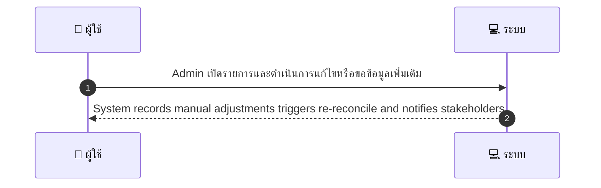
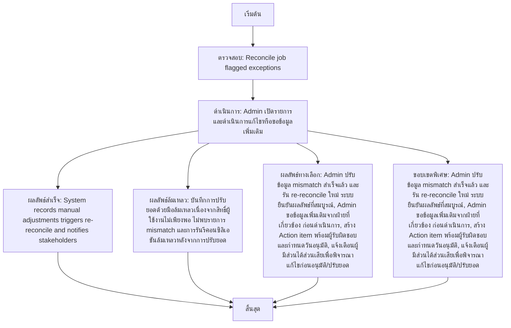

# ASYS029 - จัดการ reconciliation exceptions Exception Handling

## 👤 บทบาท
- ผู้ดูแลระบบ

## 🎯 เป้าหมายของเคส
- ในฐานะ
- ต้องการ
- เพื่อ

## ⚙️ เงื่อนไขก่อนเริ่ม (Precondition)
- Reconcile job flagged exceptions

## 🧭 ผลลัพธ์และสถานการณ์
- ✅ ผลลัพธ์ที่คาดหวัง (Success Flow): System records manual adjustments, triggers re-reconcile, and notifies stakeholders
- ❌ ผลลัพธ์ที่ Failure:  
  - บันทึกการปรับยอดด้วยมือล้มเหลว เนื่องจากสิทธิ์ผู้ใช้งานไม่เพียงพอ
  - ไม่สามารถสร้างหรือบันทึก action item ได้ เนื่องจากระบบแจ้งเตือนล้มเหลว
  - ไม่พบรายการ mismatch ที่ระบุใน reconciliation queue ทำให้ไม่สามารถดำเนินการปรับยอดได้
  - การรันรีคอนซิลิเอชัน ล้มเหลวหลังจากการปรับยอด
- 🔄 ผลลัพธ์ทางเลือก:  
  - Admin ปรับข้อมูล mismatch สำเร็จแล้ว และรัน re-reconcile ใหม่ ระบบยืนยันผลลัพธ์ที่สมบูรณ์
  - Admin ขอข้อมูลเพิ่มเติมจากฝ่ายที่เกี่ยวข้อง ก่อนดำเนินการ
  - สร้าง Action item พร้อมผู้รับผิดชอบและกำหนดวันอนุมัติ
  - แจ้งเตือนผู้มีส่วนได้ส่วนเสียเพื่อพิจารณาแก้ไขก่อนอนุมัติ/ปรับยอด
- ⚠️ ผลลัพธ์ขอบเขตพิเศษ:  
  - Admin ปรับข้อมูล mismatch สำเร็จแล้ว และรัน re-reconcile ใหม่ ระบบยืนยันผลลัพธ์ที่สมบูรณ์
  - Admin ขอข้อมูลเพิ่มเติมจากฝ่ายที่เกี่ยวข้อง ก่อนดำเนินการ
  - สร้าง Action item พร้อมผู้รับผิดชอบและกำหนดวันอนุมัติ
  - แจ้งเตือนผู้มีส่วนได้ส่วนเสียเพื่อพิจารณาแก้ไขก่อนอนุมัติ/ปรับยอด

## ✅ เกณฑ์การยอมรับ (Acceptance Criteria)
- Adjustment requires approval
- logs kept

## ⏱ ลำดับความสำคัญ / SLA
- Priority: P0
- SLA: - exception review =2 business days

---

## 🔁 Sequence Diagram  
> แสดงลำดับเหตุการณ์ระหว่าง "ผู้ใช้" กับ "ระบบ"

---

## 🧭 Flowchart Diagram
> แสดงขั้นตอนการทำงานของระบบอย่างเข้าใจง่าย

