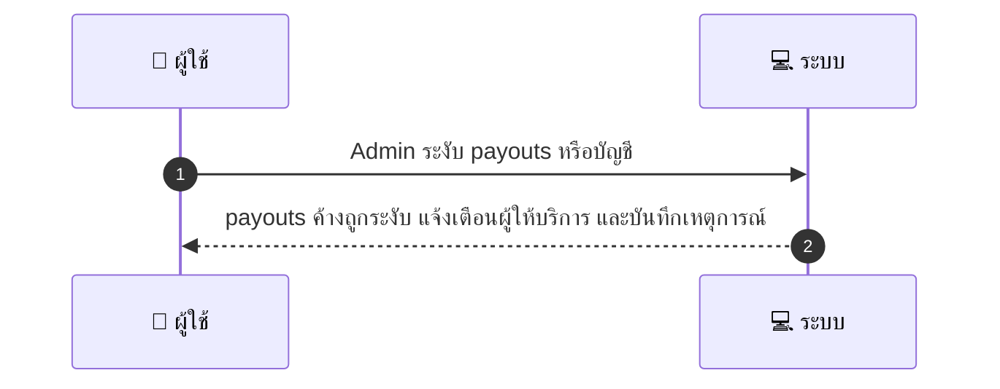
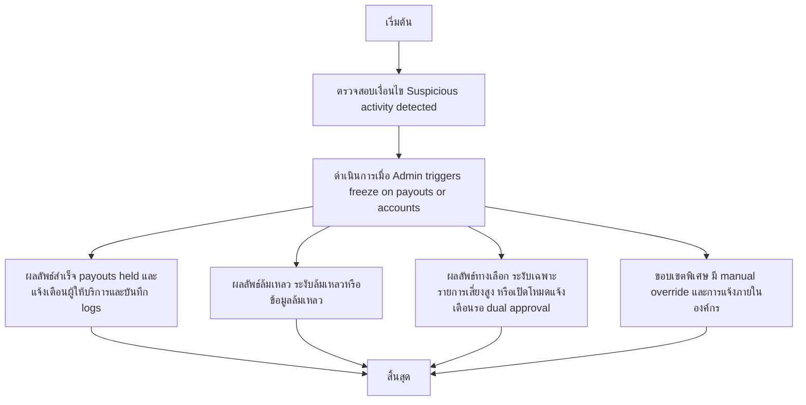

# ASYS035 - จัดการ emergency freeze / disabling payouts

## 👤 บทบาท
- ผู้ดูแลระบบ

## 🎯 เป้าหมายของเคส
- ในฐานะ Admin/Finance
- ต้องการ ระงับ payouts ชั่วคราวสำหรับบัญชี/ระบบกรณีพบความเสี่ยง
- เพื่อ ป้องกันการสูญเสียเงินเพิ่มเติม

## ⚙️ เงื่อนไขก่อนเริ่ม (Precondition)
- Suspicious activity detected

## 🧭 ผลลัพธ์และสถานการณ์
- ✅ ผลลัพธ์ที่คาดหวัง (Success Flow): payouts ค้างทั้งหมดถูกระงับ แจ้งเตือนผู้ให้บริการที่ได้รับผลกระทบ บันทึกเหตุการณ์
- ❌ ผลลัพธ์ที่ Failure:
  - ระงับ payouts ล้มเหลวเนื่องจากข้อผิดพลาดระบบ ฐานข้อมูลไม่สามารถปรับสถานะการระงับได้
  - ไม่สามารถผ่านกระบวนการ dual approval ภายในเวลาสำหรับกรณีที่ต้องการการระงับฉุกเฉิน
  - การแจ้งเตือนผู้ให้บริการล้มเหลว ส่งผลให้ผู้รับผลกระทบไม่ทราบสถานะ
  - บันทึก logs audit trail ล้มเหลว หรือไม่สมบูรณ์
  - รายการ payouts ที่รออยู่ถูกระงับไม่ครบถ้วนหรือถูกปลดระงับโดยไม่ตั้งใจ
- 🔄 ผลลัพธ์ทางเลือก:
  - ระงับเฉพาะบัญชีระบบที่มีความเสี่ยงสูงเท่านั้น โดยไม่กระทบบัญชีที่ไม่เสี่ยง
  - ระงับ payouts แล้วเปิดโหมดแจ้งเตือนและรอการอนุมัติ dual-approval ก่อนดำเนินการถัดไป
  - ระงับเฉพาะรายการ payout ในคิวรอการประมวลผลและอนุญาตให้รายการที่กำลังดำเนินการอยู่ดำเนินการต่อ
  - มี manual override หลังการประเมินความเสี่ยง โดย admin สามารถยืนยันการยกเลิกระงับกรณีพิเศษ
  - ส่งการแจ้งเตือนภายในองค์กรและออกเอกสารเหตุผลพร้อมทั้งบันทึกใน log
- ⚠️ ผลลัพธ์ขอบเขตพิเศษ:
  - ระงับเฉพาะบัญชีระบบที่มีความเสี่ยงสูงเท่านั้น โดยไม่กระทบบัญชีที่ไม่เสี่ยง
  - ระงับ payouts แล้วเปิดโหมดแจ้งเตือนและรอการอนุมัติ dual-approval ก่อนดำเนินการถัดไป
  - ระงับเฉพาะรายการ payout ในคิวรอการประมวลผลและอนุญาตให้รายการที่กำลังดำเนินการอยู่ดำเนินการต่อ
  - มี manual override หลังการประเมินความเสี่ยง โดย admin สามารถยืนยันการยกเลิกระงับกรณีพิเศษ
  - ส่งการแจ้งเตือนภายในองค์กรและออกเอกสารเหตุผลพร้อมทั้งบันทึกใน log

## ✅ เกณฑ์การยอมรับ (Acceptance Criteria)
- การระงับการดำเนินการต้องมีการอนุมัติร่วมสองฝ่ายสำหรับกรณีที่มีความเสี่ยง

## ⏱ ลำดับความสำคัญ / SLA
- Priority: P0
- SLA: freeze immediate

---

## 🔁 Sequence Diagram  
> แสดงลำดับเหตุการณ์ระหว่าง ผู้ใช้ กับ ระบบ

---

## 🧭 Flowchart Diagram
> แสดงขั้นตอนการทำงานของระบบอย่างเข้าใจง่าย

