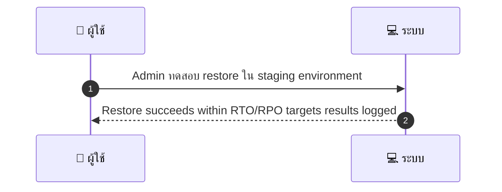
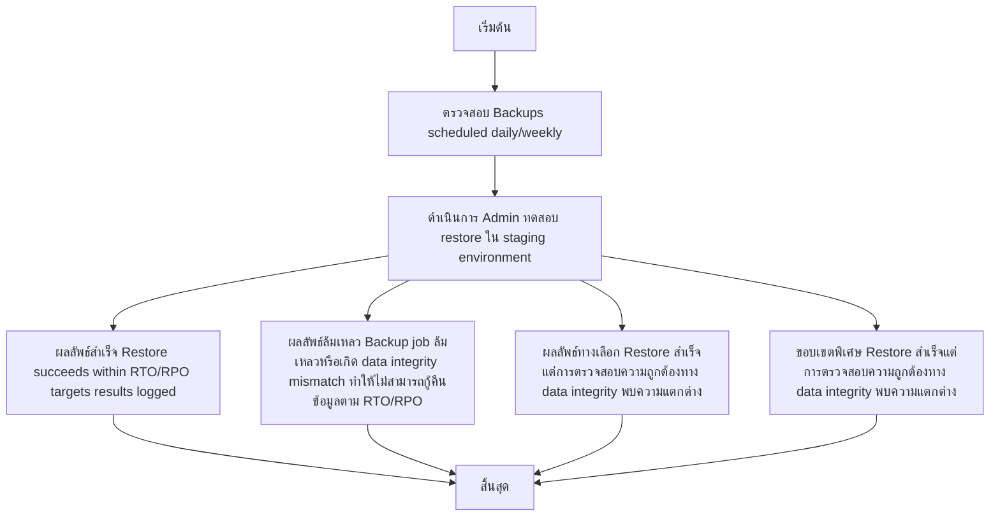

# ASYS044 - จัดการ backups และ restore tests

## 👤 บทบาท
- ผู้ดูแลระบบ

## 🎯 เป้าหมายของเคส
- ในฐานะ
  - Admin/DevOps
- ต้องการ
  - ตรวจสอบ backup schedule และทดสอบการกู้คืนข้อมูลเป็นระยะ
- เพื่อ
  - เพื่อให้มั่นใจว่า recovery สำเร็จเมื่อเกิดปัญหา

## ⚙️ เงื่อนไขก่อนเริ่ม (Precondition)
- Backups scheduled daily/weekly

## 🧭 ผลลัพธ์และสถานการณ์
- ✅ ผลลัพธ์ที่คาดหวัง (Success Flow): Restore succeeds within RTO/RPO targets results logged
- ❌ ผลลัพธ์ที่ Failure:
  - Backup job ล้มเหลวหรือเกิด data integrity mismatch ทำให้ไม่สามารถกู้คืนข้อมูลตาม RTO/RPO
  - Restore ล้มเหลวในขั้นตอนการกู้คืน เนื่องจาก backup chunk หรือ metadata เสียหาย
  - RTO ไม่ถึง เนื่องจากขั้นตอนกู้คืนใช้เวลานานเกินกว่ากำหนด
  - RPO ถูกละเมิด เนื้อหาที่คืนมาสูงกว่าเวอร์ชันล่าสุดที่จำเป็น
  - ข้อมูลที่คืนมาสำเร็จแต่ไม่ครบถ้วนหรือไม่มีความสมบูรณ์เมื่อเทียบกับฐานข้อมูลต้นทาง
- 🔄 ผลลัพธ์ทางเลือก:
  - Restore สำเร็จแต่การตรวจสอบความถูกต้องทาง data integrity (checksum, row counts) พบความแตกต่าง
  - Partial restore บางตารางหรือข้อมูลสำคัญยังไม่ถูกรื้อคืน
  - Restore สำเร็จใน staging แต่แอปพลิเคชันไม่พร้อมใช้งานเนื่องจาก dependency หรือ service ในระบบปลายทาง
  - Automated test ผ่านแต่ QA manual verification ไม่ผ่าน
  - Automated test scheduled but execution skipped due to maintenance window
- ⚠️ ผลลัพธ์ขอบเขตพิเศษ:
  - Restore สำเร็จแต่การตรวจสอบความถูกต้องทาง data integrity (checksum, row counts) พบความแตกต่าง
  - Partial restore บางตารางหรือข้อมูลสำคัญยังไม่ถูกรื้อคืน
  - Restore สำเร็จใน staging แต่แอปพลิเคชันไม่พร้อมใช้งานเนื่องจาก dependency หรือ service ในระบบปลายทาง
  - Automated test ผ่านแต่ QA manual verification ไม่ผ่าน
  - Automated test scheduled but execution skipped due to maintenance window

## ✅ เกณฑ์การยอมรับ (Acceptance Criteria)
- Automated test reports
- restore drills periodically

## ⏱ ลำดับความสำคัญ / SLA
- Priority: P0
- SLA:
  - backup health daily
  - test restore quarterly

---

## 🔁 Sequence Diagram  
> แสดงลำดับเหตุการณ์ระหว่าง "ผู้ใช้" กับ "ระบบ"

---

## 🧭 Flowchart Diagram
> แสดงขั้นตอนการทำงานของระบบอย่างเข้าใจง่าย

