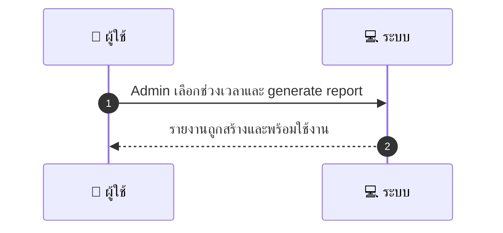
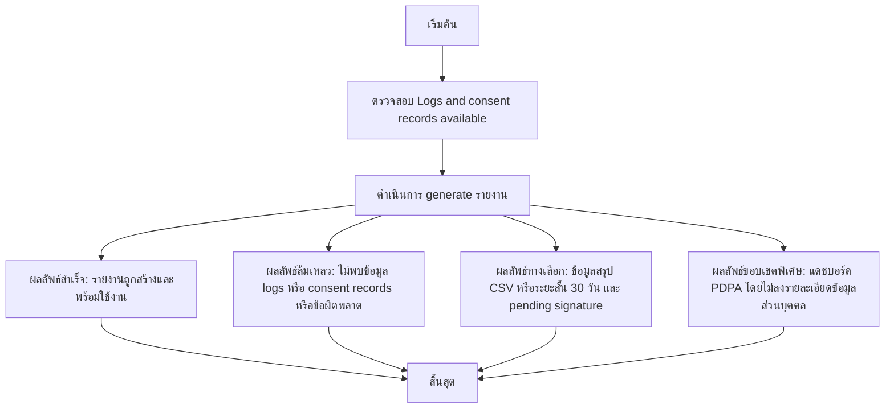

# ASYS053 - จัดทำรายงาน compliance PDPA/Audit แบบสรุป

## 👤 บทบาท
- ผู้ดูแลระบบ

## 🎯 เป้าหมายของเคส
- ในฐานะ Admin/Compliance
- ต้องการ สร้างรายงานสรุปการปฏิบัติตาม PDPA และกิจกรรม audit
- เพื่อ เพื่อยืนยัน compliance ต่อผู้ตรวจสอบภายนอก

## ⚙️ เงื่อนไขก่อนเริ่ม (Precondition)
- Logs and consent records available

## 🧭 ผลลัพธ์และสถานการณ์
- ✅ ผลลัพธ์ที่คาดหวัง (Success Flow): Report includes consent records, data requests, breaches, retention exceptions
- ❌ ผลลัพธ์ที่ Failure:
  - ไม่พบข้อมูล logs หรือ consent records ตามช่วงเวลาที่เลือก
  - เกิดข้อผิดพลาดในการดึงข้อมูลจากฐานข้อมูลหรือบริการที่เกี่ยวข้อง
  - ไม่สามารถสร้างไฟล์รายงาน PDF/Excel ได้
  - การยืนยันลายเซ็นรับรองรายงานล้มเหลวหรือมีลายเซ็นไม่ถูกต้อง
  - ผู้ใช้ไม่มีสิทธิ์ในการเรียกใช้งุณ Generate Report หรือสิทธิ์ถูกจำกัด
  - เกิดข้อผิดพลาดระหว่างการบรรจุหลักฐานลงในรายงานหรือการบูรณาการข้อมูล
- 🔄 ผลลัพธ์ทางเลือก:
  - รายงานถูกสร้างในรูปแบบสรุป high level พร้อมข้อมูลหลักแต่ไม่ลงรายละเอียดทั้งหมด
  - ส่งออกเป็น CSV แทน PDF เพื่อการตรวจสอบอย่างรวดเร็ว
  - ช่วงเวลาที่เลือกถูกปรับเป็นระยะสั้นล่าสุด เช่น 30 วันแล้วสร้างรายงาน
  - รายงานเสร็จสมบูรณ์แต่ยังอยู่ในสถานะรอการลงลายมือชื่อรับรอง pending signature
  - รวมข้อมูล PDPA compliance ในรูปแบบแดชบอร์ดสรุป โดยไม่ลงรายละเอียดข้อมูลส่วนบุคคล
- ⚠️ ผลลัพธ์ขอบเขตพิเศษ:
  - รายงานถูกสร้างในรูปแบบสรุป high level พร้อมข้อมูลหลักแต่ไม่ลงรายละเอียดทั้งหมด
  - ส่งออกเป็น CSV แทน PDF เพื่อการตรวจสอบอย่างรวดเร็ว
  - ช่วงเวลาที่เลือกถูกปรับเป็นระยะสั้นล่าสุด เช่น 30 วันแล้วสร้างรายงาน
  - รายงานเสร็จสมบูรณ์แต่ยังอยู่ในสถานะรอการลงลายมือชื่อรับรอง pending signature
  - รวมข้อมูล PDPA compliance ในรูปแบบแดชบอร์ดสรุป โดยไม่ลงรายละเอียดข้อมูลส่วนบุคคล

## ✅ เกณฑ์การยอมรับ (Acceptance Criteria)
- Exportable and signed report
- includes supporting evidence

## ⏱ ลำดับความสำคัญ / SLA
- Priority: P0
- SLA: generate 60s typical

---

## 🔁 Sequence Diagram  
> แสดงลำดับเหตุการณ์ระหว่าง "ผู้ใช้" กับ "ระบบ"

---

## 🧭 Flowchart Diagram
> แสดงขั้นตอนการทำงานของระบบอย่างเข้าใจง่าย

