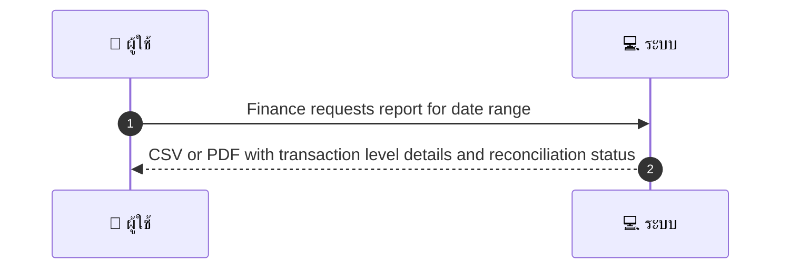
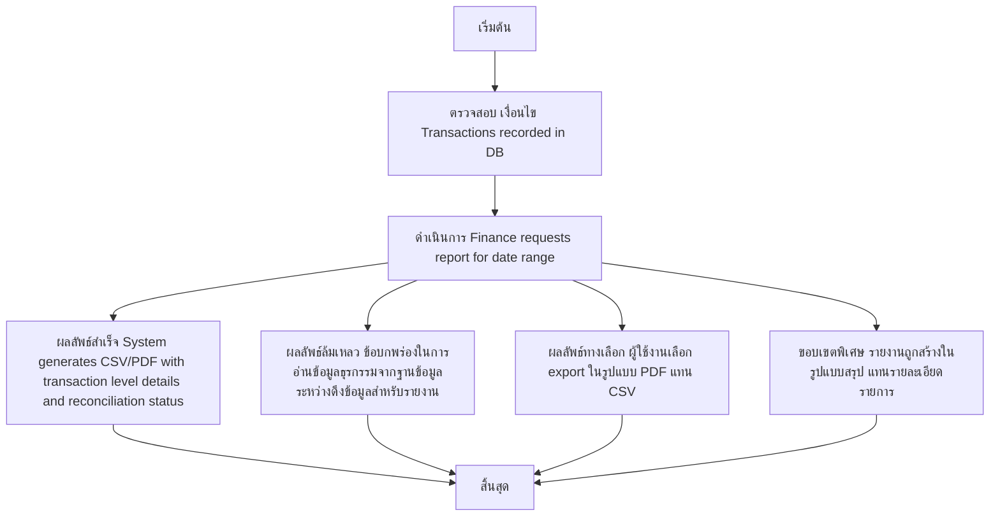

# ASYS001 - Finance Reporting Admin/Finance

## 👤 บทบาท
- ทีมการเงิน/ผู้ดูแลระบบ

## 🎯 เป้าหมายของเคส
- ในฐานะ ทีมการเงิน/ผู้ดูแลระบบ
- ต้องการ สร้างรายงาน GMV, fees, pending payouts สำหรับ reconciliation กับ Xendit
- เพื่อ เพื่อตรวจสอบยอดและกระทบบัญชี

## ⚙️ เงื่อนไขก่อนเริ่ม (Precondition)
- Transactions recorded in DB

## 🧭 ผลลัพธ์และสถานการณ์
- ✅ ผลลัพธ์ที่คาดหวัง (Success Flow): System generates CSV/PDF with transaction level details and reconciliation status
- ❌ ผลลัพธ์ที่ Failure:  
  - ข้อผิดพลาดในการอ่านข้อมูลธุรกรรมจากฐานข้อมูลระหว่างดึงข้อมูลสำหรับรายงาน
  - การสร้างไฟล์ CSV/PDF ล้มเหลว เนื่องจากสิทธิ์ในการเขียนไฟล์หรือพื้นที่ดิสก์เต็ม
  - ข้อมูลรายการธนาคารบางรายการไม่ครบถ้วน เช่น booking_id หรือ payout_status ว่าง ทำให้สรุปไม่ถูกต้อง
  - ผู้ใช้งานไม่มีสิทธิ์เข้าถึงรายงาน Authentication/Authorization error
  - ไม่มีข้อมูลธุรกรรมสำหรับช่วงวันที่ที่ระบุ
- 🔄 ผลลัพธ์ทางเลือก:  
  - ผู้ใช้งานเลือก export ในรูปแบบ PDF แทน CSV
  - Reports ถูกสร้างเป็น background job สำหรับช่วงข้อมูลใหญ่ พร้อมแจ้งเตือนเมื่อเสร็จ
  - ไฟล์ส่งออกถูกส่งผ่านอีเมลไปยังผู้ดูแลระบบ/ผู้ร้องขอ
  - รายงานถูกสร้างในรูปแบบสรุป แทนรายละเอียดรายการ
- ⚠️ ผลลัพธ์ขอบเขตพิเศษ:  
  - ผู้ใช้งานเลือก export ในรูปแบบ PDF แทน CSV
  - Reports ถูกสร้างเป็น background job สำหรับช่วงข้อมูลใหญ่ พร้อมแจ้งเตือนเมื่อเสร็จ
  - ไฟล์ส่งออกถูกส่งผ่านอีเมลไปยังผู้ดูแลระบบ/ผู้ร้องขอ
  - รายงานถูกสร้างในรูปแบบสรุป แทนรายละเอียดรายการ

## ✅ เกณฑ์การยอมรับ (Acceptance Criteria)
- Reports include booking_id, payment_id, gross, fees, net, payout_status, timestamps
- export time 60s for typical ranges or background job for large exports

## ⏱ ลำดับความสำคัญ / SLA
- Priority: P1
- SLA:
  - Export 60s (typical)
  - background job for large ranges

---

## 🔁 Sequence Diagram  
> แสดงลำดับเหตุการณ์ระหว่าง "ผู้ใช้" กับ "ระบบ"

---

## 🧭 Flowchart Diagram
> แสดงขั้นตอนการทำงานของระบบอย่างเข้าใจง่าย

