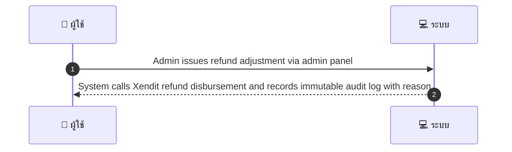
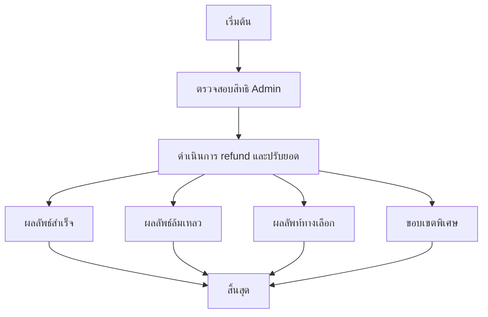

# ASYS003 - Admin Manual Refund / Adjustment

## 👤 บทบาท
- ผู้ดูแลระบบ

## 🎯 เป้าหมายของเคส
- ในฐานะ Admin
- ต้องการ ทำ manual refund adjustment เพื่อจัดการ dispute cases
- เพื่อ แก้ปัญหาและคืนเงินตามดุลยพินิจ

## ⚙️ เงื่อนไขก่อนเริ่ม (Precondition)
- กรณี dispute หรือกรณีพิเศษต้องการการดำเนินการด้วยตนเอง

## 🧭 ผลลัพธ์และสถานการณ์
- ✅ ผลลัพธ์ที่คาดหวัง: System calls Xendit refund disbursement and records immutable audit log with reason
- ❌ ผลลัพธ์ที่ล้มเหลว:
  - การเรียกใช้งาน Xendit refund disbursement ล้มเหลว เนื่องจากรหัสข้อผิดพลาดจากระบบ Xendit หรือการตอบกลับไม่สมบูรณ์
  - Admin ไม่มีสิทธิ์หรือไม่ผ่านการตรวจสอบ role permission สำหรับการทำ manual refund adjustment
  - ข้อมูลเหตุผล reason หรือ Reference ไม่ครบถ้วน หรือไม่สามารถบันทึก immutable audit log ได้
  - เกิดข้อผิดพลาดระบบภายใน Internal Server Error ระหว่างกระบวนการ refund adjustment
  - ไม่สามารถบันทึกเหตุผล Reference และ Log ได้ตามข้อกำหนดภายใน SLA
  - การดำเนินการล่าช้านอก SLA เกิน 3 วันทำการ
- 🔄 ผลลัพธ์ทางเลือก:
  - การ Refund Adjustment สำเร็จ แต่ส่งเงินไปยังวิธีจ่ายอื่น Disbursement หรือบัญชีผู้รับต่างจากที่คาดหมาย
  - การคืนเงินบางส่วน Partial refund หากยอดที่เรียกคืนไม่สอดคล้อง
  - อนุมัติปรับเปลี่ยนโดยอัตโนมัติเมื่อพบข้อมูลที่ตรงกับนโยบาย โดยมีการแจ้งเตือน
  - Admin สามารถยกเลิกการดำเนินการหากพบข้อมูลซ้ำหรือข้อผิดพลาดในขั้นตอนก่อนหน้า
  - การอัปเดต Reference เพิ่มเติมหลังจากดำเนินการ โดยไม่ส่งผลกระทบต่อยอดเงิน
- ⚠️ ผลลัพธ์ขอบเขตพิเศษ:
  - กรณี Refund/Adjustment สำเร็จ แต่ส่งเงินไปยังDisbursement หรือบัญชีผู้รับต่างจากที่คาดหมาย
  - การคืนเงินบางส่วน Partial refund หากยอดที่เรียกคืนไม่สอดคล้อง
  - อนุมัติ/ปรับเปลี่ยนโดยอัตโนมัติเมื่อพบข้อมูลที่ตรงกับนโยบาย โดยมีการแจ้งเตือน
  - Admin สามารถยกเลิกการดำเนินการหากพบข้อมูลซ้ำหรือข้อผิดพลาดในขั้นตอนก่อนหน้า
  - การอัปเดต Reference เพิ่มเติมหลังจากดำเนินการ โดยไม่ส่งผลกระทบต่อยอดเงิน

## ✅ เกณฑ์การยอมรับ (Acceptance Criteria)
- Admin actions require role/permission
- 2FA recommended for sensitive ops
- reason & reference stored
- actioned within SLA

## ⏱ ลำดับความสำคัญ / SLA
- Priority: P1
- SLA: Admin action within 3 business days

---

## 🔁 Sequence Diagram  
> แสดงลำดับเหตุการณ์ระหว่าง "ผู้ใช้" กับ "ระบบ"

---

## 🧭 Flowchart Diagram
> แสดงขั้นตอนการทำงานของระบบอย่างเข้าใจง่าย

