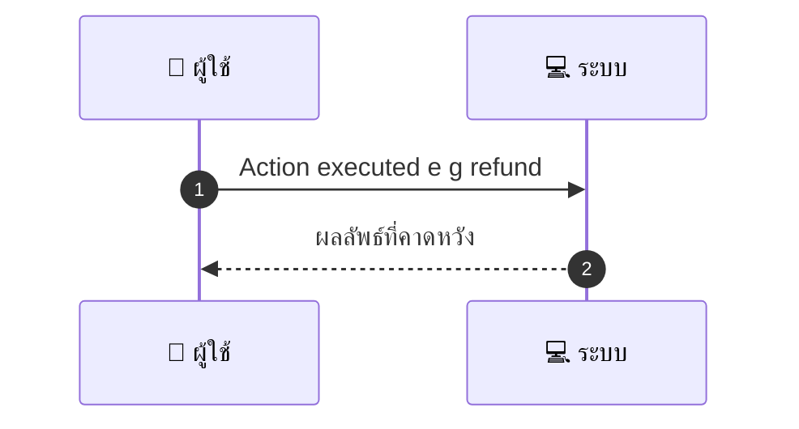
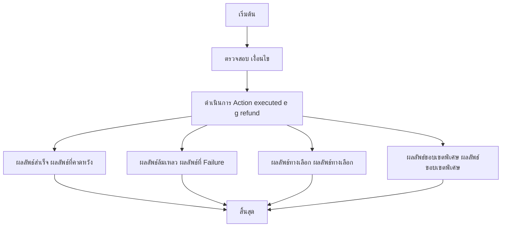

# ASYS004 - Audit Logs & PDPA Consent

## 👤 บทบาท
- ผู้ดูแลระบบ/ผู้ปฏิบัติการ

## 🎯 เป้าหมายของเคส
- ในฐานะ ผู้ดูแลระบบ/ผู้ปฏิบัติการ
- ต้องการ มี audit logs สำหรับ actions booking/payment/refund/KYC เพื่อรองรับ PDPA และ disputes
- เพื่อ ให้ตรวจสอบย้อนหลังและเป็นไปตามกฎหมาย

## ⚙️ เงื่อนไขก่อนเริ่ม (Precondition)
- Sensitive actions occur

## 🧭 ผลลัพธ์และสถานการณ์
- ✅ ผลลัพธ์ที่คาดหวัง (Success Flow): System writes immutable audit entry with who/when/what/why
- ❌ ผลลัพธ์ที่ Failure:
  - System ไม่สามารถบันทึก Audit entry ได้เนื่องจากฐานข้อมูลล่มหรือไม่สามารถเชื่อมต่อได้
  - สิทธิ์ในการเขียน Audit log ถูกจำกัดหรือตายห้ามเข้าถึง
  - ข้อมูลที่บันทึกไม่ครบถ้วนหรือไม่ถูกต้อง เช่น ข้อมูลผู้ใช้ เวลา เหตุผล หรือเหตุการณ์ที่เกิด
  - ข้อผิดพลาดระหว่างการประมวลผลที่ทำให้ไม่สามารถสร้าง Audit entry ได้ในช่วงเวลานั้น
- 🔄 ผลลัพธ์ทางเลือก:
  - ระบบจะพยายามบันทึกซ้ำตามนโยบาย retry ด้วย backoff เมื่อการบันทึกล้มเหลวชั่วคราว
  - หาก PDPA consent ยังไม่ครบถ้วน ระบบบันทึกเหตุการณ์พร้อมสถานะ consent_pending และส่งเตือนให้ผู้ดูแลดำเนินการ
  - หากข้อมูลบางส่วนไม่พร้อม ระบบบันทึกเฉพาะข้อมูลที่มีอยู่และติดป้ายว่า ขาดข้อมูลสำคัญ
  - หาก action เป็น non-sensitive หรือสถานการณ์ฉุกเฉิน ระบบอาจบันทึกสรุปเหตุการณ์เพื่อเร่งตรวจสอบภายหลัง
- ⚠️ ผลลัพธ์ขอบเขตพิเศษ:
  - ระบบจะพยายามบันทึกซ้ำตามนโยบาย retry ด้วย backoff เมื่อการบันทึกล้มเหลวชั่วคราว
  - หาก PDPA consent ยังไม่ครบถ้วน ระบบบันทึกเหตุการณ์พร้อมสถานะ consent_pending และส่งเตือนให้ผู้ดูแลดำเนินการ
  - หากข้อมูลบางส่วนไม่พร้อม ระบบบันทึกเฉพาะข้อมูลที่มีอยู่และติดป้ายว่า ขาดข้อมูลสำคัญ
  - หาก action เป็น non-sensitive หรือสถานการณ์ฉุกเฉิน ระบบอาจบันทึกสรุปเหตุการณ์เพื่อเร่งตรวจสอบภายหลัง

## ✅ เกณฑ์การยอมรับ (Acceptance Criteria)
- Audit logs tamper-evident
- data retention per PDPA
- consent records stored
- access control for logs

## ⏱ ลำดับความสำคัญ / SLA
- Priority: P1
- SLA: Retention per PDPA configurable

---

## 🔁 Sequence Diagram  
> แสดงลำดับเหตุการณ์ระหว่าง "ผู้ใช้" กับ "ระบบ"

---

## 🧭 Flowchart Diagram
> แสดงขั้นตอนการทำงานของระบบอย่างเข้าใจง่าย

