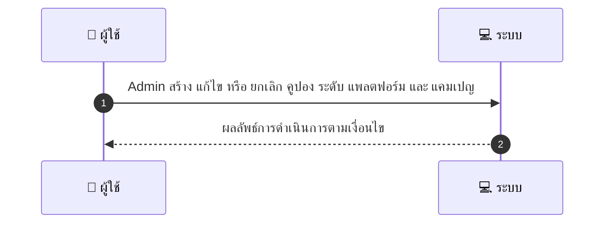
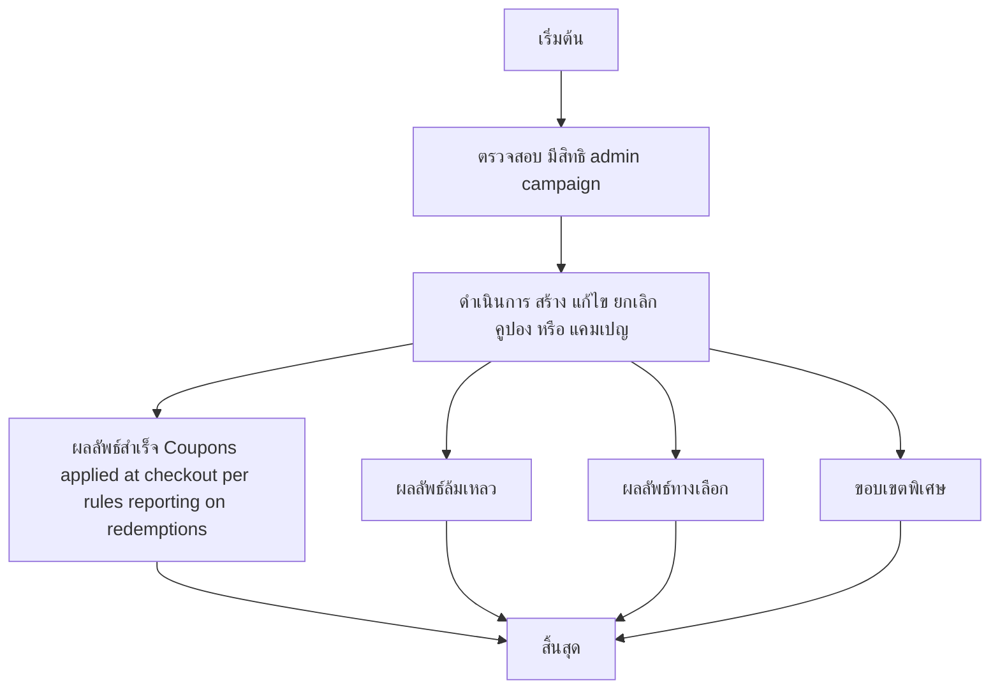

# ASYS012 - จัดการแคมเปญ/คูปองระดับแพลตฟอร์ม

## 👤 บทบาท
- ผู้ดูแลระบบ

## 🎯 เป้าหมายของเคส
- ในฐานะ Admin
- ต้องการ สร้าง แก้ไข ยกเลิกคูปองระดับแพลตฟอร์มและแคมเปญ
- เพื่อ เพื่อโปรโมตแพลตฟอร์มหรือจัดการโปรโมชั่นร่วมกับ providers

## ⚙️ เงื่อนไขก่อนเริ่ม (Precondition)
- มีสิทธิ admin campaign

## 🧭 ผลลัพธ์และสถานการณ์
- ✅ ผลลัพธ์ที่คาดหวัง (Success Flow): Coupons applied at checkout per rules reporting on redemptions
- ❌ ผลลัพธ์ที่ Failure:  
  - ยังไม่มีรายละเอียด
- 🔄 ผลลัพธ์ทางเลือก:  
  - ยังไม่มีรายละเอียด
- ⚠️ ผลลัพธ์ขอบเขตพิเศษ:  
  - ยังไม่มีรายละเอียด

## ✅ เกณฑ์การยอมรับ (Acceptance Criteria)
- Lifecycle management, usage limits, reporting, ability to revoke active codes

## ⏱ ลำดับความสำคัญ / SLA
- Priority: P1
- SLA: creation immediate

---

## 🔁 Sequence Diagram  
> แสดงลำดับเหตุการณ์ระหว่าง "ผู้ใช้" กับ "ระบบ"

---

## 🧭 Flowchart Diagram
> แสดงขั้นตอนการทำงานของระบบอย่างเข้าใจง่าย

