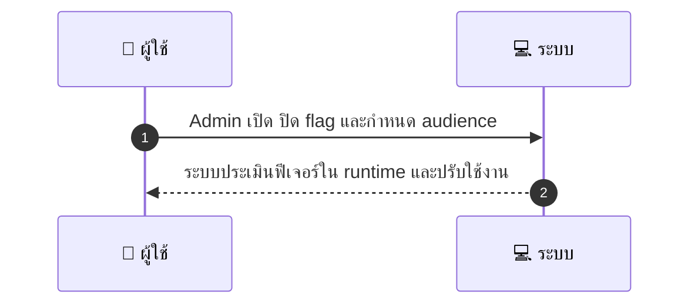
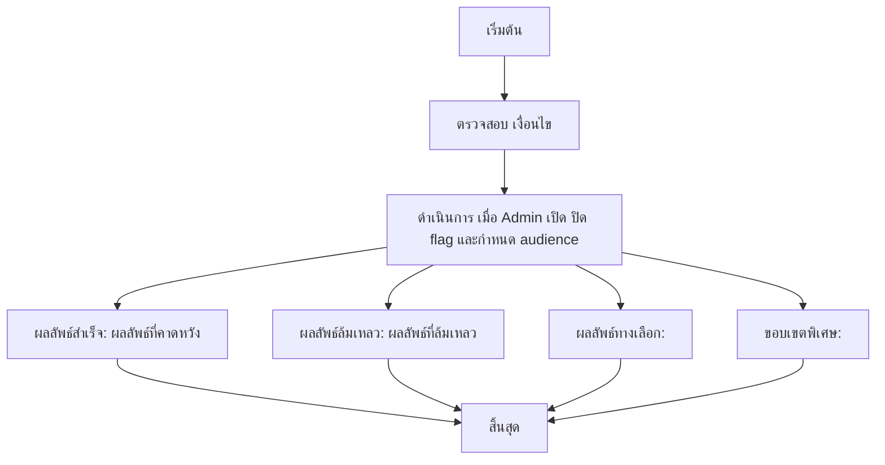

# ASYS024 - จัดการ feature flags / rollout

## 👤 บทบาท
- Admin/PM

## 🎯 เป้าหมายของเคส
- ในฐานะ: Admin/PM
- ต้องการ: สลับเปิด/ปิดฟีเจอร์โดยไม่ต้อง deploy โค้ด
- เพื่อ: เพื่อควบคุมการเปิดฟีเจอร์แบบค่อยเป็นค่อยไป

## ⚙️ เงื่อนไขก่อนเริ่ม (Precondition)
- มี feature flags framework

## 🧭 ผลลัพธ์และสถานการณ์
- ✅ ผลลัพธ์ที่คาดหวัง (Success Flow): System evaluates flags in runtime and applies changes
- ❌ ผลลัพธ์ที่ Failure:  
  - ไม่สามารถสลับสถานะฟีเจอร์ได้เนื่องจากข้อผิดพลาดเชิงเทคนิคระหว่างฟีเจอร์ flags framework กับ runtime evaluation
  - ไม่สามารถบันทึก Audit trail ของการเปลี่ยนแปลงได้ ทำให้ไม่สามารถติดตามการเปลี่ยนแปลงได้
  - ระบบไม่สามารถใช้ flag ใน session ใด ๆ ได้เนื่องจากปัญหาการสื่อสารกับ service ที่ตรวจสอบ feature flags
  - เกิดข้อผิดพลาดในการ rollback หากการเปลี่ยนถูกเปิดใช้งานไปแล้ว
- 🔄 ผลลัพธ์ทางเลือก:  
  - ฟีเจอร์ถูกเปิดเฉพาะ new sessions ตาม audience ที่กำหนด โดยผู้ใช้งานใน session ปัจจุบันยังเห็นสถานะเดิม
  - การ rollout แบบ gradual คือแบ่ง audience เป็นกลุ่มและเปิดใช้งานทีละกลุ่มเพื่อประเมินผลกระทบ
  - ระบบแจ้งเตือน Admin ให้ทราบว่าไม่สามารถเปิดฟีเจอร์สำหรับทุกกลุ่มและขออนุมัติเพิ่มเติม
  - การเปลี่ยนฟีเจอร์เกิดใน environment staging ก่อน production เพื่อทดสอบก่อนปล่อยจริง
- ⚠️ ผลลัพธ์ขอบเขตพิเศษ:  
  - ฟีเจอร์ถูกเปิดเฉพาะ new sessions ตาม audience ที่กำหนด โดยผู้ใช้งานใน session ปัจจุบันยังเห็นสถานะเดิม
  - การ rollout แบบ gradual คือแบ่ง audience เป็นกลุ่มและเปิดใช้งานทีละกลุ่มเพื่อประเมินผลกระทบ
  - ระบบแจ้งเตือน Admin ให้ทราบว่าไม่สามารถเปิดฟีเจอร์สำหรับทุกกลุ่มและขออนุมัติเพิ่มเติม
  - การเปลี่ยนฟีเจอร์เกิดใน environment staging ก่อน production เพื่อทดสอบก่อนปล่อยจริง

## ✅ เกณฑ์การยอมรับ (Acceptance Criteria)
- Flag change immediate for new sessions
- audit trail
- ability to rollback

## ⏱ ลำดับความสำคัญ / SLA
- Priority: P1
- SLA: change effective 1m

---

## 🔁 Sequence Diagram  
> แสดงลำดับเหตุการณ์ระหว่าง "ผู้ใช้" กับ "ระบบ"

---

## 🧭 Flowchart Diagram
> แสดงขั้นตอนการทำงานของระบบอย่างเข้าใจง่าย

