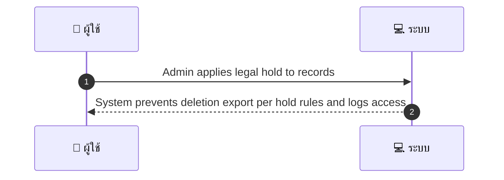
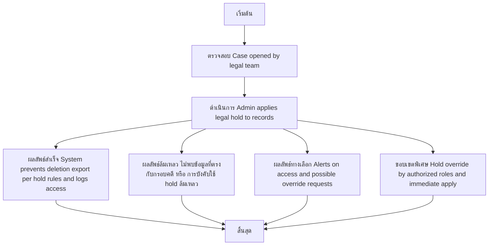

# ASYS025 - ดูและดำเนินการ legal holds evidence preservation

## 👤 บทบาท
- ผู้ดูแลระบบ

## 🎯 เป้าหมายของเคส
- ในฐานะ Legal/Compliance
- ต้องการ ตั้ง legal hold บนบัญชี/transaction ที่เกี่ยวข้องกับคดี
- เพื่อ ห้ามลบหรือทำลายข้อมูลก่อนการสอบสวน

## ⚙️ เงื่อนไขก่อนเริ่ม (Precondition)
- Case opened by legal team

## 🧭 ผลลัพธ์และสถานการณ์
- ✅ ผลลัพธ์ที่คาดหวัง (Success Flow): System prevents deletion export per hold rules and logs access
- ❌ ผลลัพธ์ที่ Failure:
  - ไม่สามารถบังคับใช้ legal hold ได้ เนื่องจากข้อมูลไม่พบหรือไม่ตรงกับกรอบคดี
  - ข้อผิดพลาดระบบระหว่างการบังคับใช้ hold เช่น ฐานข้อมูลล่ม หรือ API ตอบสนองช้า ส่งผลให้ไม่สามารถล็อกข้อมูลได้
  - สิทธิ์ของผู้ใช้งานไม่เพียงพอในการสร้าง/บังคับใช้ hold
- 🔄 ผลลัพธ์ทางเลือก:
  - Hold ถูกบังคับใช้อย่างถูกต้องแต่การแจ้งเตือนผู้เกี่ยวข้องล่าช้า เนื่องจากปัญหาการแจ้งเตือน
  - มีการยกเว้นบางรายการในกรอบ hold ตามคำสั่งทางกฎหมาย และบันทึกเหตุ override ใน audit log
  - Hold ถูกนำไปใช้กับ subset ของข้อมูลที่เกี่ยวข้องกับคดี ในขณะที่รายการที่ไม่เกี่ยวข้องยังสามารถดำเนินการได้
  - ผู้ดูแลระบบขออนุมัติ override จากผู้มีสิทธิ์สูงกว่า และ Hold อัปเดตตามการอนุมัติ
- ⚠️ ผลลัพธ์ขอบเขตพิเศษ:
  - Hold ถูกบังคับใช้อย่างถูกต้องแต่การแจ้งเตือนผู้เกี่ยวข้องล่าช้า เนื่องจากปัญหาการแจ้งเตือน
  - มีการยกเว้นบางรายการในกรอบ hold ตามคำสั่งทางกฎหมาย และบันทึกเหตุ override ใน audit log
  - Hold ถูกนำไปใช้กับ subset ของข้อมูลที่เกี่ยวข้องกับคดี ในขณะที่รายการที่ไม่เกี่ยวข้องยังสามารถดำเนินการได้
  - ผู้ดูแลระบบขออนุมัติ override จากผู้มีสิทธิ์สูงกว่า และ Hold อัปเดตตามการอนุมัติ

## ✅ เกณฑ์การยอมรับ (Acceptance Criteria)
- Hold override only by authorized roles
- alerts on access

## ⏱ ลำดับความสำคัญ / SLA
- Priority: P1
- SLA: hold effective immediate

---

## 🔁 Sequence Diagram  
> แสดงลำดับเหตุการณ์ระหว่าง "ผู้ใช้" กับ "ระบบ"

---

## 🧭 Flowchart Diagram
> แสดงขั้นตอนการทำงานของระบบอย่างเข้าใจง่าย

