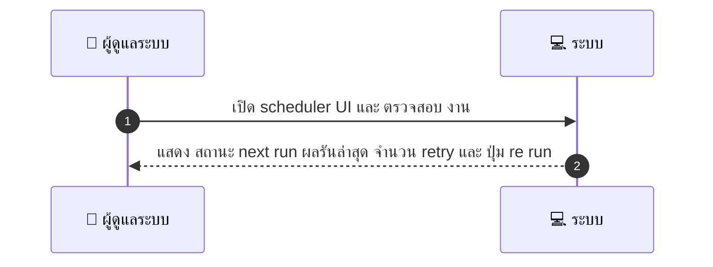
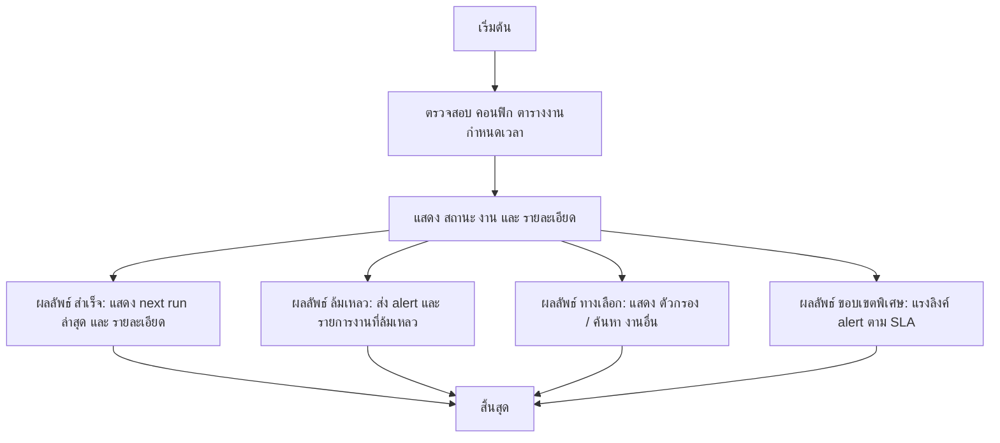

# ASYS027 - ดูและจัดการ scheduled jobs / cron tasks

## 👤 บทบาท
- ผู้ดูแลระบบ

## 🎯 เป้าหมายของเคส
- ในฐานะ: Admin/DevOps
- ต้องการ: ดูสถานะและผลการทำงานของ background jobs reconciliation auto-release
- เพื่อ: เพื่อแก้ไขปัญหางานที่ล้มเหลว

## ⚙️ เงื่อนไขก่อนเริ่ม (Precondition)
- Scheduled jobs configured

## 🧭 ผลลัพธ์และสถานการณ์
- ✅ ผลลัพธ์ที่คาดหวัง (Success Flow): ระบบแสดง next run ผลการรันล่าสุด จำนวน retry และความสามารถในการ re run
- ❌ ผลลัพธ์ที่ Failure: 
  - 
- 🔄 ผลลัพธ์ทางเลือก: 
  - ถ้าการตรวจสอบล้มเหลว ให้สามารถกรองค้นหางานอื่นได้
- ⚠️ ผลลัพธ์ขอบเขตพิเศษ: 
  - แสดง alert หากอัตราความล้มเหลวสูง

## ✅ เกณฑ์การยอมรับ (Acceptance Criteria)
- Job logs and re run capabilities
- alert on failure rate

## ⏱ ลำดับความสำคัญ / SLA
- Priority: P1
- SLA: alerts on job failure within 5m

---

## 🔁 Sequence Diagram  
> แสดงลำดับเหตุการณ์ระหว่าง "ผู้ดูแลระบบ" กับ "ระบบ"

---

## 🧭 Flowchart Diagram
> แสดงขั้นตอนการทำงานของระบบอย่างเข้าใจง่าย

