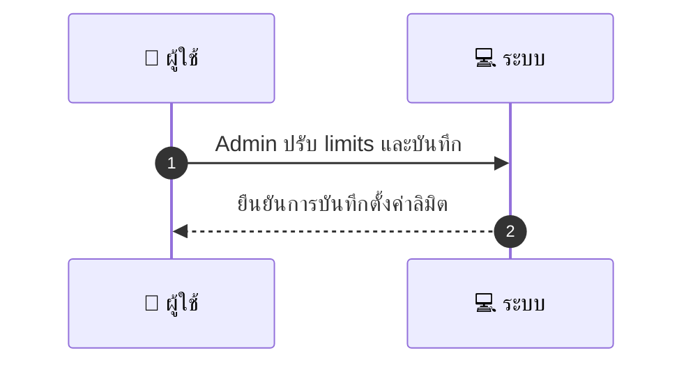
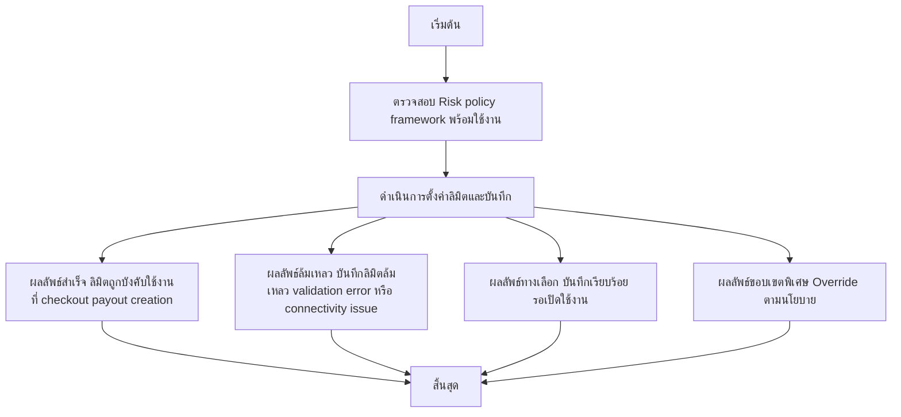

# ASYS030 - ตั้งค่าขีดจำกัดการชำระเงิน limits per user

## 👤 บทบาท
- ผู้ดูแลระบบ

## 🎯 เป้าหมายของเคส
- ในฐานะ Admin/Risk
- ต้องการ กำหนด limits for payments payouts per user provider daily monthly
- เพื่อ บริหารความเสี่ยงและป้องกันการทุจริต

## ⚙️ เงื่อนไขก่อนเริ่ม (Precondition)
- Risk policy framework available

## 🧭 ผลลัพธ์และสถานการณ์
- ✅ ผลลัพธ์ที่คาดหวัง (Success Flow): Limits enforced at checkout payout creation and if exceeded triggers review
- ❌ ผลลัพธ์ที่ Failure:
  - บันทึกการตั้งค่าลิมิตล้มเหลว validation error ของ input ข้อมูลไม่ถูกต้อง ค่าเป็นลบ หรือเกินขนาดที่กำหนด
  - ไม่สามารถเชื่อมต่อกับ Risk policy framework เพื่อนำค่าตั้งค่าไปใช้งาน
  - เกิดข้อผิดพลาดระหว่างการบังคับใช้อยู่ใน checkout/payout ไม่สามารถตรวจสอบการใช้งานปัจจุบันของผู้ใช้งาน
- 🔄 ผลลัพธ์ทางเลือก:
  - บันทึกการตั้งค่าเรียบร้อย แต่การบังคับใช้อยู่ในสถานะรอเปิดใช้งาน/อนุมัติ
  - เปิดใช้งานชั่วคราวด้วย override ที่จำกัดเวลาตามนโยบาย โดยมีขั้นตอนอนุมัติเพิ่มเติม
  - ตั้งค่าลิมิตระดับ Global ที่เป็นค่าเริ่มต้นสำหรับทุกผู้ใช้งาน โดยไม่ระบุผู้ใช้งานแต่ละราย
- ⚠️ ผลลัพธ์ขอบเขตพิเศษ:
  - บันทึกการตั้งค่าเรียบร้อย แต่การบังคับใช้อยู่ในสถานะรอเปิดใช้งาน/อนุมัติ
  - เปิดใช้งานชั่วคราวด้วย override ที่จำกัดเวลาตามนโยบาย โดยมีขั้นตอนอนุมัติเพิ่มเติม
  - ตั้งค่าลิมิตระดับ Global ที่เป็นค่าเริ่มต้นสำหรับทุกผู้ใช้งาน โดยไม่ระบุผู้ใช้งานแต่ละราย

## ✅ เกณฑ์การยอมรับ (Acceptance Criteria)
- การ override ลิมิตต้องได้รับการอนุมัติ
- เกิดการแจ้งเตือน

## ⏱ ลำดับความสำคัญ / SLA
- Priority: P1
- SLA: ลิมิตเปลี่ยนแปลงทันที

---

## 🔁 Sequence Diagram  
> แสดงลำดับเหตุการณ์ระหว่าง "ผู้ใช้" กับ "ระบบ"

---

## 🧭 Flowchart Diagram
> แสดงขั้นตอนการทำงานของระบบอย่างเข้าใจง่าย

