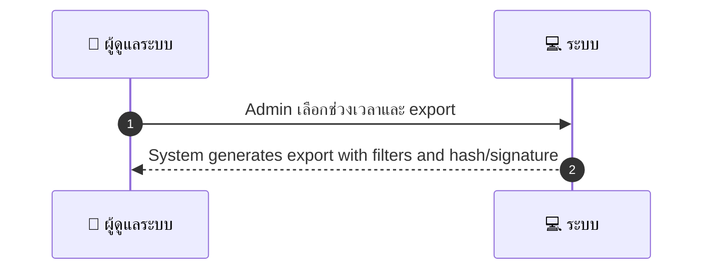
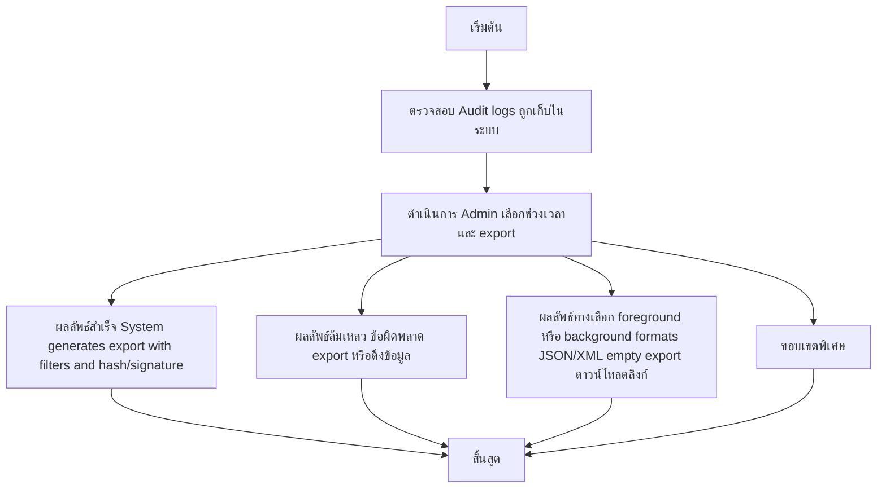

# ASYS032 - ดูและดาวน์โหลด audit trail แบบ exportable

## 👤 บทบาท
- ผู้ดูแลระบบ

## 🎯 เป้าหมายของเคส
- ในฐานะ
- Admin/Compliance
- เพื่อ

---

## ⚙️ เงื่อนไขก่อนเริ่ม (Precondition)
- Audit logs ถูกเก็บในระบบ

---

## 🧭 ผลลัพธ์และสถานการณ์
- ✅ ผลลัพธ์ที่คาดหวัง (Success Flow): System generates export with filters and hash/signature
- ❌ ผลลัพธ์ที่ Failure:
  - สิทธิ์ของผู้ใช้น้อยกว่าผู้ดูแลระบบ ไม่สามารถสร้าง export ได้
  - เกิดข้อผิดพลาดระหว่างดึงข้อมูลจาก audit log หรือการสร้างไฟล์ เช่น timeout หรือ DB connection ล้มเหลว
  - ช่วงเวลาที่เลือกไม่พบข้อมูล audit log
  - ไม่สามารถสร้างหรือตรวจสอบ hash/signature เนื่องจากคีย์ลับหมดอายุหรือตั้งค่าไม่ถูกต้อง
  - ไฟล์ export เสียหายหรือไม่สมบูรณ์ระหว่างการบันทึก/ถ่ายโอน
- 🔄 ผลลัพธ์ทางเลือก:
  - ระบบดำเนินการ export ใน foreground สำหรับชุดข้อมูลที่เล็ก และจบภายในเวลาอนุมัติ
  - ถ้าข้อมูลมีขนาดใหญ่ ระบบจะเริ่ม background job และแจ้งสถานะให้ผู้ดูแลผ่าน notification
  - ผู้ใช้เลือกฟอร์แมตอื่น เช่น export เป็น JSON หรือ XML ตามนโยบายองค์กร ถ้า supported
  - Export สำเร็จแต่ไม่มีข้อมูลให้ export ตามเงื่อนไข ส่งมอบ export เปล่า พร้อมข้อความอธิบาย
  - Export เสร็จและเก็บไว้ใน path ที่กำหนด ขณะที่แจ้งผู้ใช้งานด้วยลิงก์ดาวน์โหลด
- ⚠️ ผลลัพธ์ขอบเขตพิเศษ:
  - ระบบดำเนินการ export ใน foreground สำหรับชุดข้อมูลที่เล็ก และจบภายในเวลาอนุมัติ
  - ถ้าข้อมูลมีขนาดใหญ่ ระบบจะเริ่ม background job และแจ้งสถานะให้ผู้ดูแลผ่าน notification
  - ผู้ใช้เลือกฟอร์แมตอื่น เช่น export เป็น JSON หรือ XML ตามนโยบายองค์กร ถ้า supported
  - Export สำเร็จแต่ไม่มีข้อมูลให้ export ตามเงื่อนไข ส่งมอบ export เปล่า พร้อมข้อความอธิบาย
  - Export เสร็จและเก็บไว้ใน path ที่กำหนด ขณะที่แจ้งผู้ใช้งานด้วยลิงก์ดาวน์โหลด

---

## ✅ เกณฑ์การยอมรับ (Acceptance Criteria)
- Export includes who/when/what/why
- generation job in background if large

---

## ⏱ ลำดับความสำคัญ / SLA
- Priority: P1
- SLA: export ready notification within 30m

---

## 🔁 Sequence Diagram  
> แสดงลำดับเหตุการณ์ระหว่าง "ผู้ดูแลระบบ" กับ "ระบบ"

---

## 🧭 Flowchart Diagram
> แสดงขั้นตอนการทำงานของระบบอย่างเข้าใจง่าย

