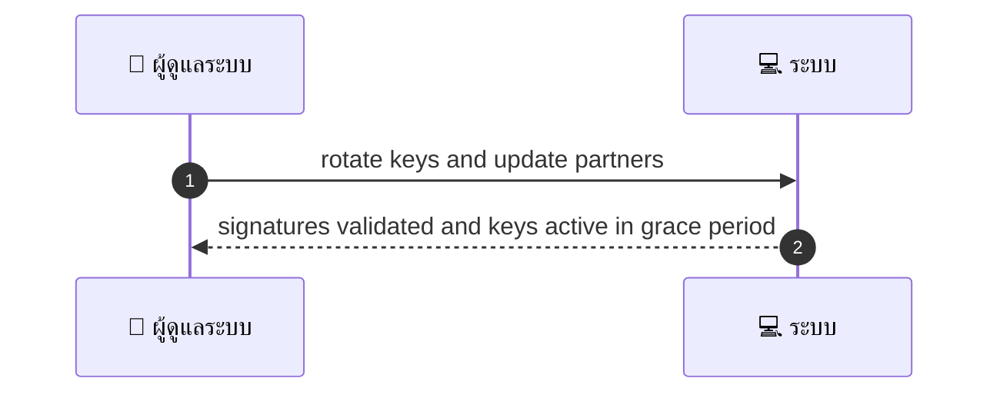
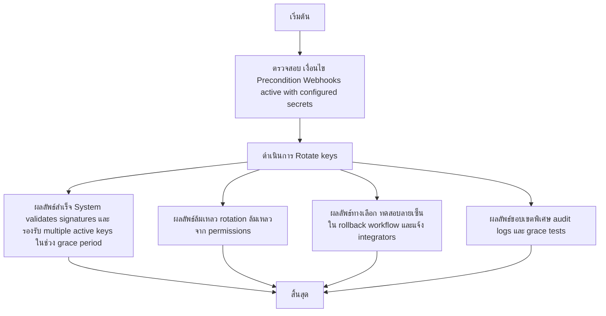

# ASYS033 - จัดการ webhook signatures/verification keys

## 👤 บทบาท
- ผู้ดูแลระบบ

## 🎯 เป้าหมายของเคส
- ในฐานะ Admin/Security
- ต้องการ ดูและหมุน secret keys สำหรับการตรวจสอบ webhook
- เพื่อ รักษาความปลอดภัยของ integrations

## ⚙️ เงื่อนไขก่อนเริ่ม (Precondition)
- Webhooks active with configured secrets

## 🧭 ผลลัพธ์และสถานการณ์
- ✅ ผลลัพธ์ที่คาดหวัง (Success Flow): System validates signatures, supports multiple active keys for grace period
- ❌ ผลลัพธ์ที่ Failure:
  - การหมุน secret key ล้มเหลวเนื่องจากสิทธิ์ของผู้ดูแลระบบไม่เพียงพอ
  - ไม่สามารถอัปเดต secret ใน secret store หรือ KMS ได้
  - การตรวจสอบลายเซ็นล้มเหลวหลัง rotation เนื่องจากรูปแบบ key ไม่ถูกต้อง
  - ไม่สามารถบันทึก Audit log ของการ rotation ได้
  - การแจ้งเตือน integrator ล้มเหลวหรือไม่ถึงคู่ค้าทั้งหมด
- 🔄 ผลลัพธ์ทางเลือก:
  - การ rotation สำเร็จและระบบรองรับ multiple active keys ในช่วง grace period ทำให้ webhook ยังลงชื่อถูกต้อง
  - บาง integrator ยังใช้ old key ในช่วง grace period แต่ระบบยอมรับทั้ง old และ new key สำหรับตราสารทั้งหมด
  - ระบบผ่านการทดสอบลายเซ็นใน environment QA ได้ แต่การทดสอบในระบบจริงยังต้องการตรวจสอบเพิ่มเติม
  - ผู้ดูแลระบบสามารถทดสอบลายเซ็นได้ในเวิร์กโฟลว์ rollback
  - การอัปเดตคู่ค้าสามารถทำแบบทีละรายหรือเป็น batch ได้โดยไม่กระทบระบบหลัก
- ⚠️ ผลลัพธ์ขอบเขตพิเศษ:
  - การ rotation สำเร็จและระบบรองรับ multiple active keys ในช่วง grace period ทำให้ webhook ยังลงชื่อถูกต้อง
  - บาง integrator ยังใช้ old key ในช่วง grace period แต่ระบบยอมรับทั้ง old และ new key สำหรับตราสารทั้งหมด
  - ระบบผ่านการทดสอบลายเซ็นใน environment QA ได้ แต่การทดสอบในระบบจริงยังต้องการตรวจสอบเพิ่มเติม
  - ผู้ดูแลระบบสามารถทดสอบลายเซ็นได้ในเวิร์กโฟลว์ rollback
  - การอัปเดตคู่ค้าสามารถทำแบบทีละรายหรือเป็น batch ได้โดยไม่กระทบระบบหลัก

## ✅ เกณฑ์การยอมรับ (Acceptance Criteria)
- Rotation audit
- ability to test signatures
- notify integrators

## ⏱ ลำดับความสำคัญ / SLA
- Priority: P1
- SLA: rotate effective immediate with grace period

---

## 🔁 Sequence Diagram  
> แสดงลำดับเหตุการณ์ระหว่าง ผู้ใช้ กับ ระบบ

---

## 🧭 Flowchart Diagram
> แสดงขั้นตอนการทำงานของระบบอย่างเข้าใจง่าย

