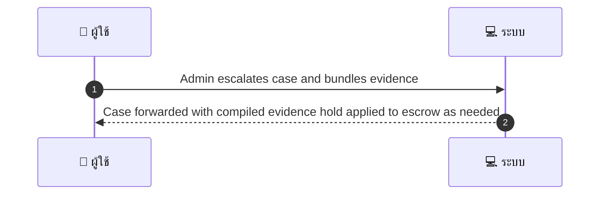
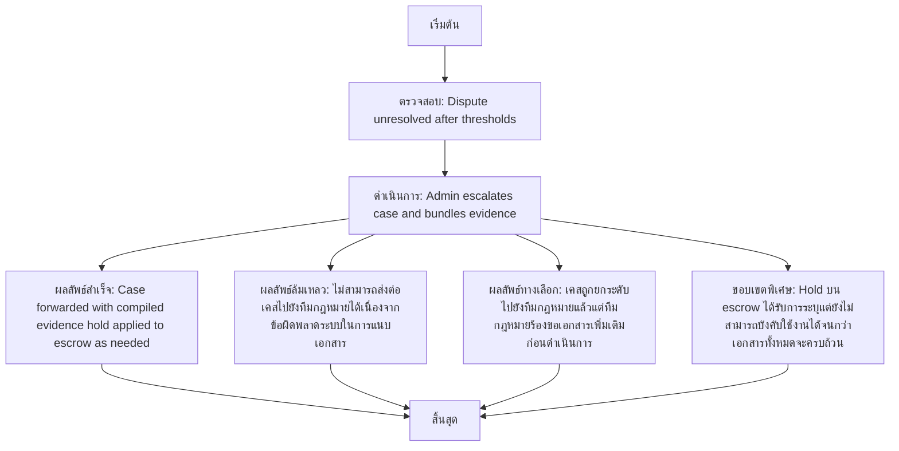

# ASYS036 - จัดการ dispute escalation to legal

## 👤 บทบาท
- ผู้ดูแลระบบ

## 🎯 เป้าหมายของเคส
- ในฐานะ Admin/Legal
- ต้องการ ยกระดับ case ที่ซับซ้อนไปยังทีมกฎหมายและแนบเอกสาร
- เพื่อ เพื่อจัดการความเสี่ยงทางกฎหมาย

## ⚙️ เงื่อนไขก่อนเริ่ม (Precondition)
- Dispute unresolved after thresholds

## 🧭 ผลลัพธ์และสถานการณ์
- ✅ ผลลัพธ์ที่คาดหวัง (Success Flow): Case forwarded with compiled evidence hold applied to escrow as needed
- ❌ ผลลัพธ์ที่ Failure:  
  - ไม่สามารถส่งต่อเคสไปยังทีมกฎหมายได้เนื่องจากข้อผิดพลาดระบบในการแนบเอกสาร
  - เอกสารหลักฐานครบถ้วนไม่ถูกต้องหรือขาดข้อมูลสำคัญ ทำให้กระบวนการยกระดับล้มเหลว
  - ผู้ใช้งานไม่มีสิทธิ์เพียงพอในการดำเนินการยกระดับเคส
- 🔄 ผลลัพธ์ทางเลือก:  
  - เคสถูกยกระดับไปยังทีมกฎหมายแล้วแต่ทีมกฎหมายร้องขอเอกสารเพิ่มเติมก่อนดำเนินการ
  - มีการตรวจสอบภายใน (internal compliance) ก่อนส่งต่อให้ทีมกฎหมายและยังอยู่ในคิวพิจารณา
  - Hold บน escrow ได้รับการระบุแต่ยังไม่สามารถบังคับใช้งานได้จนกว่าเอกสารทั้งหมดจะครบถ้วน
  - การติดตาม SLA เริ่มต้นแต่มีความล่าช้าในการตอบรับจากทีมกฎหมาย
- ⚠️ ผลลัพธ์ขอบเขตพิเศษ:  
  - เคสถูกยกระดับไปยังทีมกฎหมายแล้วแต่ทีมกฎหมายร้องขอเอกสารเพิ่มเติมก่อนดำเนินการ
  - มีการตรวจสอบภายใน (internal compliance) ก่อนส่งต่อให้ทีมกฎหมายและยังอยู่ในคิวพิจารณา
  - Hold บน escrow ได้รับการระบุแต่ยังไม่สามารถบังคับใช้งานได้จนกว่าเอกสารทั้งหมดจะครบถ้วน
  - การติดตาม SLA เริ่มต้นแต่มีความล่าช้าในการตอบรับจากทีมกฎหมาย

## ✅ เกณฑ์การยอมรับ (Acceptance Criteria)
- Escalation workflow with tracking and SLA for legal review

## ⏱ ลำดับความสำคัญ / SLA
- Priority: P1
- SLA: - escalation ack =48h

---

## 🔁 Sequence Diagram  
> แสดงลำดับเหตุการณ์ระหว่าง "ผู้ใช้" กับ "ระบบ"

---

## 🧭 Flowchart Diagram
> แสดงขั้นตอนการทำงานของระบบอย่างเข้าใจง่าย

