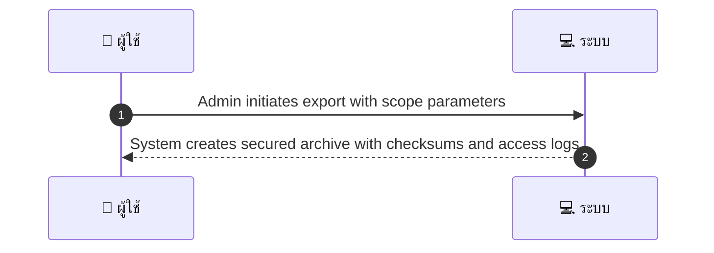
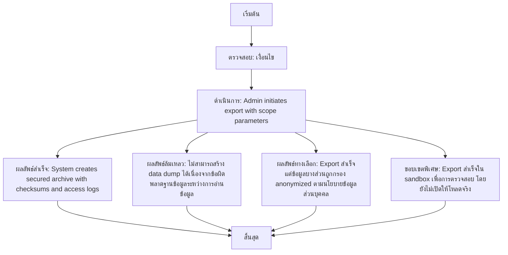

# ASYS037 - จัดการ mass user data export for audits

## 👤 บทบาท
- ผู้ดูแลระบบ

## 🎯 เป้าหมายของเคส
- ในฐานะ
- ต้องการ
- เพื่อ

- ในฐานะ: Admin/Compliance
- ต้องการ: สร้าง data dumps ตามคำขอ audit ภายใน/ภายนอก
- เพื่อ: เพื่อส่งมอบข้อมูลตามข้อกำหนด

## ⚙️ เงื่อนไขก่อนเริ่ม (Precondition)
- Audit request authorized

## 🧭 ผลลัพธ์และสถานการณ์
- ✅ ผลลัพธ์ที่คาดหวัง (Success Flow): System creates secured archive with checksums and access logs
- ❌ ผลลัพธ์ที่ Failure:
  - ไม่สามารถสร้าง data dump ได้เนื่องจากข้อผิดพลาดฐานข้อมูลระหว่างการอ่านข้อมูล
  - สิทธิ์เข้าถึง export ถูกยกเลิกหรือหมดอายุ
  - การบีบอัด zip หรือการเข้ารหัสล้มเหลว
  - Checksum ไม่ตรงกับข้อมูลใน archive ทำให้การตรวจสอบความถูกต้องล้มเหลว
  - เกิดข้อผิดพลาดขณะบันทึก access logs หรือส่งมอบลิงก์ดาวน์โหลด
- 🔄 ผลลัพธ์ทางเลือก:
  - Export สำเร็จแต่ข้อมูลบางส่วนถูกกรอง anonymized ตามนโยบายข้อมูลส่วนบุคคล
  - Export สำเร็จในโหมด sandbox เพื่อการตรวจสอบ โดยยังไม่เปิดให้โหลดจริง
  - Export สำเร็จและส่งไปยัง storage ภายนอกตามที่ระบุ แต่ลิงก์ดาวน์โหลดมีระยะเวลาที่จำกัด
  - Export สำเร็จและทำ data masking ก่อน export ตามระดับความอ่อนไหวของข้อมูล
- ⚠️ ผลลัพธ์ขอบเขตพิเศษ:
  - Export สำเร็จแต่ข้อมูลบางส่วนถูกกรอง anonymized ตามนโยบายข้อมูลส่วนบุคคล
  - Export สำเร็จในโหมด sandbox เพื่อการตรวจสอบ โดยยังไม่เปิดให้โหลดจริง
  - Export สำเร็จและส่งไปยัง storage ภายนอกตามที่ระบุ แต่ลิงก์ดาวน์โหลดมีระยะเวลาที่จำกัด
  - Export สำเร็จและทำ data masking ก่อน export ตามระดับความอ่อนไหวของข้อมูล

## ✅ เกณฑ์การยอมรับ (Acceptance Criteria)
- Access to export limited
- download link expires
- encryption applied

## ⏱ ลำดับความสำคัญ / SLA
- Priority: P1
- SLA: export job start within 1h

---

## 🔁 Sequence Diagram  
> แสดงลำดับเหตุการณ์ระหว่าง "ผู้ใช้งาน" กับ "ระบบ"

---

## 🧭 Flowchart Diagram
> แสดงขั้นตอนการทำงานของระบบอย่างเข้าใจง่าย

