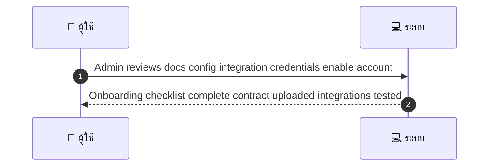
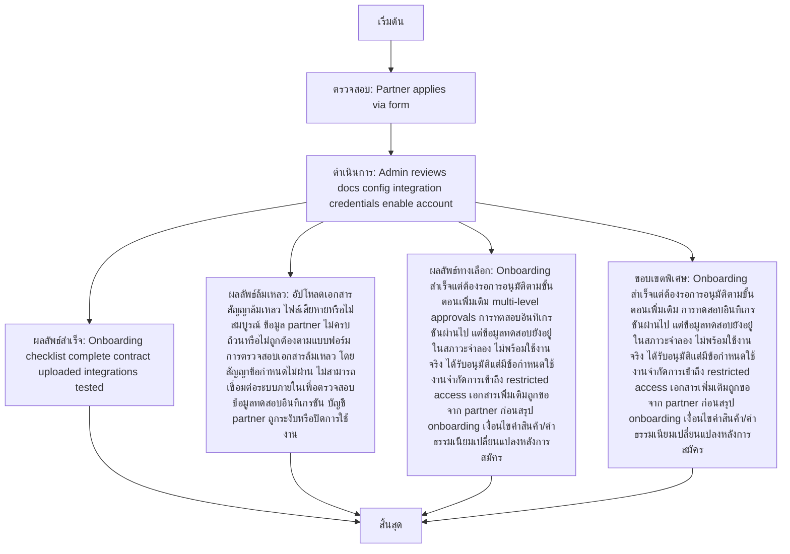

# ASYS039 - จัดการ partner onboarding B2B

## 👤 บทบาท
- ผู้ดูแลระบบ

## 🎯 เป้าหมายของเคส
- ในฐานะ Admin/Partnership
- ต้องการ รับ onboarding ของ partner enterprise contract, fees, integrations
- เพื่อ เชื่อมพันธมิตรทางธุรกิจอย่างมีมาตรฐาน

## ⚙️ เงื่อนไขก่อนเริ่ม
- Partner applies via form

## 🧭 ผลลัพธ์และสถานการณ์
- ✅ ผลลัพธ์ที่คาดหวัง (Success Flow): Onboarding checklist complete, contract uploaded, integrations tested
- ❌ ผลลัพธ์ที่ Failure:
  - อัปโหลดเอกสารสัญญาล้มเหลว: ไฟล์เสียหายหรือไม่สมบูรณ์
  - ข้อมูล partner ไม่ครบถ้วนหรือไม่ถูกต้องตามแบบฟอร์ม
  - การตรวจสอบเอกสารล้มเหลว โดยสัญญา/ข้อกำหนดไม่ผ่าน
  - ไม่สามารถเชื่อมต่อระบบภายในเพื่อตรวจสอบข้อมูล/ทดสอบอินทิเกรชัน
  - บัญชี partner ถูกระงับหรือปิดการใช้งานทันที
  - การอนุมัติสัญญาถูกปฏิเสธโดยฝ่ายกรรมการ
- 🔄 ผลลัพธ์ทางเลือก:
  - Onboarding สำเร็จแต่ต้องรอการอนุมัติตามขั้นตอนเพิ่มเติม multi-level approvals
  - การทดสอบอินทิเกรชันผ่านไป แต่ข้อมูลทดสอบยังอยู่ในสภาวะจำลอง ไม่พร้อมใช้งานจริง
  - ได้รับอนุมัติแต่มีข้อกำหนดใช้งานจำกัดการเข้าถึง restricted access
  - เอกสารเพิ่มเติมถูกขอจาก partner ก่อนสรุป onboarding
  - เงื่อนไขค่าสินค้า/ค่าธรรมเนียมเปลี่ยนแปลงหลังการสมัคร
- ⚠️ ผลลัพธ์ขอบเขตพิเศษ:
  - Onboarding สำเร็จแต่ต้องรอการอนุมัติตามขั้นตอนเพิ่มเติม multi-level approvals
  - การทดสอบอินทิเกรชันผ่านไป แต่ข้อมูลทดสอบยังอยู่ในสภาวะจำลอง ไม่พร้อมใช้งานจริง
  - ได้รับอนุมัติแต่มีข้อกำหนดใช้งานจำกัดการเข้าถึง restricted access
  - เอกสารเพิ่มเติมถูกขอจาก partner ก่อนสรุป onboarding
  - เงื่อนไขค่าสินค้า/ค่าธรรมเนียมเปลี่ยนแปลงหลังการสมัคร

- ✅ เกณฑ์การยอมรับ
  - Onboarding status tracked
  - approvals required

- ⏱ ลำดับความสำคัญ / SLA
  - Priority: P1
  - SLA: onboarding =48h

---

## 🔁 Sequence Diagram  
> แสดงลำดับเหตุการณ์ระหว่าง "ผู้ใช้" กับ "ระบบ"

---

## 🧭 Flowchart Diagram
> แสดงขั้นตอนการทำงานของระบบอย่างเข้าใจง่าย

