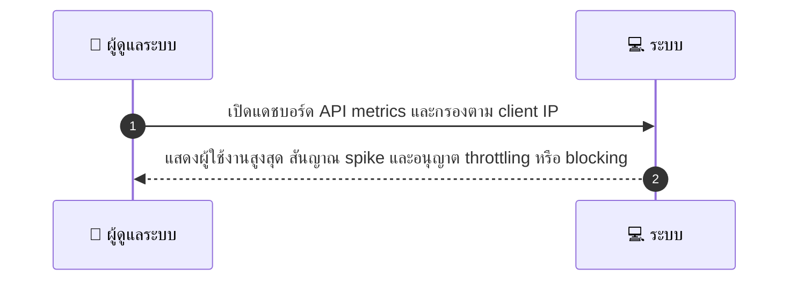
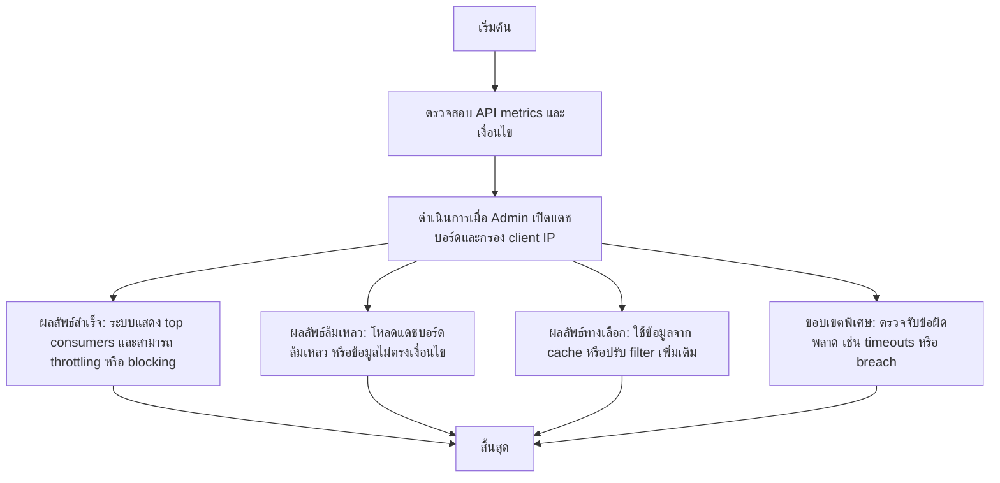

# ASYS040 - ดูการใช้งาน API Rate limiting dashboard

## 👤 บทบาท
- ผู้ดูแลระบบ

## 🎯 เป้าหมายของเคส
- ในฐานะ Admin/DevOps
- ต้องการ ติดตามการใช้ API rate limit breaches และบล็อก abusive clients
- เพื่อ ป้องกันการถูกโจมตีหรือ abuse

## ⚙️ เงื่อนไขก่อนเริ่ม (Precondition)
- API metrics collected

## 🧭 ผลลัพธ์และสถานการณ์
- ✅ ผลลัพธ์ที่คาดหวัง (Success Flow): ระบบแสดงผู้ใช้งานสูงสุด สัญญาณ spike และอนุญาต throttling หรือ blocking
- ❌ ผลลัพธ์ที่ Failure:
  - ไม่สามารถโหลดแดชบอร์ด API metrics ได้ เนื่องจาก data source ล้มเหลวหรือไม่พร้อมใช้งาน
  - การกรองตาม client IP ล้มเหลว หรือแสดงข้อมูลผิดพลาดไม่สอดคล้องกับเงื่อนไขที่เลือก
  - การดำเนินการ throttling/ban ล้มเหลวเนื่องจากข้อผิดพลาด API หรือสิทธิ์เข้าถึง
  - การแจ้งเตือนผู้ดูแลผ่านระบบ Notification ล้มเหลว
- 🔄 ผลลัพธ์ทางเลือก:
  - ระบบโหลดข้อมูลจาก cache เพื่อให้แดชบอร์ดแสดงผลได้ทันทีเมื่อ data source ล้มเหลวชั่วคราว
  - ไม่มี spikeหรือ breach ตาม filter ที่เลือก แสดงสถานะปกติพร้อม top consumers
  - สามารถปรับ filter ตาม client IP แล้วดูสถานะการถูกจำกัดและประวัติการ ban/timeout ในแต่ละ client
  - ระบบเสนอการตั้งค่า alert สำหรับการ breach ง่ายๆ พร้อมบันทึกไว้ใช้งาน
  - หากพบ breach แต่ไม่ถึงเกณฑ์บล็อก ระบบแนะนำ throttling ที่เหมาะสมให้
- ⚠️ ผลลัพธ์ขอบเขตพิเศษ:
  - ระบบโหลดข้อมูลจาก cache เพื่อให้แดชบอร์ดแสดงผลได้ทันทีเมื่อ data source ล้มเหลวชั่วคราว
  - ไม่มี spikeหรือ breach ตาม filter ที่เลือก แสดงสถานะปกติพร้อม top consumers
  - สามารถปรับ filter ตาม client/IP แล้วดูสถานะการถูกจำกัดและประวัติการ ban/timeout ในแต่ละ client
  - ระบบเสนอการตั้งค่า alert สำหรับการ breach ง่ายๆ พร้อมบันทึกไว้ใช้งาน
  - หากพบ breach แต่ไม่ถึงเกณฑ์บล็อก ระบบแนะนำ throttling ที่เหมาะสมให้

## ✅ เกณฑ์การยอมรับ (Acceptance Criteria)
- สามารถบล็อกชั่วคราวและแจ้งเจ้าของได้

## ⏱ ลำดับความสำคัญ / SLA
- Priority: P1
- SLA: alerts on spike 5m

---

## 🔁 Sequence Diagram  
> แสดงลำดับเหตุการณ์ระหว่าง "ผู้ดูแลระบบ" กับ "ระบบ"

---

## 🧭 Flowchart Diagram
> แสดงขั้นตอนการทำงานของระบบอย่างเข้าใจง่าย

