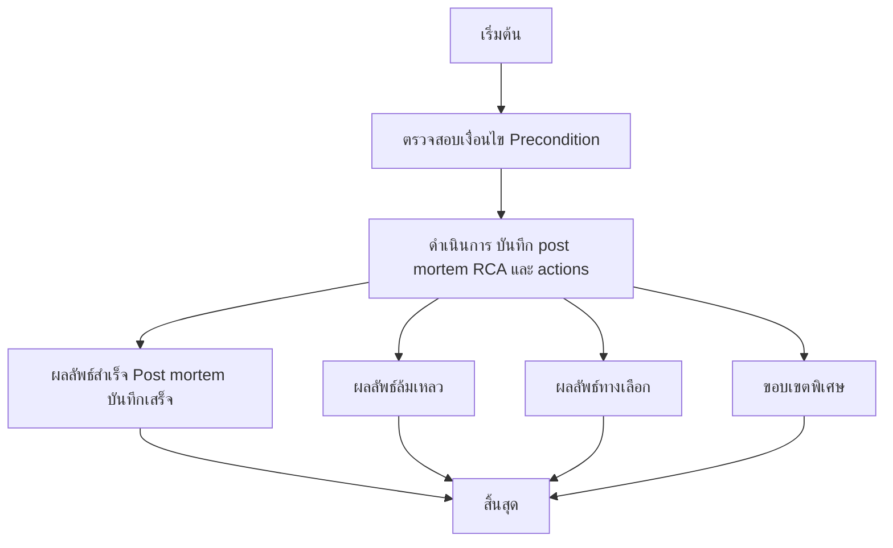

# ASYS043 - สร้างและจัดการ incident post-mortems

## 👤 บทบาท
- ผู้ดูแลระบบ

## 🎯 เป้าหมายของเคส
- ในฐานะ Admin/Operations
- ต้องการ บันทึกเหตุการณ์ major incidents root cause และ corrective actions
- เพื่อ เพื่อปรับปรุงความเสถียร

## ⚙️ เงื่อนไขก่อนเริ่ม (Precondition)
- Incident occurred and logs available

## 🧭 ผลลัพธ์และสถานการณ์
- ✅ ผลลัพธ์ที่คาดหวัง (Success Flow): PM engineering actions tracked to closure distribution to stakeholders
- ❌ ผลลัพธ์ที่ Failure:
  - ระบบบันทึก post-mortem ล้มเหลวระหว่างบันทึก ทำให้ข้อมูลไม่ครบถ้วน
  - ข้อมูลไม่ครบถ้วน เช่น incident_id หรือ root cause ไม่ถูกระบุเพียงพอ
  - ไม่พบ logs ที่เกี่ยวข้องกับเหตุการณ์ ทำให้ไม่สามารถสรุปสาเหตุเชิงลึกได้
  - การมอบหมายและติดตาม actions ล้มเหลวเนื่องจากผู้ใช้งานไม่มีสิทธิ์หรือมีข้อจำกัดในการสร้างงาน
  - ส่ง post-mortem เกิน SLA 7 วัน
- 🔄 ผลลัพธ์ทางเลือก:
  - สร้าง post-mortem เป็นฉบับร่างเพื่อการตรวจสอบก่อนเผยแพร่
  - กระจายเอกสารไปยัง stakeholders หลายกลุ่ม พร้อมการระบุ RCA ยังอยู่ในสถานะ pending
  - RCA ยังไม่ชัดเจนและถูกติดธง Pending เพื่อการทบทวนเพิ่มเติม
  - โพสต์มอร์ตอมถูกสร้างตาม template แต่ขั้นตอน approval ซ้ำซ้อนทำให้ล่าช้า
  - มีการอัปเดต post-mortem ภายหลังเมื่อข้อมูลเพิ่มเติมได้มา
- ⚠️ ผลลัพธ์ขอบเขตพิเศษ:
  - สร้าง post-mortem เป็นฉบับร่างเพื่อการตรวจสอบก่อนเผยแพร่
  - กระจายเอกสารไปยัง stakeholders หลายกลุ่ม พร้อมการระบุ RCA ยังอยู่ในสถานะ pending
  - RCA ยังไม่ชัดเจนและถูกติดธง Pending เพื่อการทบทวนเพิ่มเติม
  - โพสต์มอร์ตอมถูกสร้างตาม template แต่ขั้นตอน approval ซ้ำซ้อนทำให้ล่าช้า
  - มีการอัปเดต post-mortem ภายหลังเมื่อข้อมูลเพิ่มเติมได้มา

## ✅ เกณฑ์การยอมรับ (Acceptance Criteria)
- Post-mortem template used
- follow-up actions assigned

## ⏱ ลำดับความสำคัญ / SLA
- Priority: P1
- SLA: post-mortem <=7 days after incident

---

## 🔁 Sequence Diagram  
> แสดงลำดับเหตุการณ์ระหว่าง "ผู้ใช้" กับ "ระบบ"

```mermaid
sequenceDiagram
  aut onumber
  participant U as 🧑 ผู้ใช้
  participant S as 💻 ระบบ
  U->>S: Admin สร้าง post-mortem document and assign actions
  S-->>U: PM engineering actions tracked to closure distribution to stakeholders
```

---

## 🧭 Flowchart Diagram
> แสดงขั้นตอนการทำงานของระบบอย่างเข้าใจง่าย



