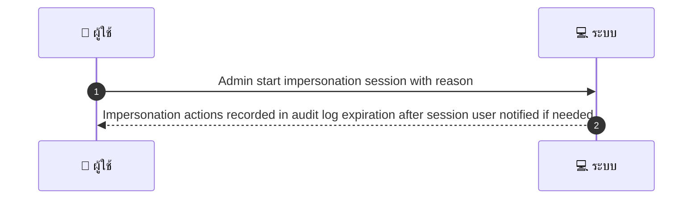
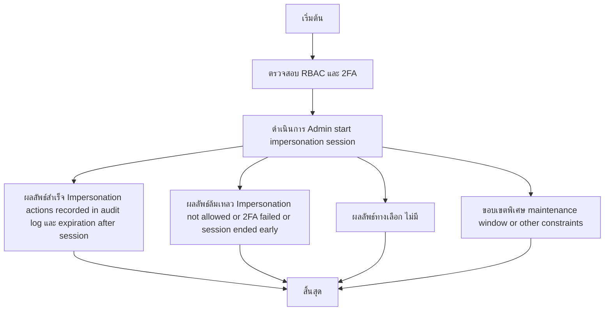

# ASYS046 - ตั้งค่าการอนุญาต/จำกัดการเข้าถึงใน production Impersonation

## 👤 บทบาท
- ผู้ดูแลระบบ

## 🎯 เป้าหมายของเคส
- ในฐานะ
- ต้องการ
- เพื่อ

- ในฐานะ: Admin/Support
- ต้องการ: สามารถ impersonate user/provider เพื่อ debug issue โดยมี audit
- เพื่อ: เพื่อช่วยแก้ปัญหาโดยไม่ต้องสอบถามรหัสผ่านผู้ใช้

## ⚙️ เงื่อนไขก่อนเริ่ม (Precondition)
- Support ticket requires impersonation

## 🧭 ผลลัพธ์และสถานการณ์
- ✅ ผลลัพธ์ที่คาดหวัง (Success Flow): Impersonation actions recorded in audit log expiration after session user notified if needed
- ❌ ผลลัพธ์ที่ Failure:
  - ไม่สามารถสร้าง session impersonation ได้ เนื่องจาก RBAC ไม่มีสิทธิ impersonate
  - การยืนยันตัวตนด้วย 2FA ของ Admin ล้มเหลว ทำให้เริ่ม impersonation ไม่ได้
  - ไม่มี/ไม่อนุมัติ Support ticket ที่ระบุให้ impersonation
  - ไม่สามารถบันทึกข้อมูลลง audit log ได้ หรือเกิดข้อผิดพลาดในการเขียน log ทำให้ไม่บันทึกเหตุการณ์
  - ระบบที่ต้อง impersonate อยู่ภายใต้ maintenance window และห้าม impersonationในช่วงนี้
  - ระยะเวลาของ session เกินในระหว่างเริ่มใช้งาน หรือถูกยุติก่อนการทำงาน
- 🔄 ผลลัพธ์ทางเลือก:
  - ไม่มี
- ⚠️ ผลลัพธ์ขอบเขตพิเศษ:
  - ไม่มี

## ✅ เกณฑ์การยอมรับ (Acceptance Criteria)
- Impersonation requires RBAC and 2FA for admin

## ⏱ ลำดับความสำคัญ / SLA
- Priority: P1
- SLA: session timeout defined e g 30m

---

## 🔁 Sequence Diagram  
> แสดงลำดับเหตุการณ์ระหว่าง "ผู้ใช้" กับ "ระบบ"

---

## 🧭 Flowchart Diagram
> แสดงขั้นตอนการทำงานของระบบอย่างเข้าใจง่าย

