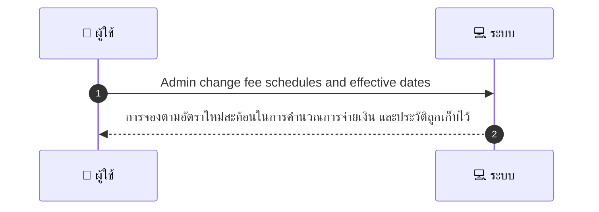
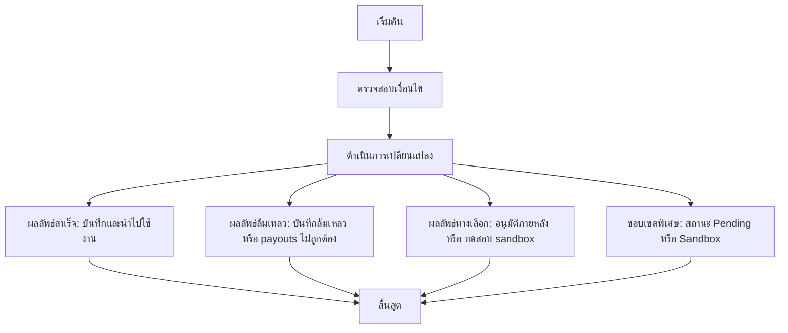

# ASYS048 - จัดการ merchant fee schedule และ adjustments

## 👤 บทบาท
- ผู้ดูแลระบบ

## 🎯 เป้าหมายของเคส
- ในฐานะ Admin/Finance
- ต้องการ ตั้งค่า commission rates per category provider contracts
- เพื่อ คำนวณ payouts อย่างถูกต้อง

## ⚙️ เงื่อนไขก่อนเริ่ม (Precondition)
- กฎค่าคอมมิชชั่นถูกกำหนดทั้งระดับ Global และตามผู้ให้บริการ

## 🧭 ผลลัพธ์และสถานการณ์
- ✅ ผลลัพธ์ที่คาดหวัง (Success Flow): การจองตามอัตราใหม่สะท้อนในการคำนวณการจ่ายเงิน และประวัติถูกเก็บไว้
- ❌ ผลลัพธ์ที่ Failure:  
  - บันทึกการเปลี่ยนแปลงล้มเหลว ข้อผิดพลาดการตรวจสอบข้อมูล เช่น ช่องข้อมูลที่จำเป็นขาด หรือวันที่มีผลบังคับไม่ถูกต้อง วันที่มีผลบังคับในอนาคตหรือย้อนกลับ ทำให้บันทึกไม่ได้
  - การคำนวณการจ่ายเงินล้มเหลวหลังอัปเดต สูตรค่าคอมมิชชั่นใหม่ไม่สอดคล้องกับข้อมูลใน bookings ทำให้การจ่ายเงินคลาดเคลื่อน
  - คำขออนุมัติการเปลี่ยนแปลงล้มเหลว ขั้นตอนอนุมัติไม่ผ่านหรือหมดเวลายืนยัน ส่งผลให้การเปลี่ยนแปลงไม่ถูกนำไปใช้
- 🔄 ผลลัพธ์ทางเลือก:  
  - ไม่อนุมัติการเปลี่ยนแปลง ผู้อนุมัติปฏิเสธคำขอ ทำให้ใช้สถานะเดิมและรอการปรับปรุง
  - รอการอนุมัติเพิ่มเติม สถานะเปลี่ยนแปลงอยู่ใน Pending และ Admin ต้องให้อภิปรายหรือข้อมูลเพิ่มเติมก่อนอนุมัติ
  - รันเทสต์ใน sandbox ก่อนใช้งานจริง มีการทดสอบผลกระทบกับข้อมูลจำลอง และหากผ่านจึงเผยแพร่สู่ระบบจริง
- ⚠️ ผลลัพธ์ขอบเขตพิเศษ:  
  - ไม่อนุมัติการเปลี่ยนแปลง: ผู้อนุมัติปฏิเสธคำขอ ทำให้ใช้สถานะเดิมและรอการปรับปรุง
  - รอการอนุมัติเพิ่มเติม: สถานะเปลี่ยนแปลงอยู่ใน Pending และ Admin ต้องให้อภิปรายหรือข้อมูลเพิ่มเติมก่อนอนุมัติ
  - รันเทสต์ใน sandbox ก่อนใช้งานจริง: มีการทดสอบผลกระทบกับข้อมูลจำลอง และหากผ่านจึงเผยแพร่สู่ระบบจริง

## ✅ เกณฑ์การยอมรับ (Acceptance Criteria)
- กระบวนการอนุมัติสำหรับการเปลี่ยนแปลง
- สื่อสารไปยังผู้ให้บริการ

## ⏱ ลำดับความสำคัญ / SLA
- Priority: P1
- SLA: change effective per scheduled date

---

## 🔁 Sequence Diagram  
> แสดงลำดับเหตุการณ์ระหว่าง "ผู้ใช้" กับ "ระบบ"

---

## 🧭 Flowchart Diagram
> แสดงขั้นตอนการทำงานของระบบอย่างเข้าใจง่าย

