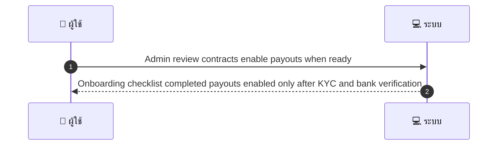
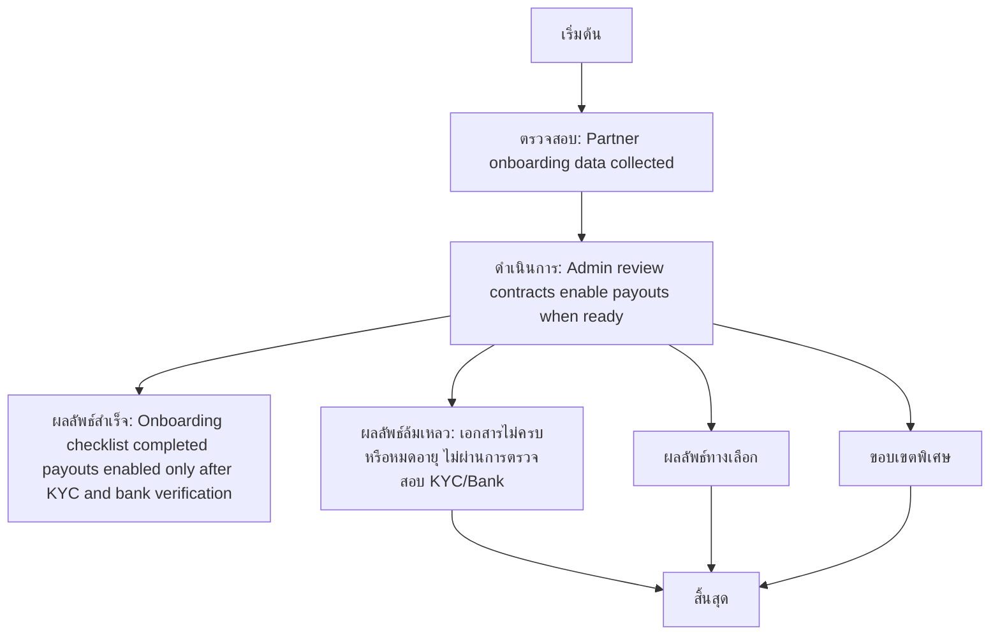

# ASYS051 - จัดการ partner settlement & merchant onboarding docs

## 👤 บทบาท
- ผู้ดูแลระบบ

## 🎯 เป้าหมายของเคส
- ในฐานะ
- ต้องการ
- เพื่อ

## ⚙️ เงื่อนไขก่อนเริ่ม (Precondition)
- Partner onboarding data collected

## 🧭 ผลลัพธ์และสถานการณ์
- ✅ ผลลัพธ์ที่คาดหวัง (Success Flow): Onboarding checklist completed payouts enabled only after KYC and bank verification
- ❌ ผลลัพธ์ที่ Failure:
  - เอกสารไม่ครบหรือหมดอายุ ไม่ผ่านการตรวจสอบ KYC/Bank
  - ข้อมูลธนาคารไม่ถูกต้อง หรือไม่ผ่านการยืนยัน
  - การตรวจสอบ Compliance ล้มเหลว ทำให้ไม่สามารถเปิด payouts
  - Onboarding checklist ไม่ครบถ้วนภายใน SLA 48h
  - ระบบล่มระหว่างกระบวนการบันทึกข้อมูล onboarding
- 🔄 ผลลัพธ์ทางเลือก:
  - 
- ⚠️ ผลลัพธ์ขอบเขตพิเศษ:
  - 
- 🔎 เกณฑ์การยอมรับเพิ่มเติม (เมื่อมี): 
  - Docs marked verified
  - escrow rules apply until onboarding complete

## ✅ เกณฑ์การยอมรับ (Acceptance Criteria)
- Docs marked verified
- escrow rules apply until onboarding complete

## ⏱ ลำดับความสำคัญ / SLA
- Priority: P1
- SLA: onboarding verification =48h

---

## 🔁 Sequence Diagram  
> แสดงลำดับเหตุการณ์ระหว่าง "ผู้ใช้" กับ "ระบบ"

---

## 🧭 Flowchart Diagram
> แสดงขั้นตอนการทำงานของระบบอย่างเข้าใจง่าย

