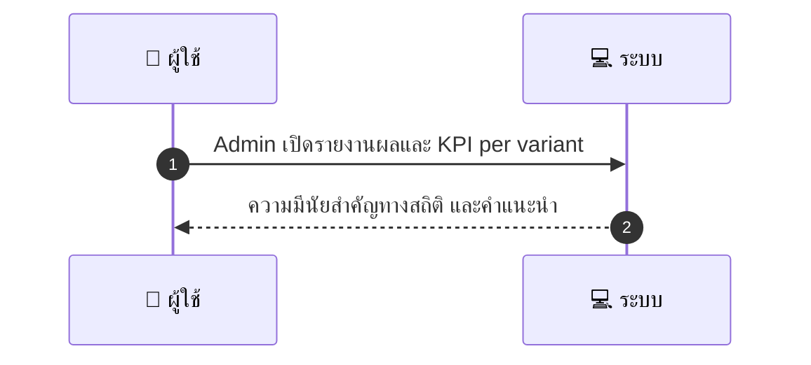
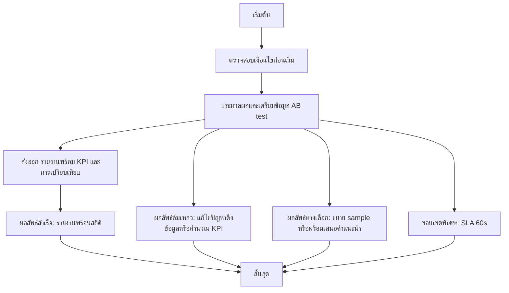

# ASYS041 - จัดการ feature rollout metrics AB results

## 👤 บทบาท
- ผู้ดูแลระบบ

## 🎯 เป้าหมายของเคส
- ในฐานะ Admin/PM
- ต้องการ ดูผลการใช้งานของฟีเจอร์ที่ rollout และทำ AB analysis
- เพื่อวัดผลก่อนขยายฟีเจอร์

## ⚙️ เงื่อนไขก่อนเริ่ม (Precondition)
- Experiments running with adequate sample

## 🧭 ผลลัพธ์และสถานการณ์
- ✅ ผลลัพธ์ที่คาดหวัง: แสดงความมีนัยสำคัญทางสถิติ และแนะนำการโปรโมตหรือ rollback
- ❌ ผลลัพธ์ที่ Failure:
  - ระบบไม่สามารถดึงข้อมูลการทดลองจาก data source เนื่องจาก network API หรือ database error ทำให้ไม่สามารถคำนวณ KPI ได้
  - ข้อมูลการทดลองมีความผิดปกติ เช่น ค่า metric เป็น NaN หรือไม่มีความแตกต่างระหว่าง variants ทำให้สรุปไม่ได้
  - การส่งออก รายงานล้มเหลว เนื่องจากสิทธิ์การใช้งานไม่ครบถ้วน หรือพบข้อผิดพลาดในการเขียนไฟล์
  - ข้อมูลการ allocate variant หรือ logs ไม่ครบถ้วน ทำให้ไม่สามารถสร้าง per variant report ได้
  - การประมวลผลล้มเหลวเนื่องจากเวลาสร้างรายงานเกิน SLA 60 วินาที
- 🔄 ผลลัพธ์ทางเลือก:
  - รายงานยังไม่ถึงนัยสำคัญทางสถิติ แต่แสดง KPI สำคัญและครอบคลุม 2 3 metrics เพื่อช่วยตัดสินใจเบื้องต้น
  - นำเสนอสรุปเบื้องต้น per variant พร้อมคำแนะนำให้รันเพิ่มเติมเพื่อเพิ่ม sample size
  - แสดงเปรียบเทียบผลรวมของ variant กับ baseline พร้อมกราฟและคำอธิบายเพื่อการตัดสินใจ
  - มีตัวเลือกให้ส่งออก logs และ data export สำหรับการตรวจสอบโดยทีม QA BA
  - เสนอทางเลือกให้หยุด rollout ชั่วคราวเพื่อรอผลลัพธ์ที่มีความนัยสำคัญก่อนขยาย
- ⚠️ ผลลัพธ์ขอบเขตพิเศษ:
  - รายงานยังไม่ถึงนัยสำคัญทางสถิติ แต่แสดง KPI สำคัญและครอบคลุม 2 3 metrics เพื่อช่วยตัดสินใจเบื้องต้น
  - นำเสนอสรุปเบื้องต้น per variant พร้อมคำแนะนำให้รันเพิ่มเติมเพื่อเพิ่ม sample size
  - แสดงเปรียบเทียบผลรวมของ variant กับ baseline พร้อมกราฟและคำอธิบายเพื่อการตัดสินใจ
  - มีตัวเลือกให้ส่งออก logs และ data export สำหรับการตรวจสอบโดยทีม QA BA
  - เสนอทางเลือกให้หยุด rollout ชั่วคราวเพื่อรอผลลัพธ์ที่มีความนัยสำคัญก่อนขยาย

## ✅ เกณฑ์การยอมรับ (Acceptance Criteria)
- Exportable experiment logs and variant allocation data

## ⏱ ลำดับความสำคัญ / SLA
- Priority: P2
- SLA: report generate 60s

---

## 🔁 Sequence Diagram  
> แสดงลำดับเหตุการณ์ระหว่าง "ผู้ใช้" กับ "ระบบ"

---

## 🧭 Flowchart Diagram
> แสดงขั้นตอนการทำงานของระบบอย่างเข้าใจง่าย

