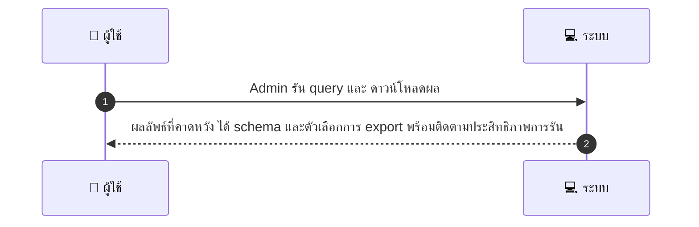
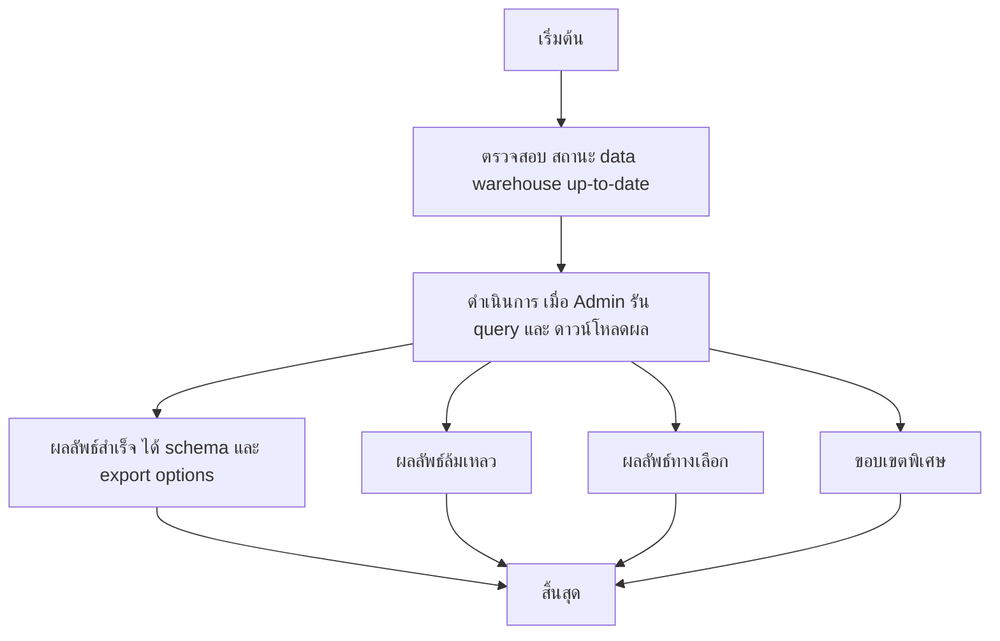

# ASYS050 - จัดการ analytics queries & ad hoc reports

## 👤 บทบาท
- ผู้ดูแลระบบ

## 🎯 เป้าหมายของเคส
- ในฐานะ Admin/Analytics
- ต้องการ รัน ad hoc queries และสร้างรายงานเฉพาะกิจสำหรับ stakeholders
- เพื่อ เพื่อสนับสนุนตัดสินใจเชิงธุรกิจ

## ⚙️ เงื่อนไขก่อนเริ่ม (Precondition)
- Data warehouse มีข้อมูล up to date

## 🧭 ผลลัพธ์และสถานการณ์
- ✅ ผลลัพธ์ที่คาดหวัง (Success Flow): ได้ผลลัพธ์พร้อมสคีมาและตัวเลือกการ export และมีการติดตามประสิทธิภาพการรัน
- ❌ ผลลัพธ์ที่ Failure:
  - การรันล้มเหลวเนื่องจากการเชื่อมต่อกับ data warehouse ล้มเหลว ทำให้ดึงข้อมูลไม่สำเร็จ
  - ข้อผิดพลาดในการประมวลผล query ภายในระบบ เช่น syntax error หรือ resource limit
  - สิทธิ์เข้าถึงข้อมูลถูกปฏิเสธ หรือ export ถูก จำกัด ตามนโยบายความปลอดภัย
  - การรันหมดเวลา timeout หรือใช้เวลาประมวลผลเกิน SLA ที่กำหนด
- 🔄 ผลลัพธ์ทางเลือก:
  - รันสำเร็จใน sandbox พร้อม schema และสามารถ export ได้ในรูปแบบ CSV, Excel หรือ JSON
  - ผลลัพธ์มี preview ก่อนการสร้างรีพอร์ต เพื่อให้ผู้ใช้งตรวจสอบก่อน export
  - รายงานเฉพาะกิจถูกสร้างเป็น snapshot พร้อม meta data สำหรับ stakeholder distribution
  - ข้อมูลถูก export ในรูปแบบที่สั้นลง (paginated) เพื่อรองรับการส่งอีเมลหรือนำไปแชท
- ⚠️ ผลลัพธ์ขอบเขตพิเศษ:
  - รันสำเร็จใน sandbox พร้อม schema และสามารถ export ได้ในรูปแบบ CSV, Excel หรือ JSON
  - ผลลัพธ์มี preview ก่อนการสร้างรีพอร์ต เพื่อให้ผู้ใช้งตรวจสอบก่อน export
  - รายงานเฉพาะกิจถูกสร้างเป็น snapshot พร้อม meta data สำหรับ stakeholder distribution
  - ข้อมูลถูก export ในรูปแบบที่สั้นลง (paginated) เพื่อรองรับการส่งอีเมลหรือนำไปแชท

## ✅ เกณฑ์การยอมรับ (Acceptance Criteria)
- Queries run in sandbox
- heavy jobs scheduled as background

## ⏱ ลำดับความสำคัญ / SLA
- Priority: P2
- SLA: ad hoc query response within 120 seconds typical

---

## 🔁 Sequence Diagram  
> แสดงลำดับเหตุการณ์ระหว่าง "ผู้ใช้" กับ "ระบบ"

---

## 🧭 Flowchart Diagram
> แสดงขั้นตอนการทำงานของระบบอย่างเข้าใจง่าย

