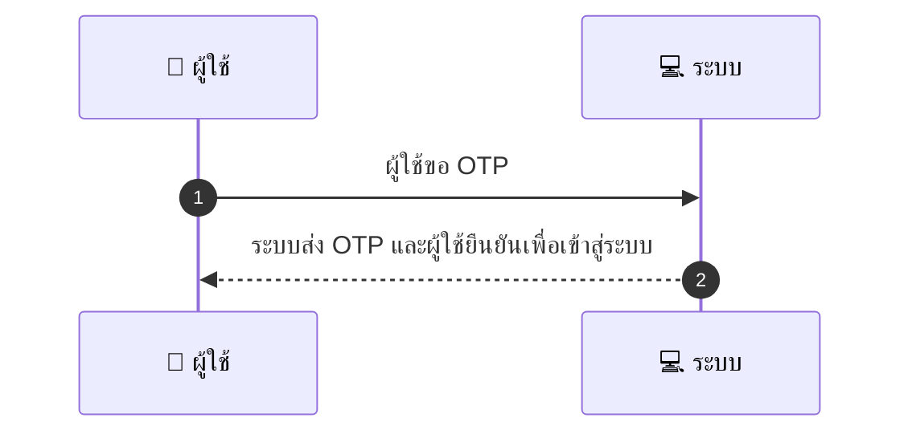
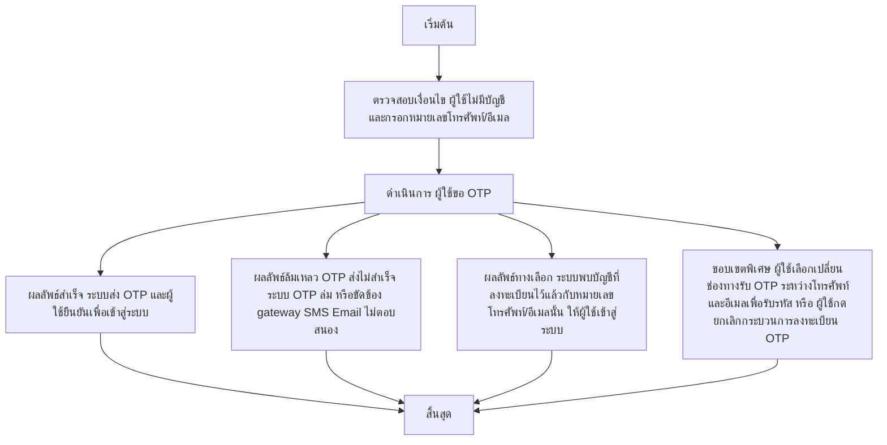

# CUS001 - Signup Customer

## 👤 บทบาท
- ลูกค้า

## 🎯 เป้าหมายของเคส
- ในฐานะ ลูกค้า
- ต้องการ ลงทะเบียน/เข้าสู่ระบบด้วยหมายเลขโทรศัพท์หรืออีเมล OTP
- เพื่อ เพื่อเริ่มจองบริการ

## ⚙️ เงื่อนไขก่อนเริ่ม (Precondition)
- ผู้ใช้ไม่มีบัญชีและกรอกหมายเลขโทรศัพท์/อีเมล

## 🧭 ผลลัพธ์และสถานการณ์
- ✅ ผลลัพธ์ที่คาดหวัง (Success Flow): ระบบส่ง OTP และผู้ใช้ยืนยันเพื่อเข้าสู่ระบบ  
- ❌ ผลลัพธ์ที่ Failure:  
  - OTP ส่งไม่สำเร็จเนื่องจากบริการ OTP ล่มหรือขัดข้อง gateway SMS Email ไม่ตอบสนอง
  - รหัส OTP ไม่ถูกต้องหรือหมดอายุเมื่อผู้ใช้กรอก
  - ไม่สามารถสร้าง/ออก JWT access/refresh token หลังยืนยัน OTP
  - ข้อผิดพลาดด้านฐานข้อมูลระหว่างบันทึกบัญชีใหม่หรือสถานะผู้ใช้งาน
- 🔄 ผลลัพธ์ทางเลือก:  
  - ระบบพบบัญชีที่ลงทะเบียนไว้แล้วกับหมายเลขโทรศัพท์/อีเมลนั้น ให้ผู้ใช้เข้าสู่ระบบแทนการลงทะเบียนใหม่
  - ผู้ใช้เลือกเปลี่ยนช่องทางรับ OTP ระหว่างโทรศัพท์และอีเมลเพื่อรับรหัส
  - ผู้ใช้กดยกเลิกกระบวนการลงทะเบียน OTP ก่อนยืนยันและสามารถกลับมาทำใหม่ได้ในภายหลัง
- ⚠️ ผลลัพธ์ขอบเขตพิเศษ:  
  - ระบบพบบัญชีที่ลงทะเบียนไว้แล้วกับหมายเลขโทรศัพท์/อีเมลนั้น ให้ผู้ใช้เข้าสู่ระบบแทนการลงทะเบียนใหม่
  - ผู้ใช้เลือกเปลี่ยนช่องทางรับ OTP ระหว่างโทรศัพท์และอีเมลเพื่อรับรหัส
  - ผู้ใช้กดยกเลิกกระบวนการลงทะเบียน OTP ก่อนยืนยันและสามารถกลับมาทำใหม่ได้ในภายหลัง

## ✅ เกณฑ์การยอมรับ (Acceptance Criteria)
- OTP ถูกสร้าง/ส่งภายใน 5s
- OTP ใช้ได้ 5 นาที
- หลังยืนยันคืน JWT access+refresh token
- ข้อความผิดพลาดชัดเจน

## ⏱ ลำดับความสำคัญ / SLA
- Priority: P0
- SLA: - OTP ส่งภายใน 5s
- SLA: - OTP expiry 5m

---

## 🔁 Sequence Diagram  
> แสดงลำดับเหตุการณ์ระหว่าง "ผู้ใช้" กับ "ระบบ"

---

## 🧭 Flowchart Diagram
> แสดงขั้นตอนการทำงานของระบบอย่างเข้าใจง่าย

