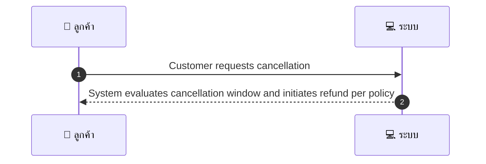
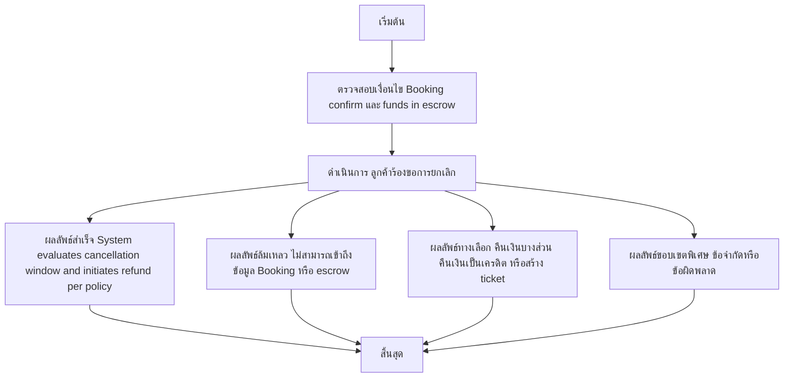

# CUS007 - Customer Cancellation after Payment per policy

## 👤 บทบาท
- ลูกค้า

## 🎯 เป้าหมายของเคส
- ในฐานะ: ลูกค้า
- ต้องการ: ยกเลิกการจองหลังชำระเงินและขอคืนเงินตาม policy
- เพื่อ: เพื่อรับเงินคืนตามเงื่อนไข

## ⚙️ เงื่อนไขก่อนเริ่ม (Precondition)
- Booking confirmed & funds in escrow

## 🧭 ผลลัพธ์และสถานการณ์
- ✅ ผลลัพธ์ที่คาดหวัง (Success Flow): System evaluates cancellation window & initiates refund auto/manual per policy
- ❌ ผลลัพธ์ที่ Failure:
  - ไม่สามารถเข้าถึงข้อมูล Booking หรือเงินทุนใน Escrow ได้ ทำให้คำนวณ/ดำเนินการคืนเงินล้มเหลว
  - การคืนเงินผ่าน Xendit ถูกปฏิเสธ/ล้มเหลว Declined/Failed ทำให้ไม่สามารถคืนเงินได้
  - ข้อมูลเงื่อนไขนโยบายคืนเงินหายหรือไม่ครบถ้วน ส่งผลให้ไม่สามารถคำนวณจำนวนเงินคืน
  - บันทึกธุรกรรมคืนเงินไม่สำเร็จหรือสูญหาย ต้องสอบทานด้วยเจ้าหน้าที่
  - ระบบแจ้งเตือนลูกค้าผิดพลาดหรือไม่ส่งข้อความยืนยันการคืนเงิน
- 🔄 ผลลัพธ์ทางเลือก:
  - คืนเงินบางส่วนตามส่วนที่ refundable เมื่อมีการหักค่าธรรมเนียมยกเลิก
  - สร้าง ticket สนับสนุนเพื่อให้ผู้ดูแลตรวจสอบด้วย Manual Review และแจ้งผลภายหลัง
  - คืนเงินเป็นเครดิตในแพลตฟอร์มแทนเงินสด/โอนเงิน
  - ลูกค้าคอนเฟิร์มรับเงินคืนผ่านวิธีอื่นที่ไม่ใช่ Xendit เช่นโอนบัญชีธนาคารโดยตรง และระบบจะบันทึก
- ⚠️ ผลลัพธ์ขอบเขตพิเศษ:
  - คืนเงินบางส่วนตามส่วนที่ refundable เมื่อมีการหักค่าธรรมเนียมยกเลิก
  - สร้าง ticket สนับสนุนเพื่อให้ผู้ดูแลตรวจสอบด้วย Manual Review และแจ้งผลภายหลัง
  - คืนเงินเป็นเครดิตในแพลตฟอร์มแทนเงินสด/โอนเงิน
  - ลูกค้าคอนเฟิร์มรับเงินคืนผ่านวิธีอื่นที่ไม่ใช่ Xendit เช่นโอนบัญชีธนาคารโดยตรง และระบบจะบันทึก

## ✅ เกณฑ์การยอมรับ (Acceptance Criteria)
- System calculates refundable amount per policy
- auto-refund if >=48h
- otherwise create support ticket
- refund initiated via Xendit and recorded
- customer notified

## ⏱ ลำดับความสำคัญ / SLA
- Priority: P0
- SLA:
  - Auto-refund trigger immediate
  - Xendit processing time applies

---

## 🔁 Sequence Diagram  
> แสดงลำดับเหตุการณ์ระหว่าง "ผู้ใช้" กับ "ระบบ"

---

## 🧭 Flowchart Diagram
> แสดงขั้นตอนการทำงานของระบบอย่างเข้าใจง่าย

