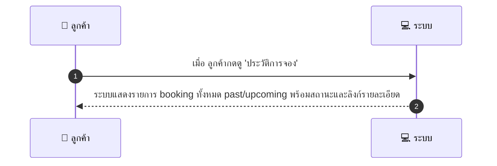
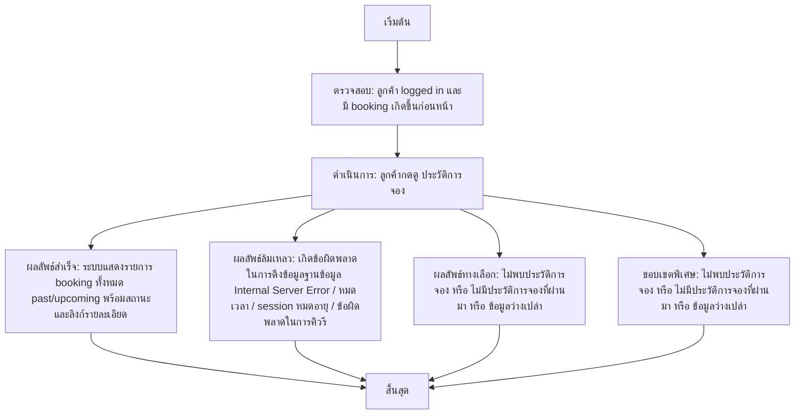

# CUS009 - ดูประวัติการจอง Booking History

## 👤 บทบาท
- ลูกค้า

## 🎯 เป้าหมายของเคส
- ในฐานะ ลูกค้า
- ต้องการ ดูประวัติการจองทั้งหมด
- เพื่อ เห็น booking ที่ผ่านมา/กำลังจะมาถึง

## ⚙️ เงื่อนไขก่อนเริ่ม (Precondition)
- ลูกค้า logged in และมี booking เกิดขึ้นก่อนหน้า

## 🧭 ผลลัพธ์และสถานการณ์
- ✅ ผลลัพธ์ที่คาดหวัง (Success Flow): ระบบแสดงรายการ booking ทั้งหมด past/upcoming พร้อมสถานะและลิงก์รายละเอียด
- ❌ ผลลัพธ์ที่ Failure:
  - เกิดข้อผิดพลาดในการดึงข้อมูลประวัติการจองจากฐานข้อมูล Internal Server Error
  - หมดเวลาการตอบสนองจากเซิร์ฟเวอร์ ทำให้โหลดรายการจองไม่สำเร็จ
  - ข้อผิดพลาดในการตรวจสอบสถานะผู้ใช้งาน session หมดอายุ/ไม่ authenticated ทำให้เรียกดูประวัติไม่สำเร็จ
  - ข้อผิดพลาดในการคิวรีข้อมูลจากระบบ booking
- 🔄 ผลลัพธ์ทางเลือก:
  - ไม่พบประวัติการจองสำหรับผู้ใช้งานนี้
  - ไม่มีประวัติการจองที่ผ่านมาในช่วงเวลาที่เลือก
  - ระบบแสดงพฤติกรรมข้อมูลว่างเปล่าเมื่อไม่มี booking
- ⚠️ ผลลัพธ์ขอบเขตพิเศษ:
  - ไม่พบประวัติการจองสำหรับผู้ใช้งานนี้
  - ไม่มีประวัติการจองที่ผ่านมาในช่วงเวลาที่เลือก
  - ระบบแสดงพฤติกรรมข้อมูลว่างเปล่าเมื่อไม่มี booking

## ✅ เกณฑ์การยอมรับ (Acceptance Criteria)
- แสดง booking_id, วันที่, ผู้ให้บริการ, สถานะ, ยอดเงิน
- pagination
- response 2s typical

## ⏱ ลำดับความสำคัญ / SLA
- Priority: P0
- SLA: response 2s

---

## 🔁 Sequence Diagram  
> แสดงลำดับเหตุการณ์ระหว่าง "ผู้ใช้" กับ "ระบบ"

---

## 🧭 Flowchart Diagram
> แสดงขั้นตอนการทำงานของระบบอย่างเข้าใจง่าย

