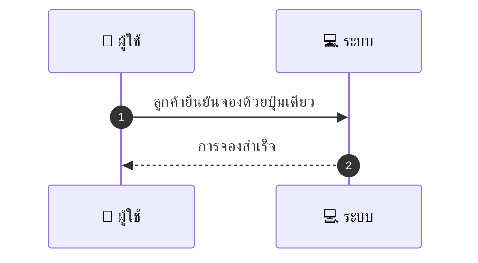
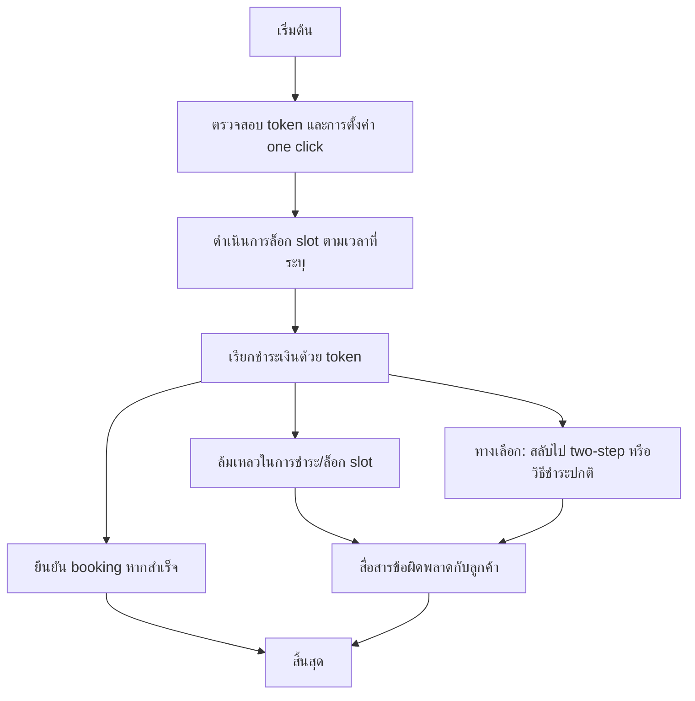

# CUS013 - จองแบบ one-click สำหรับ saved method One-click booking

## 👤 บทบาท
- ลูกค้า

## 🎯 เป้าหมายของเคส
- ในฐานะ ลูกค้า
- ต้องการ จองด้วยปุ่มเดียวโดยใช้ saved payment token
- เพื่อ เร่งกระบวนการจอง

## ⚙️ เงื่อนไขก่อนเริ่ม (Precondition)
- ลูกค้ามี saved payment token และเลือก one-click booking

## 🧭 ผลลัพธ์และสถานการณ์
- ✅ ผลลัพธ์ที่คาดหวัง (Success Flow): ระบบล็อก slot เรียกชำระเงิน token และยืนยัน booking หากสำเร็จ
- ❌ ผลลัพธ์ที่ Failure:
  - ไม่สามารถล็อก slot ตามเวลาที่ระบุ เนื่องจากทรัพยากรถถูกจองไปก่อน
  - การชำระด้วย token ล้มเหลว ธนาคารปฏิเสธ token หรือ token หมดอายุ
  - ข้อผิดพลาดระบบระหว่างการเรียกชำระเงิน/ล็อก slot ทำให้กระบวนการล้มเหลว
  - Timeout ระหว่างขั้นตอนล็อกและชำระ ทำให้ไม่สามารถยืนยันการจองได้
- 🔄 ผลลัพธ์ทางเลือก:
  - ลูกค้ายกเลิกจองด้วยตนเองระหว่างขั้นตอน one-click
  - ระบบสลับไปจองแบบ two-step หรือวิธีชำระแบบปกติเมื่อ one-click ไม่สำเร็จ
  - Token ยังไม่พร้อมใช้งาน ต้องรอจน token พร้อมใช้งาน แล้วจองใหม่
- ⚠️ ผลลัพธ์ขอบเขตพิเศษ:
  - ลูกค้ายกเลิกจองด้วยตนเองระหว่างขั้นตอน one-click
  - ระบบสลับไปจองแบบ two-step หรือวิธีชำระแบบปกติเมื่อ one-click ไม่สำเร็จ
  - Token ยังไม่พร้อมใช้งาน ต้องรอจน token พร้อมใช้งาน แล้วจองใหม่

## ✅ เกณฑ์การยอมรับ (Acceptance Criteria)
- Lock/charge atomic
- UX แจ้งเวลา lock remaining
- failure flows แจ้งชัดเจน

## ⏱ ลำดับความสำคัญ / SLA
- Priority: P0
- SLA: lock op 1s, payment 5s

---

## 🔁 Sequence Diagram  
> แสดงลำดับเหตุการณ์ระหว่าง "ผู้ใช้" กับ "ระบบ"

---

## 🧭 Flowchart Diagram
> แสดงขั้นตอนการทำงานของระบบอย่างเข้าใจง่าย

