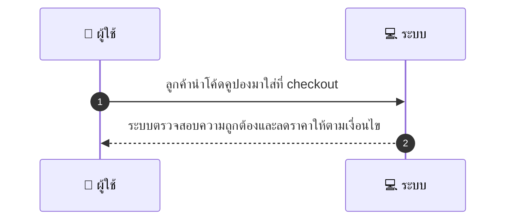
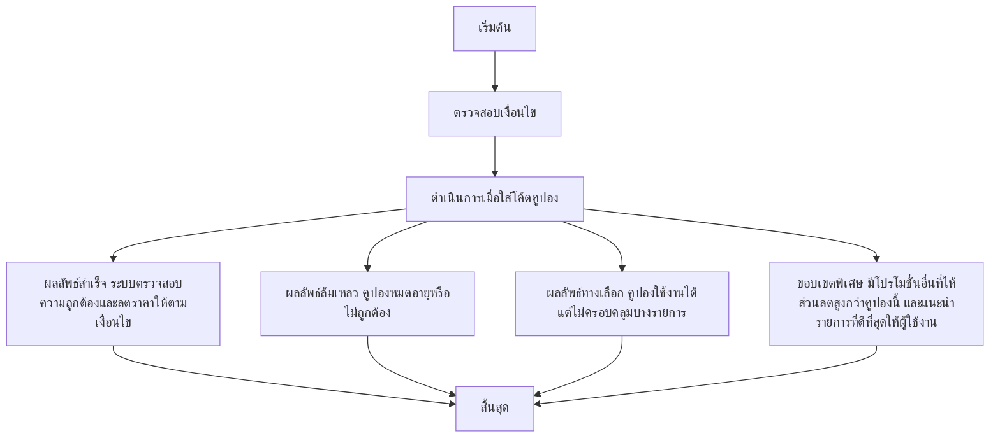

# CUS016 - ใช้คูปองที่มี Apply Coupon at Checkout

## 👤 บทบาท
- ลูกค้า

## 🎯 เป้าหมายของเคส
- ในฐานะ: ลูกค้า
- ต้องการ: ใส่โค้ดคูปองที่ checkout
- เพื่อ: เพื่อรับส่วนลดตามเงื่อนไข

## ⚙️ เงื่อนไขก่อนเริ่ม (Precondition)
- ลูกค้ามีคูปองที่ใช้งานได้

## 🧭 ผลลัพธ์และสถานการณ์
- ✅ ผลลัพธ์ที่คาดหวัง (Success Flow): ระบบตรวจสอบความถูกต้องและลดราคาให้ตามเงื่อนไข  
- ❌ ผลลัพธ์ที่ Failure:  
  - คูปองหมดอายุหรือไม่ถูกต้อง
  - รหัสคูปองไม่พบในระบบ
  - คูปองไม่สามารถใช้งานกับรายการสินค้าในตะกร้า
  - ยอดซื้อไม่ถึงขั้นต่ำที่กำหนด min_spend
  - คูปองถูกใช้งานไปแล้ว usage_limit
  - ข้อผิดพลาดภายในระบบขณะตรวจสอบคูปอง
- 🔄 ผลลัพธ์ทางเลือก:  
  - คูปองใช้งานได้ แต่ส่วนลดจำกัดเฉพาะบางรายการในตะกร้า
  - คูปองใช้งานได้ แต่ไม่ครอบคลุมสินค้าบางประเภท/บริการที่เลือก
  - มีโปรโมชั่นอื่นที่ให้ส่วนลดสูงกว่าคูปองนี้ และระบบแนะนำรายการที่ดีที่สุดให้ผู้ใช้งาน
- ⚠️ ผลลัพธ์ขอบเขตพิเศษ:  
  - คูปองใช้งานได้ แต่ส่วนลดจำกัดเฉพาะบางรายการในตะกร้า
  - คูปองใช้งานได้ แต่ไม่ครอบคลุมสินค้าบางประเภท/บริการที่เลือก
  - มีโปรโมชั่นอื่นที่ให้ส่วนลดสูงกว่าคูปองนี้ และระบบแนะนำรายการที่ดีที่สุดให้ผู้ใช้งาน

## ✅ เกณฑ์การยอมรับ (Acceptance Criteria)
- ตรวจสอบกฎ min_spend ใช้ได้กับบริการผู้ให้บริการที่ระบุ ช่วงเวลาที่คูปองใช้งานได้ และจำนวนครั้งการใช้งาน
- แสดงยอดเงินที่อัปเดตแล้ว
- ปลอดภัยในการใช้งานพร้อมกัน (concurrency-safe)

## ⏱ ลำดับความสำคัญ / SLA
- Priority: P0
- SLA: validation 1s

---

## 🔁 Sequence Diagram  
> แสดงลำดับเหตุการณ์ระหว่าง "ผู้ใช้" กับ "ระบบ"

---

## 🧭 Flowchart Diagram
> แสดงขั้นตอนการทำงานของระบบอย่างเข้าใจง่าย

