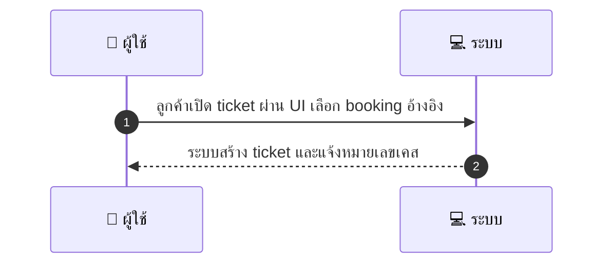
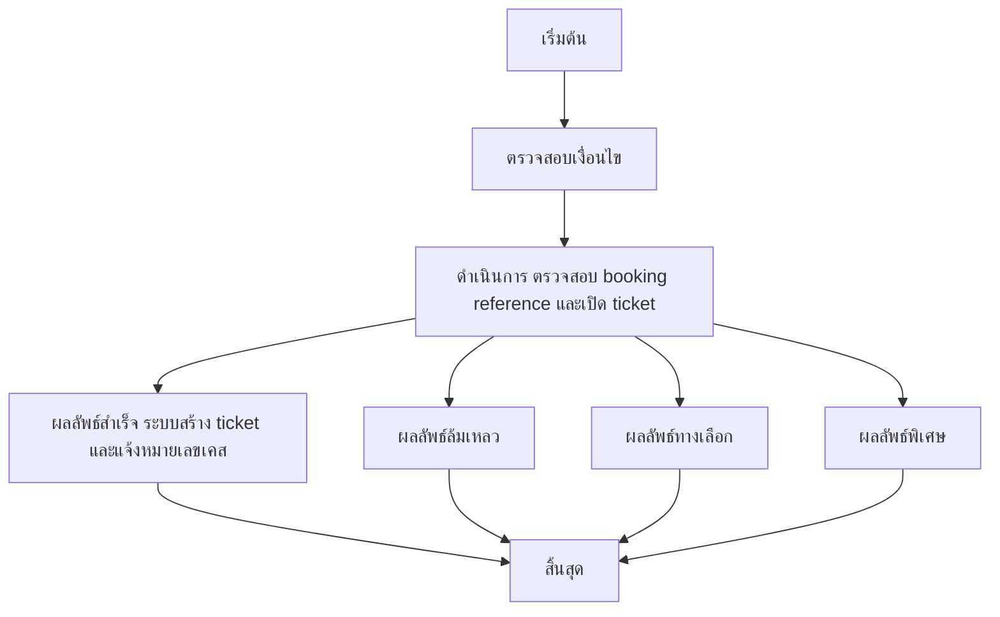

# CUS031 - เปิด ticket/ติดต่อ support Support Ticket

## 👤 บทบาท
- ลูกค้า

## 🎯 เป้าหมายของเคส
- ในฐานะ: ลูกค้า
- ต้องการ: เปิด ticket ในกรณีมีปัญหา booking/payment
- เพื่อ: เพื่อให้ support ช่วยแก้ไขปัญหา

## ⚙️ เงื่อนไขก่อนเริ่ม (Precondition)
- ลูกค้ามีปัญหาหรือข้อร้องเรียนเกี่ยวกับ booking/payment

## 🧭 ผลลัพธ์และสถานการณ์
- ✅ ผลลัพธ์ที่คาดหวัง (Success Flow): ระบบสร้าง ticket และมอบหมายให้กับคิวสนับสนุน พร้อมแจ้งหมายเลข case
- ❌ ผลลัพธ์ที่ Failure:
  - ระบบล้มเหลวในการสร้าง ticket DB/API ล่ม ทำให้ไม่สามารถบันทึกข้อมูลได้
  - Booking reference ไม่ถูกต้อง/ไม่พบในระบบ ทำให้ไม่สามารถเปิด ticket ได้
  - ไฟล์แนบมีขนาดเกินกำหนดหรือชนิดไฟล์ไม่รองรับ ทำให้การบันทึกข้อมูลล้มเหลว
  - ไม่สามารถจัดสรร ticket ไปยังคิวสนับสนุนได้เนื่องจากคิวว่างหมดหรือสิทธิ์ผู้ใช้งานไม่เพียงพอ
- 🔄 ผลลัพธ์ทางเลือก:
  - ลูกค้ายกเลิกการเปิด ticket ระหว่างขั้นตอนกรอกข้อมูล
  - ระบบสร้าง ticket สำเร็จแต่มอบหมายไปยังทีมสนับสนุนที่ต่างจากที่ร้องขอ โดยมี fallback queue พร้อมแจ้งลูกค้า
  - ลูกค้าสามารถอัปโหลดเอกสารเพิ่มภายหลังเปิด ticket เพื่อสนับสนุนการแก้ไข
  - การยืนยันรับทราบ ack ล่าช้าเกิน SLA เนื่องจากปัญหาการส่งข้อความแจ้งเตือน
- ⚠️ ผลลัพธ์ขอบเขตพิเศษ:
  - ลูกค้ายกเลิกการเปิด ticket ระหว่างขั้นตอนกรอกข้อมูล
  - ระบบสร้าง ticket สำเร็จแต่มอบหมายไปยังทีมสนับสนุนที่ต่างจากที่ร้องขอ โดยมี fallback queue พร้อมแจ้งลูกค้า
  - ลูกค้าสามารถอัปโหลดเอกสารเพิ่มภายหลังเปิด ticket เพื่อสนับสนุนการแก้ไข
  - ack ล่าช้าเกิน SLA เนื่องจากปัญหาการส่งข้อความแจ้งเตือน

## ✅ เกณฑ์การยอมรับ (Acceptance Criteria)
- Ticket ประกอบด้วย booking ref และไฟล์แนบ
- ack ถึงลูกค้าภายใน SLA
- ติดตามระยะเวลาการแก้ไข

## ⏱ ลำดับความสำคัญ / SLA
- Priority: P0
- SLA: initial ack 24h

---

## 🔁 Sequence Diagram  
> แสดงลำดับเหตุการณ์ระหว่าง "ผู้ใช้" กับ "ระบบ"

---

## 🧭 Flowchart Diagram
> แสดงขั้นตอนการทำงานของระบบอย่างเข้าใจง่าย

