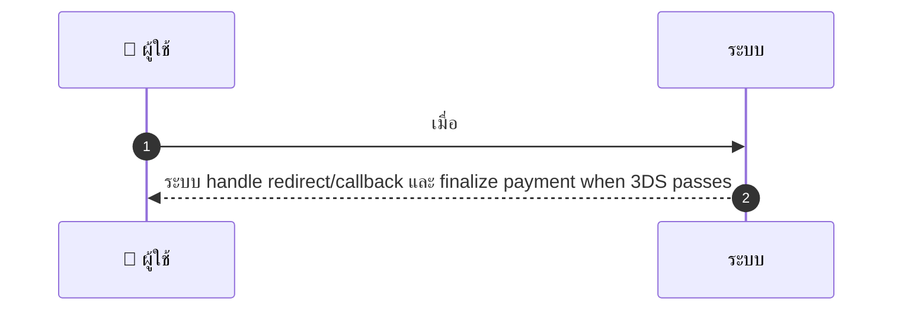
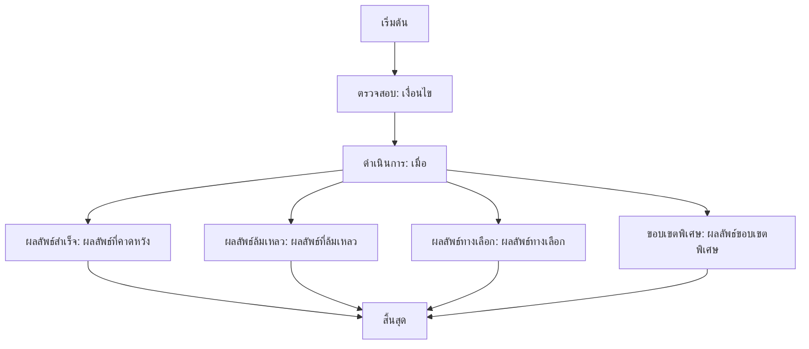

# CUS040 - ใช้ credit card 3D Secure flows Card Auth & Challenge

## 👤 บทบาท
- ลูกค้า

## 🎯 เป้าหมายของเคส
- ในฐานะ ลูกค้า
- ต้องการ รองรับการชำระบัตรที่ต้องทำ 3DS
- เพื่อ ความปลอดภัยและ compliance

## ⚙️ เงื่อนไขก่อนเริ่ม (Precondition)
- ลูกค้าชำระด้วยบัตรที่ต้องทำ 3DS

## 🧭 ผลลัพธ์และสถานการณ์
- ✅ ผลลัพธ์ที่คาดหวัง (Success Flow): ระบบ handle redirect/callback และ finalize payment when 3DS passes
- ❌ ผลลัพธ์ที่ Failure:  
  - 3DS authentication ล้มเหลวโดย issuer ไม่อนุมัติการชำระ
  - การท้าทาย challenge ล้มเหลวหรือถูกปฏิเสธโดยระบบธนาคาร
  - หมดเวลาช่องทาง redirect/iframe ระหว่างกระบวนการ 3DS
  - เครือข่ายล้มเหลวระหว่างเรียกธนาคาร/Payment gateway
  - ข้อมูลบัตรไม่ถูกต้องหรือไม่รองรับ 3DS
  - ผู้ใช้ยกเลิกการชำระระหว่างขั้นตอน 3DS
- 🔄 ผลลัพธ์ทางเลือก:  
  - 3DS แบบ frictionless ที่ issuer อนุมัติผ่าน without กระบวนการท้าทาย payment สำเร็จ
  - ผู้ใช้เลือกชำระด้วยวิธีอื่น เช่น e-wallet, bank transfer เมื่อ 3DS ไม่พร้อม/ไม่จำเป็น
  - OTP/Push-based 3DS ผ่านแอปธนาคารแล้วการชำระสำเร็จ
- ⚠️ ผลลัพธ์ขอบเขตพิเศษ:  
  - 3DS แบบ frictionless ที่ issuer อนุมัติผ่าน without กระบวนการท้าทาย payment สำเร็จ
  - ผู้ใช้เลือกชำระด้วยวิธีอื่น เช่น e-wallet, bank transfer เมื่อ 3DS ไม่พร้อม/ไม่จำเป็น
  - OTP/Push-based 3DS ผ่านแอปธนาคารแล้วการชำระสำเร็จ

## ✅ เกณฑ์การยอมรับ (Acceptance Criteria)
- Handle success/fail/challenge timeout
- user friendly error and retry options

## ⏱ ลำดับความสำคัญ / SLA
- Priority: P0
- SLA: challenge handling less than 2m

---

## 🔁 Sequence Diagram  
> แสดงลำดับเหตุการณ์ระหว่าง "ผู้ใช้" กับ "ระบบ"

---

## 🧭 Flowchart Diagram
> แสดงขั้นตอนการทำงานของระบบอย่างเข้าใจง่าย

