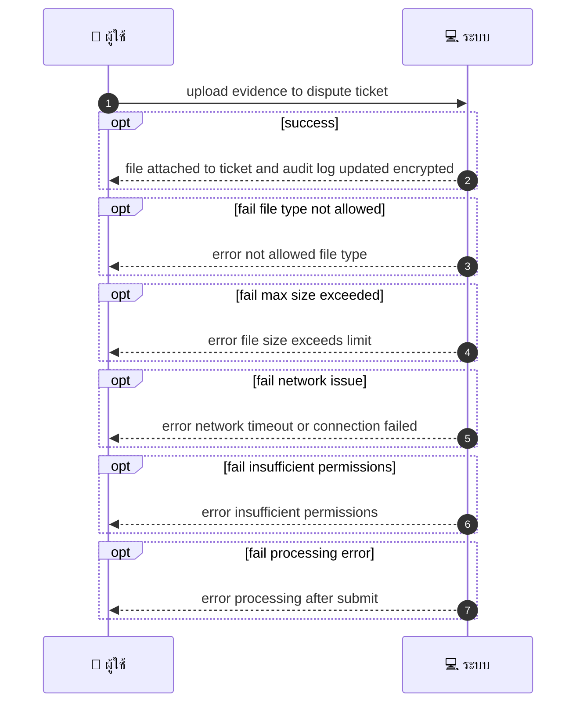
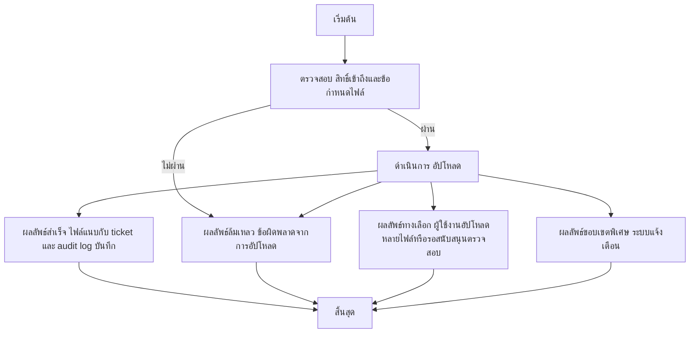

# CUS049 - ขอส่งภาพ/เอกสารหลังการบริการ Upload Evidence for Dispute

## 👤 บทบาท
- ลูกค้า

## 🎯 เป้าหมายของเคส
- ในฐานะ: ลูกค้า
- ต้องการ: อัปโหลดหลักฐานเมื่อเปิด dispute
- เพื่อ: เพื่อสนับสนุนการพิจารณา dispute

## ⚙️ เงื่อนไขก่อนเริ่ม (Precondition)
- ลูกค้ามีข้อพิพาท/ปัญหาและต้องการแนบหลักฐาน

## 🧭 ผลลัพธ์และสถานการณ์
- ✅ ผลลัพธ์ที่คาดหวัง (Success Flow): ไฟล์ถูกแนบกับ ticket และเก็บใน audit log (เข้ารหัส)
- ❌ ผลลัพธ์ที่ Failure:  
  - ไม่สามารถอัปโหลดไฟล์ได้เนื่องจากประเภทไฟล์ไม่อนุญาต
  - ขนาดไฟล์เกินข้อกำหนดสูงสุด
  - การเชื่อมต่อเครือข่ายล้มเหลวระหว่างการอัปโหลด
  - สิทธิ์เข้าถึงของผู้ใช้ไม่เพียงพอสำหรับแนบไฟล์
  - ระบบประมวลผลล้มเหลวหลังจากการส่งไฟล์
- 🔄 ผลลัพธ์ทางเลือก:  
  - ผู้ใช้งานเลือกอัปโหลดไฟล์หลายไฟล์จนกว่าจะครบถ้วน
  - ผู้ใช้งานยกเลิกการอัปโหลดและรอให้ฝ่ายสนับสนุนตรวจสอบก่อนอัปโหลดใหม่
  - ไฟล์ถูกแนบเรียบร้อยแต่สถานะ dispute ยังไม่อัปเดตแจ้งผู้ใช้งาน
  - แนบไฟล์อื่นในภายหลังเพื่อประกอบหลักฐานเพิ่มเติม
  - ระบบแจ้งเตือนว่าฟайлแนบไม่ครบถ้วนหรือมีข้อมูลบางส่วนขัดข้อง
- ⚠️ ผลลัพธ์ขอบเขตพิเศษ:  
  - ผู้ใช้งานเลือกอัปโหลดไฟล์หลายไฟล์จนกว่าจะครบถ้วน
  - ผู้ใช้งานยกเลิกการอัปโหลดและรอให้ฝ่ายสนับสนุนตรวจสอบก่อนอัปโหลดใหม่
  - ไฟล์ถูกแนบเรียบร้อยแต่สถานะ dispute ยังไม่อัปเดตแจ้งผู้ใช้งาน
  - แนบไฟล์อื่นในภายหลังเพื่อประกอบหลักฐานเพิ่มเติม
  - ระบบแจ้งเตือนว่าฟайлแนบไม่ครบถ้วนหรือมีข้อมูลบางส่วนขัดข้อง

## ✅ เกณฑ์การยอมรับ (Acceptance Criteria)
- File type limits, max size, admin access, PDPA handling

## ⏱ ลำดับความสำคัญ / SLA
- Priority: P0
- SLA: upload <30s

---

## 🔁 Sequence Diagram  
> แสดงลำดับเหตุการณ์ระหว่าง "ผู้ใช้" กับ "ระบบ"

---

## 🧭 Flowchart Diagram
> แสดงขั้นตอนการทำงานของระบบอย่างเข้าใจง่าย

