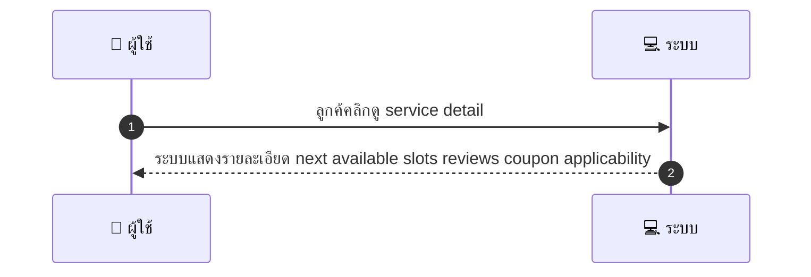
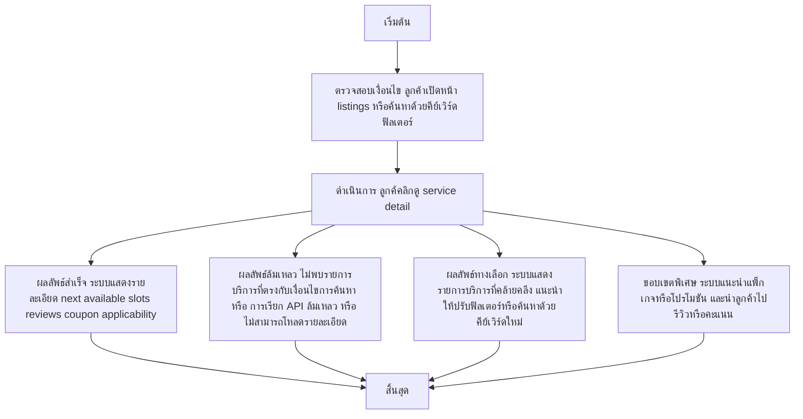

# CUS002 - Search & View Service

## 👤 บทบาท
- ลูกค้า

## 🎯 เป้าหมายของเคส
- ในฐานะ: ลูกค้า
- ต้องการ: ค้นหาและดูรายละเอียดบริการ รวม coupon applicability และ slots
- เพื่อ: เพื่อเปรียบเทียบและตัดสินใจจอง

## ⚙️ เงื่อนไขก่อนเริ่ม (Precondition)
- เงื่อนไข: ลูกค้าเปิดหน้า listings หรือค้นหาด้วยคีย์เวิร์ด/ฟิลเตอร์

## 🧭 ผลลัพธ์และสถานการณ์
- ✅ ผลลัพธ์ที่คาดหวัง (Success Flow): ระบบแสดงรายละเอียด next available slots reviews coupon applicability
- ❌ ผลลัพธ์ที่ Failure:  
  - ไม่พบรายการบริการที่ตรงกับเงื่อนไขการค้นหา
  - การเรียก API ค้นหาล้มเหลว network time-out
  - ไม่สามารถโหลดรายละเอียดบริการเมื่อคลิกดู service detail
  - ข้อมูล coupon applicability ไม่สามารถดึงมาจากระบบ
- 🔄 ผลลัพธ์ทางเลือก:  
  - ระบบแสดงรายการบริการที่คล้ายคลึงแนะนำบริการใกล้เคียงเพื่อเปรียบเทียบ
  - แนะนำให้ปรับฟิลเตอร์หรือค้นหาด้วยคีย์เวิร์ดใหม่เพื่อผลลัพธ์ที่ตรงขึ้น
  - ระบบนำลูกค้าไปยังหน้ารีวิวหรือคะแนนโดยรวมก่อนตัดสินใจจอง
  - ระบบเสนอแพ็กเกจหรือโปรโมชันที่เกี่ยวข้องกับบริการที่ดู
- ⚠️ ผลลัพธ์ขอบเขตพิเศษ:  
  - ระบบแสดงรายการบริการที่คล้ายคลึงแนะนำบริการใกล้เคียงเพื่อเปรียบเทียบ
  - แนะนำให้ปรับฟิลเตอร์หรือค้นหาด้วยคีย์เวิร์ดใหม่เพื่อผลลัพธ์ที่ตรงขึ้น
  - ระบบนำลูกค้าไปยังหน้ารีวิวหรือคะแนนโดยรวมก่อนตัดสินใจจอง
  - ระบบเสนอแพ็กเกจหรือโปรโมชันที่เกี่ยวข้องกับบริการที่ดู

## ✅ เกณฑ์การยอมรับ (Acceptance Criteria)
- Search response 1s cached
- slots shown in Asia Bangkok
- coupon applicability indicator present

## ⏱ ลำดับความสำคัญ / SLA
- Priority: P1
- SLA: Search 1s cached

---

## 🔁 Sequence Diagram  
> แสดงลำดับเหตุการณ์ระหว่าง "ผู้ใช้" กับ "ระบบ"

---

## 🧭 Flowchart Diagram
> แสดงขั้นตอนการทำงานของระบบอย่างเข้าใจง่าย

