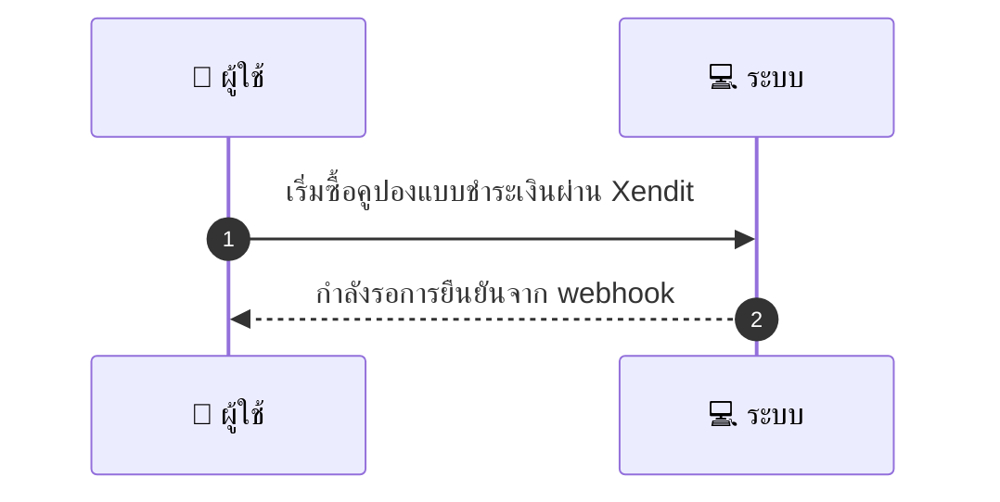
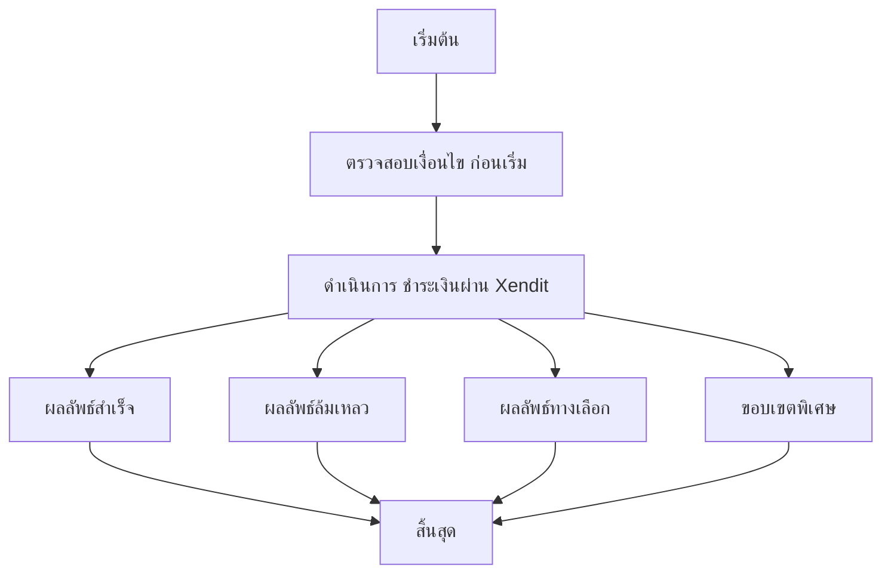

# CUS003 - Purchase Coupon Paid Voucher

## 👤 บทบาท
- ลูกค้า

## 🎯 เป้าหมายของเคส
- ในฐานะ ลูกค้า
- ต้องการ ซื้อคูปองแบบชำระเงินและเก็บไว้ในบัญชี
- เพื่อ เพื่อใช้งานในอนาคต

## ⚙️ เงื่อนไขก่อนเริ่ม (Precondition)
- ลูกค้า เลือก paid voucher และดำเนินการชำระ

## 🧭 ผลลัพธ์และสถานการณ์
- ✅ ผลลัพธ์ที่คาดหวัง (Success Flow): เมื่อ webhook ยืนยันความสำเร็จ ระบบมอบ voucher ให้ลูกค้า
- ❌ ผลลัพธ์ที่ Failure:
  - การชำระเงินล้มเหลผ่าน Xendit ลูกค้ากดซื้อ paid voucher แล้วถูกปฏิเสธหรือหมดเวลาในขั้นตอนชำระ เงิน ทำให้ไม่มีการมอบคูปอง และสถานะคำสั่งถูกบันทึกว่า ชำระเงินล้มเหลว
  - Webhook ยืนยันความสำเร็จล้มเหลวหรือไม่ครบถ้วน: ระบบรอ webhook แล้วไม่ยืนยันภายใน SLA หรือ webhook ถูกปฏิเสธ/ผิดรูปแบบ ทำให้ไม่มอบคูปองและต้องแจ้งเหตุขัดข้อง
  - หมดสต็อกคูปองแบบชำระเงินระหว่างดำเนินการ: ลูกค้าชำระเงินเรียบร้อยแล้วแต่โควต้าหมดก่อนการมอบคูปอง ทำให้ไม่สามารถมอบคูปองได้
  - ข้อผิดพลาดภายในระบบระหว่างมอบคูปอง เช่น ฐานข้อมูลล้มเหลว service error: คำสั่งถูกตั้งสถานะล้มเหลวและต้องมีการแก้ไขเรียกคืนจากเจ้าหน้าที่
- 🔄 ผลลัพธ์ทางเลือก:  
- ⚠️ ผลลัพธ์ขอบเขตพิเศษ:  
- ✅ เกณฑ์การยอมรับ (Acceptance Criteria)
  - Payment initiated within 5s
  - webhook validated idempotently
  - voucher assigned within 5s of webhook
  - confirmation notification sent

## ⏱ ลำดับความสำคัญ / SLA
- Priority: P1
- SLA: Webhook process 5s, retries up to 5

---

## 🔁 Sequence Diagram  
> แสดงลำดับเหตุการณ์ระหว่าง "ผู้ใช้" กับ "ระบบ"

---

## 🧭 Flowchart Diagram
> แสดงขั้นตอนการทำงานของระบบอย่างเข้าใจง่าย

