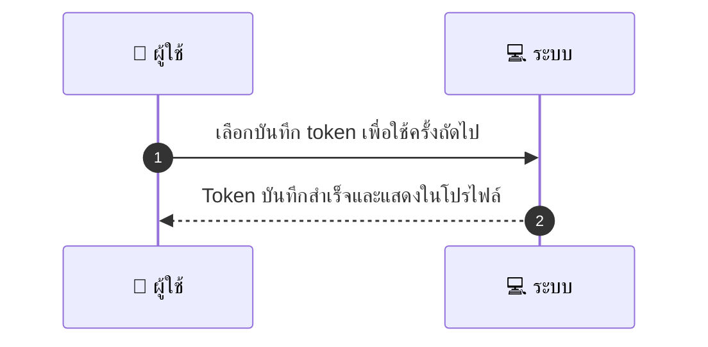
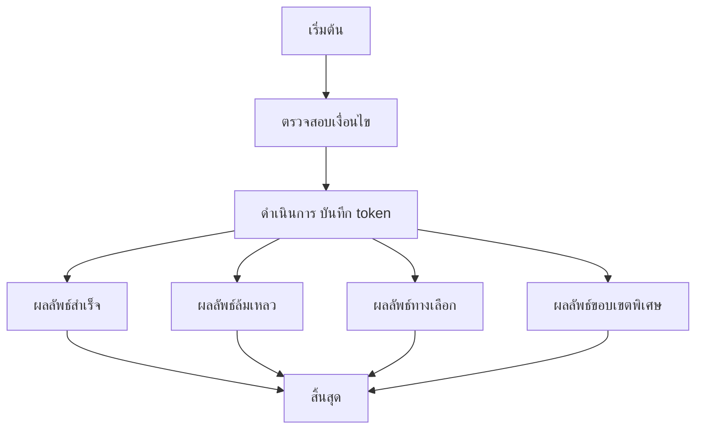

# CUS012 - เก็บบัตร/ช่องทางชำระเงิน Save Payment Method

## 👤 บทบาท
- ลูกค้า

## 🎯 เป้าหมายของเคส
- ในฐานะ ลูกค้า
- ต้องการ บันทึกช่องทางชำระผ่าน Xendit token
- เพื่อ ชำระแบบสะดวกครั้งถัดไป

## ⚙️ เงื่อนไขก่อนเริ่ม (Precondition)
- ลูกค้าชำระผ่าน Xendit และเลือกบันทึกบัตร/ewallet token

## 🧭 ผลลัพธ์และสถานการณ์
- ✅ ผลลัพธ์ที่คาดหวัง (Success Flow): ระบบเก็บ token ไม่เก็บเลขบัตร ผ่าน Xendit vault และแสดงในโปรไฟล์
- ❌ ผลลัพธ์ที่ Failure:
  - ล้มเหลว ไม่สามารถติดต่อ Xendit Vault API ระหว่างการบันทึก token network/timeout
  - ล้มเหลว token ที่ได้รับจาก Xendit ไม่ถูกต้องหรือหมดอายุ ทำให้ไม่สามารถบันทึกได้
  - ล้มเหลว ขั้นตอนเข้ารหัส token ล้มเหลว ทำให้ไม่สามารถเก็บ token อย่างปลอดภัย
- 🔄 ผลลัพธ์ทางเลือก:
  - ทางเลือก ผู้ใช้ยกเลิกการบันทึก token หลังจากยืนยันชำระ ระบบจะไม่เก็บ token และใช้วิธีชำระเดิมในอนาคต
  - ทางเลือก บันทึก token สำเร็จ แต่ไม่แสดงในโปรไฟล์ทันที ต้องทำการรีเฟรชหน้าเพื่อให้เห็น
  - ทางเลือก บันทึกเฉพาะบางช่องทาง ตามนโยบาย พร้อมให้เลือกเพิ่มช่องทางในภายหลัง
- ⚠️ ผลลัพธ์ขอบเขตพิเศษ:
  - ทางเลือก ผู้ใช้ยกเลิกการบันทึก token หลังจากยืนยันชำระ ระบบจะไม่เก็บ token และใช้วิธีชำระเดิมในอนาคต
  - ทางเลือก บันทึก token สำเร็จ แต่ไม่แสดงในโปรไฟล์ทันที ต้องทำการรีเฟรชหน้าเพื่อให้เห็น
  - ทางเลือก บันทึกเฉพาะบางช่องทาง ตามนโยบาย พร้อมให้เลือกเพิ่มช่องทางในภายหลัง

## ✅ เกณฑ์การยอมรับ (Acceptance Criteria)
- Token เก็บอย่างปลอดภัย encrypted สามารถลบได้จาก UI

## ⏱ ลำดับความสำคัญ / SLA
- Priority: P1
- SLA: token save 5s

---

## 🔁 Sequence Diagram  
> แสดงลำดับเหตุการณ์ระหว่าง "ผู้ใช้" กับ "ระบบ"

---

## 🧭 Flowchart Diagram
> แสดงขั้นตอนการทำงานของระบบอย่างเข้าใจง่าย

