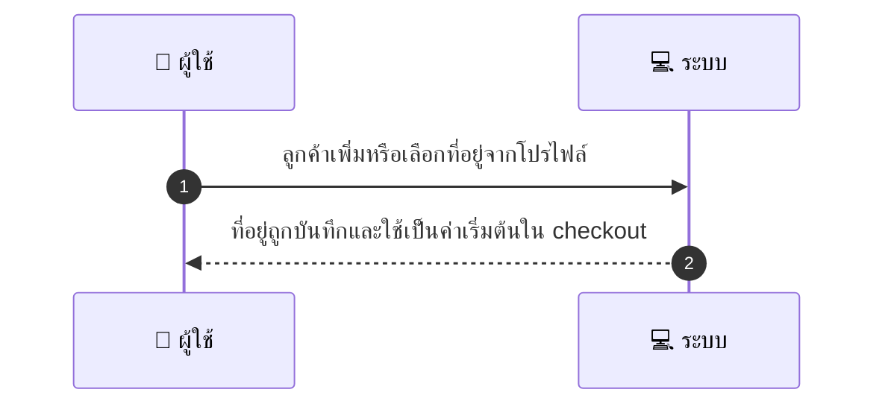
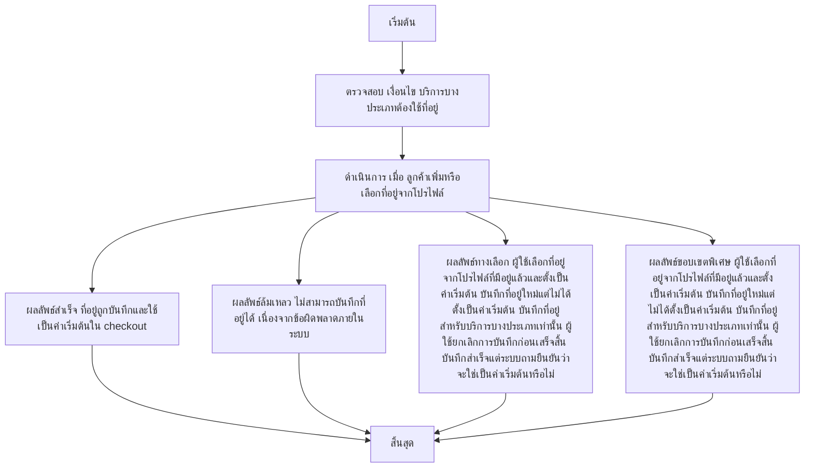

# CUS014 - บันทึกที่อยู่/สถานที่ให้บริการ Save Service Location

## 👤 บทบาท
- ลูกค้า

## 🎯 เป้าหมายของเคส
- ในฐานะ ลูกค้า
- ต้องการ บันทึกที่อยู่สำหรับบริการส่งถึงบ้าน
- เพื่อ เพื่อใช้เป็นค่าเริ่มต้นใน checkout

## ⚙️ เงื่อนไขก่อนเริ่ม (Precondition)
- บริการบางประเภทต้องใช้ที่อยู่

## 🧭 ผลลัพธ์และสถานการณ์
- ✅ ผลลัพธ์ที่คาดหวัง (Success Flow): ที่อยู่ถูกบันทึกและใช้เป็นค่าเริ่มต้นใน checkout  
- ❌ ผลลัพธ์ที่ Failure:  
  - ไม่สามารถบันทึกที่อยู่ได้ เนื่องจากข้อผิดพลาดภายในระบบ  
  - ข้อมูลที่อยู่ไม่ครบถ้วนหรือไม่ถูกต้อง ถนนบ้านเลขที่รหัสไปรษณีย์หรือตำบลไม่ครบ  
  - รหัสไปรษณีย์หรือเขตรายการไม่ผ่านการตรวจสอบ  
  - การเชื่อมต่อเครือข่ายล้มเหลวระหว่างบันทึกที่อยู่  
  - ที่อยู่ซ้ำกับรายการที่มีอยู่ในโปรไฟล์และระบบไม่อนุญาตให้บันทึกซ้ำ  
- 🔄 ผลลัพธ์ทางเลือก:  
  - ผู้ใช้เลือกที่อยู่จากโปรไฟล์ที่มีอยู่แล้วและตั้งเป็นค่าเริ่มต้น  
  - บันทึกที่อยู่ใหม่แต่ไม่ได้ตั้งเป็นค่าเริ่มต้น (สถานะเป็นแค่ถูกบันทึก)  
  - บันทึกที่อยู่สำหรับบริการบางประเภทเท่านั้น ไม่ใช่สำหรับทุกประเภทการส่ง  
  - ผู้ใช้ยกเลิกการบันทึกก่อนเสร็จสิ้น กระบวนการหยุดชั่วคราว  
  - บันทึกสำเร็จแต่ระบบถามยืนยันว่าจะใช่เป็นค่าเริ่มต้นหรือไม่  
- ⚠️ ผลลัพธ์ขอบเขตพิเศษ:  
  - ผู้ใช้เลือกที่อยู่จากโปรไฟล์ที่มีอยู่แล้วและตั้งเป็นค่าเริ่มต้น  
  - บันทึกที่อยู่ใหม่แต่ไม่ได้ตั้งเป็นค่าเริ่มต้น (สถานะเป็นแค่ถูกบันทึก)  
  - บันทึกที่อยู่สำหรับบริการบางประเภทเท่านั้น ไม่ใช่สำหรับทุกประเภทการส่ง  
  - ผู้ใช้ยกเลิกการบันทึกก่อนเสร็จสิ้น กระบวนการหยุดชั่วคราว  
  - บันทึกสำเร็จแต่ระบบถามยืนยันว่าจะใช่เป็นค่าเริ่มต้นหรือไม่

## ✅ เกณฑ์การยอมรับ (Acceptance Criteria)
- Address validation postal code district และแสดง map preview optional

## ⏱ ลำดับความสำคัญ / SLA
- Priority: P1
- SLA: validation 2s

---

## 🔁 Sequence Diagram  
> แสดงลำดับเหตุการณ์ระหว่าง "ผู้ใช้" กับ "ระบบ"

---

## 🧭 Flowchart Diagram
> แสดงขั้นตอนการทำงานของระบบอย่างเข้าใจง่าย

---

