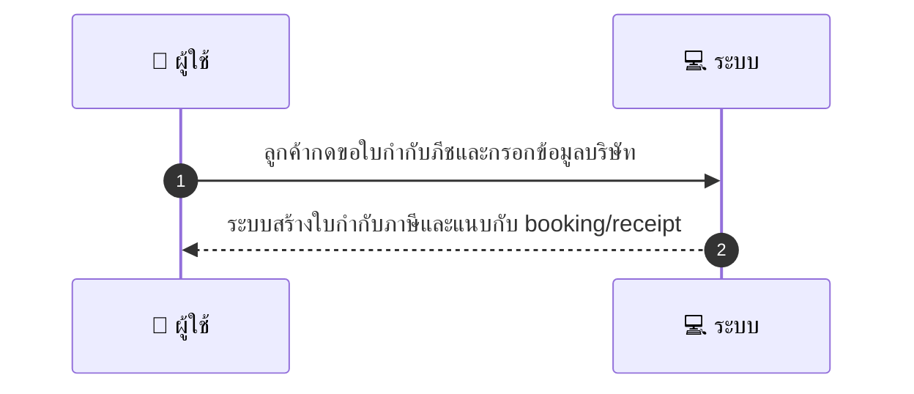
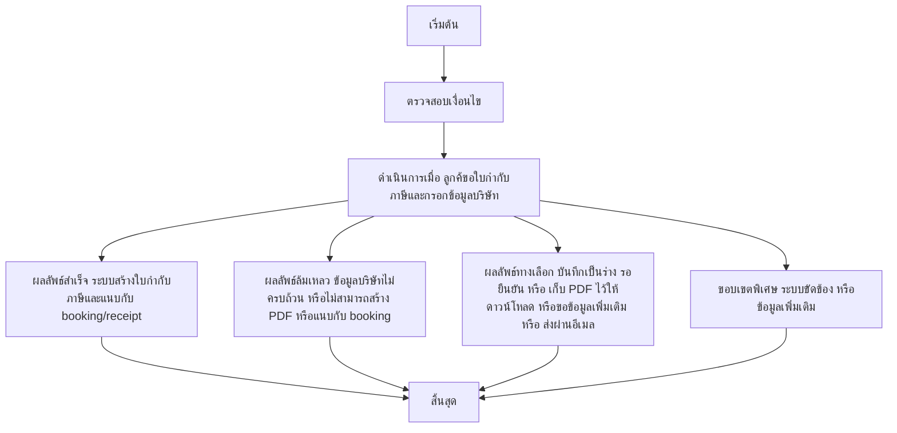

# CUS015 - ขอใบกำกับภาษี Invoice Request

## 👤 บทบาท
- ลูกค้า

## 🎯 เป้าหมายของเคส
- ในฐานะ: ลูกค้า
- ต้องการ: ขอใบกำกับภาษีสำหรับธุรกิจ
- เพื่อ: เพื่อใช้ทางบัญชี/ภาษี

## ⚙️ เงื่อนไขก่อนเริ่ม (Precondition)
- ลูกค้าต้องการเอกสารภาษีสำหรับธุรกิจ

## 🧭 ผลลัพธ์และสถานการณ์
- ✅ ผลลัพธ์ที่คาดหวัง (Success Flow): ระบบสร้างใบกำกับภาษีและแนบกับ booking/receipt
- ❌ ผลลัพธ์ที่ Failure:
  - ข้อมูลบริษัทไม่ครบถ้วน เช่น VAT/Tax ID, ชื่อบริษัท หรือที่อยู่บริษัท
  - ระบบไม่สามารถสร้าง PDF ใบกำกับภาษีได้ชั่วคราว และหยุดกระบวนการออกใบกำกับ
  - เกิดข้อผิดพลาดในการแนบใบกำกับภาษีกับ booking/receipt หลังจากสร้าง PDF
  - สถานะบัญชีหรือสิทธิ์ของลูกค้าไม่อนุมัติให้ออกใบกำกับภาษี
  - ข้อมูลภาษีที่กรอกไม่ตรงกับข้อมูลในระบบและไม่สามารถตรวจสอบได้
- 🔄 ผลลัพธ์ทางเลือก:
  - บันทึกใบกำกับภาษีเป็นร่างและให้ผู้ใช้งยืนยันข้อมูลก่อนออกจริง
  - ใบกำกับภาษีที่สร้างแล้วถูกเก็บไว้ในระบบและไม่แนบกับ booking/receipt ผู้ใช้สามารถดาวน์โหลด PDF ได้ด้วยตนเอง
  - ระบบร้องขอข้อมูลเพิ่มเติม (เช่น VAT ID หรือข้อมูลบริษัท) ก่อนออกใบกำกับภาษี
  - ผู้ใช้เลือกส่งใบกำกับภาษีผ่านอีเมลไปยังที่อยู่ที่ลงทะเบียนแทนการดาวน์โหลด
- ⚠️ ผลลัพธ์ขอบเขตพิเศษ:
  - บันทึกใบกำกับภาษีเป็นร่างและให้ผู้ใช้งยืนยันข้อมูลก่อนออกจริง
  - ใบกำกับภาษีที่สร้างแล้วถูกเก็บไว้ในระบบและไม่แนบกับ booking/receipt ผู้ใช้สามารถดาวน์โหลด PDF ได้ด้วยตนเอง
  - ระบบร้องขอข้อมูลเพิ่มเติม (เช่น VAT ID หรือข้อมูลบริษัท) ก่อนออกใบกำกับภาษี
  - ผู้ใช้เลือกส่งใบกำกับภาษีผ่านอีเมลไปยังที่อยู่ที่ลงทะเบียนแทนการดาวน์โหลด

## ✅ เกณฑ์การยอมรับ (Acceptance Criteria)
- ฟิลด์ต้องครบ
- เก็บข้อมูล VAT/Tax ID
- PDF พร้อมดาวน์โหลด

## ⏱ ลำดับความสำคัญ / SLA
- Priority: P1
- SLA: generate 30s

---

## 🔁 Sequence Diagram  
> แสดงลำดับเหตุการณ์ระหว่าง "ผู้ใช้" กับ "ระบบ"

---

## 🧭 Flowchart Diagram
> แสดงขั้นตอนการทำงานของระบบอย่างเข้าใจง่าย

