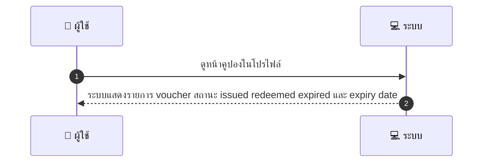

# CUS017 - ดูคูปอง/วอยเชอร์ในบัญชี

## 👤 บทบาท
- ลูกค้า

## 🎯 เป้าหมายของเคส
- ในฐานะ: ลูกค้า
- ต้องการ: ดูรายการ voucher ที่เป็นของตน
- เพื่อ: ดูสถานะและวันที่หมดอายุ

## ⚙️ เงื่อนไขก่อนเริ่ม (Precondition)
- ลูกค้าล็อกอินและมี voucher/credits

## 🧭 ผลลัพธ์และสถานการณ์
- ✅ ผลลัพธ์ที่คาดหวัง (Success Flow): ระบบแสดงรายการ voucher สถานะ issued redeemed expired และ expiry date
- ❌ ผลลัพธ์ที่ Failure:  
  - HTTP 500 Internal Server Error ขณะดึงข้อมูลคูปอง
  - การตรวจสอบสิทธิ์ล้มเหลว session หมดอายุ/token ไม่ถูกต้อง
  - Timeout ระหว่างเรียก API คูปอง response เกิน SLA
- 🔄 ผลลัพธ์ทางเลือก:  
  - ไม่พบคูปองตามเงื่อนไขที่เลือก
  - บัญชีนี้ไม่มีคูปอง/เครดิตในขณะนั้น
  - กรองสถานะที่เลือกไม่พบรายการคูปอง
- ⚠️ ผลลัพธ์ขอบเขตพิเศษ:  
  - ไม่พบคูปองตามเงื่อนไขที่เลือก
  - บัญชีนี้ไม่มีคูปอง/เครดิตในขณะนั้น
  - กรองสถานะที่เลือกไม่พบรายการคูปอง

## ✅ เกณฑ์การยอมรับ (Acceptance Criteria)
- สามารถกรองตามสถานะและแสดงรายละเอียดเงื่อนไข

## ⏱ ลำดับความสำคัญ / SLA
- Priority: P1
- SLA: 2s

---

## 🔁 Sequence Diagram  
> แสดงลำดับเหตุการณ์ระหว่าง "ผู้ใช้" กับ "ระบบ"



---

## 🧭 Flowchart Diagram
> แสดงขั้นตอนการทำงานของระบบอย่างเข้าใจง่าย

```mermaid
flowchart TD
  A[เริ่มต้น] --> B[ตรวจสอบ: [ลูกค้าล็อกอินและมี voucher/credits]]
  B --> C[ดำเนินการ: [ดูหน้าคูปองในโปรไฟล์]]
  C --> D[ผลลัพธ์สำเร็จ: [ระบบแสดงรายการ voucher สถานะ issued redeemed expired และ expiry date]]
  C --> E[ผลลัพธ์ล้มเหลว: [HTTP 500 ขณะดึงข้อมูลคูปอง session หมดอายุ/ token ไม่ถูกต้อง timeout ระหว่างเรียก API คูปอง]]
  C --> F[ผลลัพธ์ทางเลือก: [ไม่พบคูปองตามเงื่อนไขที่เลือก บัญชีนี้ไม่มีคูปอง/เครดิตในขณะนั้น กรองสถานะที่เลือกไม่พบรายการคูปอง]]
  C --> G[ขอบเขตพิเศษ: [ไม่พบคูปองตามเงื่อนไขที่เลือก บัญชีนี้ไม่มีคูปอง/เครดิตในขณะนั้น กรองสถานะที่เลือกไม่พบรายการคูปอง]]
  D --> H[สิ้นสุด]
  E --> H
  F --> H
  G --> H
```

