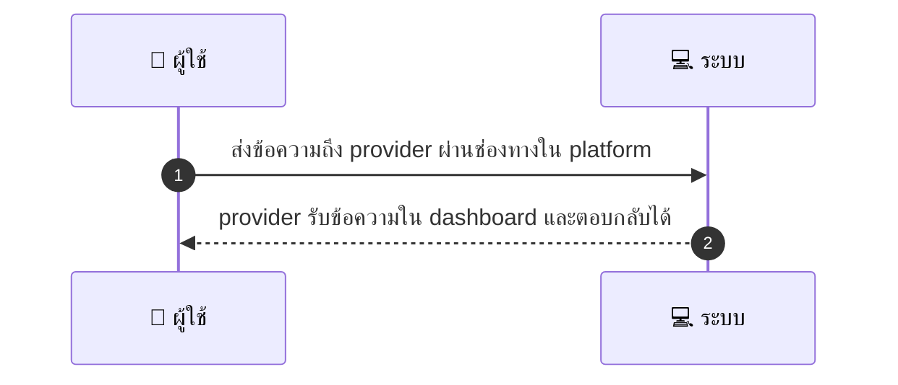
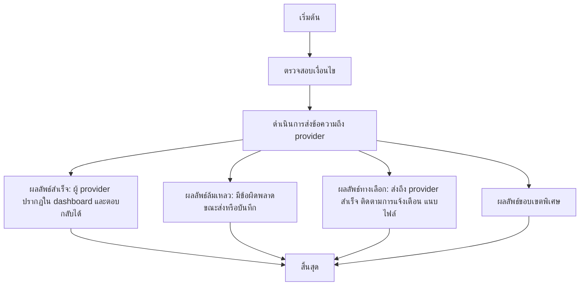

# CUS020 - ส่งข้อความถึง provider ก่อน/หลังการจอง Message Provider

## 👤 บทบาท
- ลูกค้า

## 🎯 เป้าหมายของเคส
- ในฐานะ
- ต้องการ
- เพื่อ

## ⚙️ เงื่อนไขก่อนเริ่ม (Precondition)
- ลูกค้ามีคำถามเกี่ยวกับบริการหรือรายละเอียดการนัดหมาย

## 🧭 ผลลัพธ์และสถานการณ์
- ✅ ผลลัพธ์ที่คาดหวัง (Success Flow): Provider รับข้อความใน dashboard/notification และตอบกลับได้
- ❌ ผลลัพธ์ที่ Failure:
  - ไม่สามารถส่งข้อความถึง provider เนื่องจากข้อผิดพลาดเครือข่ายหรือระบบส่งข้อความล้มเหลว
  - ข้อความไม่ถูกบันทึกลงประวัติการสนทนา ทำให้ไม่มีหลักฐานการสื่อสารในระบบ
  - มีข้อผิดพลาดขณะบันทึก/ส่งข้อความ ทำให้ผู้ใช้ไม่ได้รับการแจ้งเตือนหรือไม่ได้รับคำตอบจาก provider
- 🔄 ผลลัพธ์ทางเลือก:
  - ข้อความส่งถึง provider สำเร็จ ผู้ provider ปรากฏใน dashboard/notifications พร้อมสามารถตอบกลับได้
  - ผู้ใช้งานได้รับการแจ้งเตือนตามการตั้งค่า (push และ/หรืออีเมล) เมื่อมีการตอบกลับหรือข้อความใหม่
  - สามารถแนบไฟล์หรือเอกสารกับข้อความได้ (โดยระบบตรวจสอบชนิด/ขนาดไฟล์)
  - หาก provider ไม่ตอบภายใน SLA พยายามส่งเตือนซ้ำหรือเปิดช่องทางติดต่อเพิ่มเติม
- ⚠️ ผลลัพธ์ขอบเขตพิเศษ:
  - ข้อความส่งถึง provider สำเร็จ ผู้ provider ปรากฏใน dashboard/notifications พร้อมสามารถตอบกลับได้
  - ผู้ใช้งานได้รับการแจ้งเตือนตามการตั้งค่า (push และ/หรืออีเมล) เมื่อมีการตอบกลับหรือข้อความใหม่
  - สามารถแนบไฟล์หรือเอกสารกับข้อความได้ (โดยระบบตรวจสอบชนิด/ขนาดไฟล์)
  - หาก provider ไม่ตอบภายใน SLA พยายามส่งเตือนซ้ำหรือเปิดช่องทางติดต่อเพิ่มเติม

## ✅ เกณฑ์การยอมรับ (Acceptance Criteria)
- Message history เก็บ
- push/email alert ตาม preference
- rate limiting/safety checks

## ⏱ ลำดับความสำคัญ / SLA
- Priority: P1
- SLA: provider initial response =24h

---

## 🔁 Sequence Diagram  
> แสดงลำดับเหตุการณ์ระหว่าง "ผู้ใช้" กับ "ระบบ"

---

## 🧭 Flowchart Diagram
> แสดงขั้นตอนการทำงานของระบบอย่างเข้าใจง่าย

