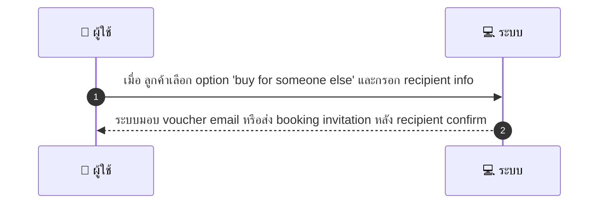
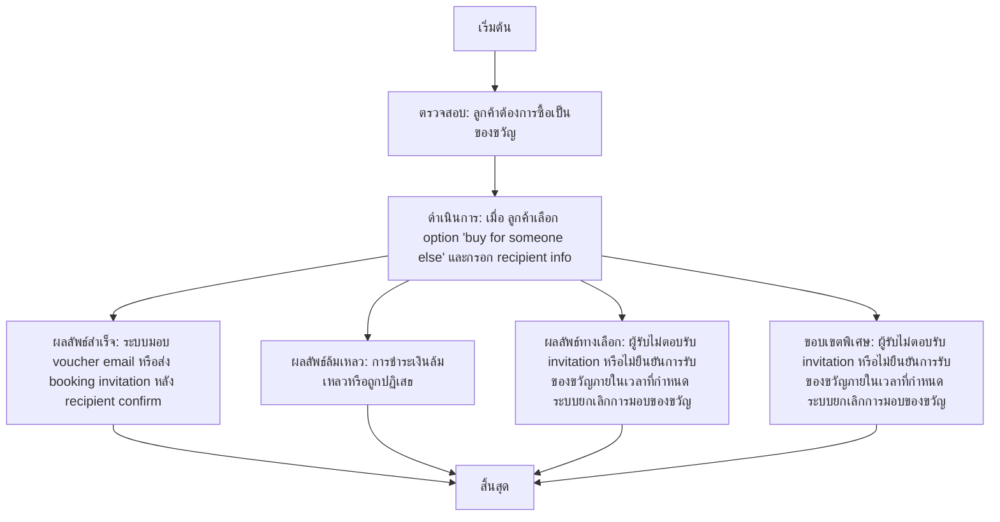

# CUS024 - จองเป็นของขวัญ Gift Booking Buy for Someone Else

## 👤 บทบาท
- ลูกค้า

## 🎯 เป้าหมายของเคส
- ในฐานะ ลูกค้า
- ต้องการ ซื้อ voucher/booking ให้คนอื่น
- เพื่อมอบของขวัญหรือใช้แทนผู้รับบริการ

## ⚙️ เงื่อนไขก่อนเริ่ม (Precondition)
- ลูกค้าต้องการซื้อเป็นของขวัญ และเมื่อ ลูกค้าเลือก option 'buy for someone else' และกรอก recipient info

## 🧭 ผลลัพธ์และสถานการณ์
- ✅ ผลลัพธ์ที่คาดหวัง (Success Flow): ระบบมอบ voucher email หรือส่ง booking invitation หลัง recipient confirm
- ❌ ผลลัพธ์ที่ Failure:
  - การชำระเงินล้มเหลวหรือถูกปฏิเสธ
  - ข้อมูล recipient ไม่ครบถ้วนหรือไม่ถูกต้อง
  - การตรวจสอบความปลอดภัยล้มเหลว ตรวจจับข้อมูลผิดปกติ/เฟิร์มเลย์
  - ไม่สามารถออก voucher ได้เพราะข้อจำกัดทางภูมิภาค/นโยบาย
- 🔄 ผลลัพธ์ทางเลือก:
  - ผู้รับไม่ตอบรับ invitation หรือไม่ยืนยันการรับของขวัญภายในเวลาที่กำหนด ระบบยกเลิกการมอบของขวัญ
  - ผู้ส่งแก้ไข recipient info ก่อนการส่ง invitation และระบบออก invitation ใหม่
  - ระบบให้เลือกส่งของขวัญเป็น voucher code แทนการส่ง invitation
  - ระบบจัดส่ง invitation ผ่านช่องทางอื่น SMS/Push หากอีเมลไม่สามารถใช้งานได้
- ⚠️ ผลลัพธ์ขอบเขตพิเศษ:
  - ผู้รับไม่ตอบรับ invitation หรือไม่ยืนยันการรับของขวัญภายในเวลาที่กำหนด ระบบยกเลิกการมอบของขวัญ
  - ผู้ส่งแก้ไข recipient info ก่อนการส่ง invitation และระบบออก invitation ใหม่
  - ระบบให้เลือกส่งของขวัญเป็น voucher code แทนการส่ง invitation
  - ระบบจัดส่ง invitation ผ่านช่องทางอื่น SMS/Push หากอีเมลไม่สามารถใช้งานได้

## ✅ เกณฑ์การยอมรับ (Acceptance Criteria)
- Support guest details, optional scheduled time, transfer of voucher on redemption
- security checks

## ⏱ ลำดับความสำคัญ / SLA
- Priority: P1
- SLA: voucher issuance immediate on payment webhook

---

## 🔁 Sequence Diagram  
> แสดงลำดับเหตุการณ์ระหว่าง "ผู้ใช้" กับ "ระบบ"

---

## 🧭 Flowchart Diagram
> แสดงขั้นตอนการทำงานของระบบอย่างเข้าใจง่าย

