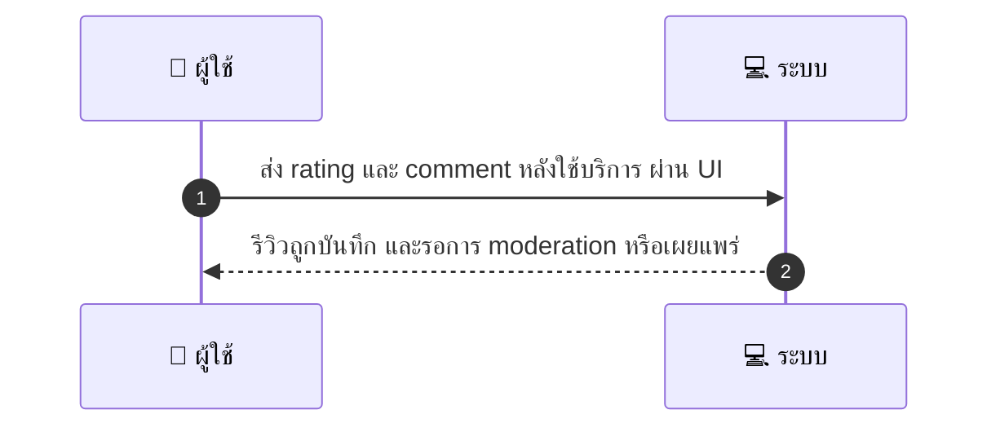

# CUS032 - ให้คะแนน/รีวิว provider หลังใช้บริการ Submit Review

## 👤 บทบาท
- ลูกค้า

## 🎯 เป้าหมายของเคส
- ในฐานะ
- ต้องการ
- เพื่อ

## ⚙️ เงื่อนไขก่อนเริ่ม (Precondition)
- Booking ปิดและไม่อยู่ในสถานะ dispute

## 🧭 ผลลัพธ์และสถานการณ์
- ✅ ผลลัพธ์ที่คาดหวัง (Success Flow): ระบบบันทึกรีวิวและแสดงผล หลัง moderation ถ้ามี
- ❌ ผลลัพธ์ที่ Failure:  
  - ผู้ใช้งานไม่ได้รับการยืนยันตัวตน ไม่ใช่ verified customer จึงไม่สามารถส่งรีวิวได้
  - Booking ยังไม่ปิดหรืออยู่ในสถานะ dispute ทำให้ไม่สามารถรีวิว
  - ระยะเวลารีวิวเกิน 30 วันที่อนุญาต
  - ข้อมูลคะแนนหรือข้อความรีวิวไม่ครบถ้วน ไม่ถูกต้อง คะแนนอยู่ในช่วง 1 ถึง 5 หรือข้อความว่าง
  - ระบบบันทึกรีวิวล้มเหลวทางเทคนิค DB write timeout
- 🔄 ผลลัพธ์ทางเลือก:  
  - ผู้ใช้งานส่งรีวิวสำเร็จ แต่รีวิวถูกส่งไปขั้น moderation ก่อนเผยแพร่
  - ผู้ใช้งานรีวิวสำเร็จ แต่ถูก moderation ปรับแต่งข้อความหรือเพิ่มคำเตือนก่อนเผยแพร่
  - รีวิวสำเร็จและเผยแพร่ทันทีหากไม่มี moderation หรือ moderation ผ่านทันที
  - ผู้ใช้งานแก้ไขรีวิวที่ส่งไปแล้วก่อนการอนุมัติ Edit submission หรือยกเลิกการนำเสนอรีวิว
  - ระบบแจ้งเตือนผู้ใช้เมื่อรีวิวถูก moderation flagging และรอการอนุมัติ
- ⚠️ ผลลัพธ์ขอบเขตพิเศษ:  
  - รีวิวสำเร็จและถูกส่งไป moderation ก่อนเผยแพร่ (รอการอนุมัติ)
  - Moderation ปรับข้อความหรือเพิ่มคำเตือนก่อนเผยแพร่
  - รีวิวเผยแพร่ทันทีหากไม่มี moderation หรือ moderation ผ่านทันที
  - แก้ไขรีวิวที่ส่งไปแล้วก่อนการอนุมัติ หรือยกเลิกการนำเสนอรีวิว
  - ระบบแจ้งเตือนเมื่อรีวิวถูก moderation flagging และรอการอนุมัติ

## ✅ เกณฑ์การยอมรับ (Acceptance Criteria)
- เฉพาะลูกค้าที่ยืนยันตัวตนเท่านั้นถึงสามารถรีวิว
- รีวิวภายใน 30 วัน
- มีฟีเจอร์ moderation flagging

## ⏱ ลำดับความสำคัญ / SLA
- Priority: P1
- SLA: review visible within moderation SLA 24h

---

## 🔁 Sequence Diagram  
> แสดงลำดับเหตุการณ์ระหว่าง ผู้ใช้ กับ ระบบ



---

## 🧭 Flowchart Diagram
> แสดงขั้นตอนการทำงานของระบบอย่างเข้าใจง่าย

```mermaid
flowchart TD
  A เริ่มต้น --> B ตรวจสอบเงื่อนไขก่อนเริ่ม
  B --> C ตรวจสอบว่าผู้ใช้งานเป็น verified Booking ปิดและไม่อยู่ใน dispute
  C --> D ตรวจสอบข้อมูล rating และ comment อยู่ในช่วง 1 ถึง 5 และไม่ว่าง
  D --> E บันทึกรีวิวในฐานข้อมูล
  E --> F{ มี moderation หรือไม่ }
  F --> G[เผยแพร่ทันที ถ้าไม่มี moderation หรือ moderation ผ่าน]
  F --> H[ส่งไป moderation และรอการอนุมัติ]
  G --> I สิ้นสุด
  H --> I สิ้นสุด
```

