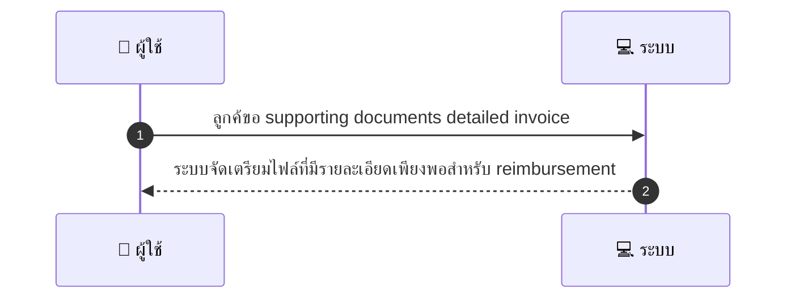
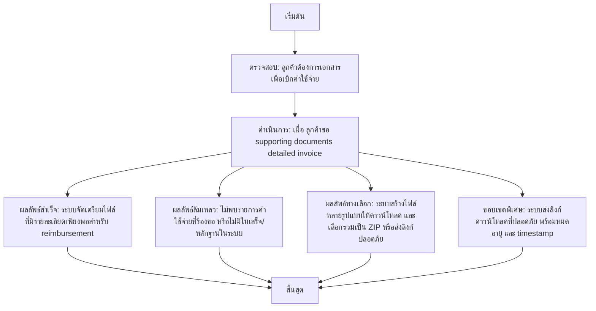

# CUS035 - ขอใบเสร็จ/หลักฐานสำหรับ reimbursement Expense Claim Support

## 👤 บทบาท
- ลูกค้า

## 🎯 เป้าหมายของเคส
- ในฐานะ ลูกค้า
- ต้องการ ขอ supporting documents สำหรับ reimbursement
- เพื่อ เพื่อใช้เบิกค่าใช้จ่าย

## ⚙️ เงื่อนไขก่อนเริ่ม (Precondition)
- ลูกค้าต้องการเอกสารเพื่อเบิกค่าใช้จ่าย

## 🧭 ผลลัพธ์และสถานการณ์
- ✅ ผลลัพธ์ที่คาดหวัง (Success Flow): ระบบจัดเตรียมไฟล์ที่มีรายละเอียดเพียงพอสำหรับ reimbursement
- ❌ ผลลัพธ์ที่ Failure:
  - ไม่พบรายการค่าใช้จ่ายที่ร้องขอ หรือไม่มีใบเสร็จ/หลักฐานในระบบ
  - ข้อมูลใบเสร็จไม่ครบถ้วน: ขาดรายละเอียดบริษัท วันที่ ค่าใช้จ่าย หรือเลขใบเสร็จ
  - เกิดข้อผิดพลาดในการเข้าถึงไฟล์เอกสารจากคลังเอกสาร หรือไฟล์เสียหาย
  - การสร้างไฟล์ล้มเหลวจากปัญหาทางระบบ (timeout ฐานข้อมูล ฯลฯ)
  - สิทธิ์เข้าถึงเอกสารถูกจำกัด เนื่องจากสถานะบัญชีหรือเงื่อนไขการอนุมัติ
- 🔄 ผลลัพธ์ทางเลือก:
  - ระบบสร้างไฟล์หลายรูปแบบให้เลือกดาวน์โหลด เช่น PDF หรือ CSV พร้อมให้เลือกรวมเป็น ZIP
  - เอกสารสามารถแนบโลโก้บริษัทและรายละเอียดบริษัทถ้าลูกค้าร้องขอ พร้อมข้อมูล timestamp
  - ถ้าข้อมูลรายละเอียดน้อย ระบบส่งสรุปค่าใช้จ่ายในรูปแบบ overview ก่อน แล้วรอการยืนยันเพิ่มเติม
  - ระบบส่งลิงก์ดาวน์โหลดที่ปลอดภัย พร้อมหมดอายุและแจ้ง timestamp
  - ลูกค้าสามารถเลือกดาวน์โหลดไฟล์ทีละใบเสร็จหรือรวบรวมทั้งหมดเป็นไฟล์ ZIP
- ⚠️ ผลลัพธ์ขอบเขตพิเศษ:
  - ระบบสร้างไฟล์หลายรูปแบบให้เลือกดาวน์โหลด เช่น PDF หรือ CSV พร้อมให้เลือกรวมเป็น ZIP
  - เอกสารสามารถแนบโลโก้บริษัทและรายละเอียดบริษัทถ้าลูกค้าร้องขอ พร้อมข้อมูล timestamp
  - ถ้าข้อมูลรายละเอียดน้อย ระบบส่งสรุปค่าใช้จ่ายในรูปแบบ overview ก่อน แล้วรอการยืนยันเพิ่มเติม
  - ระบบส่งลิงก์ดาวน์โหลดที่ปลอดภัย พร้อมหมดอายุและแจ้ง timestamp
  - ลูกค้าสามารถเลือกดาวน์โหลดไฟล์ทีละใบเสร็จหรือรวบรวมทั้งหมดเป็นไฟล์ ZIP

## ✅ เกณฑ์การยอมรับ (Acceptance Criteria)
- Include company details if requested
- downloadable
- timestamped

## ⏱ ลำดับความสำคัญ / SLA
- Priority: P1
- SLA: generate 30s

---

## 🔁 Sequence Diagram  
> แสดงลำดับเหตุการณ์ระหว่าง "ผู้ใช้" กับ "ระบบ"

---

## 🧭 Flowchart Diagram
> แสดงขั้นตอนการทำงานของระบบอย่างเข้าใจง่าย

