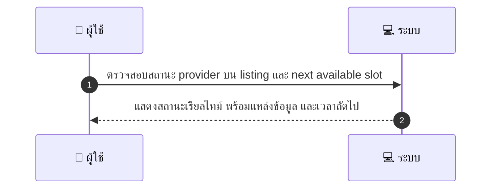
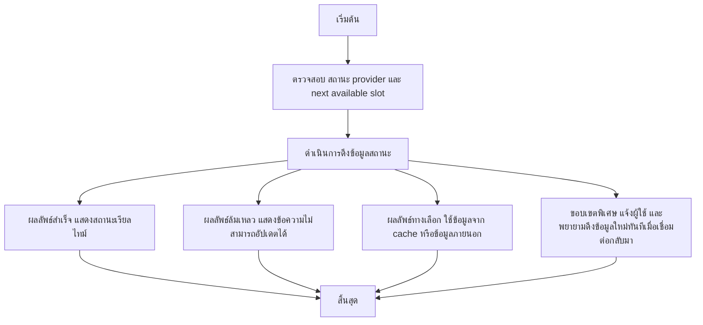

# CUS037 - ดูสถานะ provider online/offline และเวลาที่ว่างล่าสุด Provider Availability Indicator

## 👤 บทบาท
- ลูกค้า

## 🎯 เป้าหมายของเคส
- ในฐานะ ลูกค้า
- ต้องการ ดูสถานะ availability แบบเรียลไทม์บน listing
- เพื่อ ตัดสินใจเลือกเวลาจอง

## ⚙️ เงื่อนไขก่อนเริ่ม (Precondition)
- ลูกค้าดู listing/provider card

## 🧭 ผลลัพธ์และสถานการณ์
- ✅ ผลลัพธ์ที่คาดหวัง (Success Flow): Status updated near real-time cached for performance show source in-app Google sync
- ❌ ผลลัพธ์ที่ Failure:
  - ระบบไม่สามารถดึงสถานะเรียลไทม์จาก provider ได้ server error ทำให้ไม่แสดงสถานะล่าสุด
  - การเชื่อมต่อเครือข่ายขาดหายระหว่างการดึงข้อมูล ทำให้สถานะไม่อัปเดต
  - แหล่งข้อมูลสถานะ in-app cache/ Google sync เสียหายหรือล่ม ส่งผลให้ข้อมูลสถานะผิดพลาด
  - ไม่สามารถคำนวณ Next available slot ได้ หรือข้อมูลขัดแย้ง ทำให้ไม่แสดงเวลาที่ว่างถัดไป
- 🔄 ผลลัพธ์ทางเลือก:
  - แสดงสถานะล่าสุดที่อยู่ใน cache พร้อม timestamp และระบุแหล่งที่มาเป็น cache
  - แสดงสถานะจากข้อมูลใน listing ก่อนหน้า ไม่เรียลไทม์ และชี้แจงว่าเป็นข้อมูลเก่า
  - ใช้งานข้อมูลจากแหล่งข้อมูลภายนอกอื่นชั่วคราว fallback พร้อมระบุแหล่งที่มาชั่วคราว
  - แจ้งผู้ใช้ว่าไม่สามารถอัปเดตเรียลไทม์ได้ชั่วคราว แต่จะพยายามดึงข้อมูลใหม่ทันทีเมื่อเชื่อมต่อกลับมา
- ⚠️ ผลลัพธ์ขอบเขตพิเศษ:
  - แสดงสถานะล่าสุดที่อยู่ใน cache พร้อม timestamp และระบุแหล่งที่มาเป็น cache
  - แสดงสถานะจากข้อมูลใน listing ก่อนหน้า ไม่เรียลไทม์ และชี้แจงว่าเป็นข้อมูลเก่า
  - ใช้งานข้อมูลจากแหล่งข้อมูลภายนอกอื่นชั่วคราว fallback พร้อมระบุแหล่งที่มาชั่วคราว
  - แจ้งผู้ใช้ว่าไม่สามารถอัปเดตเรียลไทม์ได้ชั่วคราว แต่จะพยายามดึงข้อมูลใหม่ทันทีเมื่อเชื่อมต่อกลับมา

## ✅ เกณฑ์การยอมรับ (Acceptance Criteria)
- แสดงสถานะเรียลไทม์บน listing ใกล้เคียงจริง
- มีการ caching เพื่อประสิทธิภาพและแสดง timestamp พร้อมแหล่งที่มา
- แสดงแหล่งที่มาของสถานะ เช่น in-app cache หรือ Google sync
- แสดง next available slot อย่างถูกต้อง
- เมื่อไม่สามารถอัปเดตเรียลไทม์ได้ จะมี fallback ที่ชัดเจน

## ⏱ ลำดับความสำคัญ / SLA
- Priority: P1
- SLA: update within seconds

---

## 🔁 Sequence Diagram  
> แสดงลำดับเหตุการณ์ระหว่าง "ผู้ใช้" กับ "ระบบ"

---

## 🧭 Flowchart Diagram
> แสดงขั้นตอนการทำงานของระบบอย่างเข้าใจง่าย

