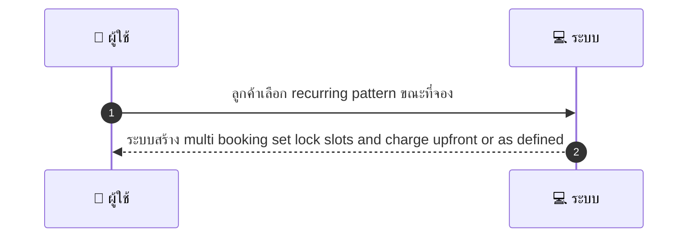
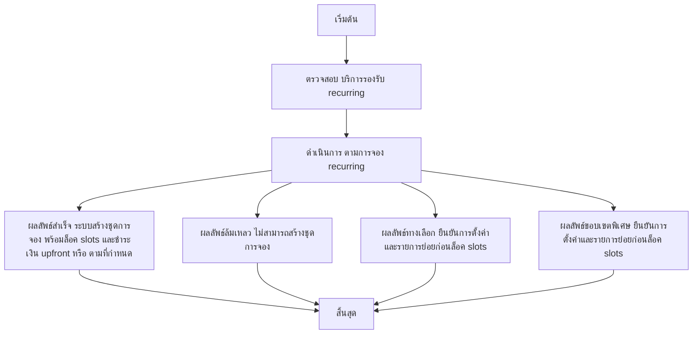

# CUS038 - จอง recurring / series appointments Recurring Booking

## 👤 บทบาท
- ลูกค้า

## 🎯 เป้าหมายของเคส
- ในฐานะ: ลูกค้า
- ต้องการ: จองบริการเป็นชุด/ซ้ำ weekly/biweekly
- เพื่อ: เพื่อความต่อเนื่องของบริการ

## ⚙️ เงื่อนไขก่อนเริ่ม (Precondition)
- บริการรองรับ recurring

## 🧭 ผลลัพธ์และสถานการณ์
- ✅ ผลลัพธ์ที่คาดหวัง (Success Flow): ระบบสร้าง multi booking set lock slots and charge upfront or as defined
- ❌ ผลลัพธ์ที่ Failure:
  - ไม่สามารถสร้าง multi booking set ได้เนื่องจาก slots ไม่ว่างในทุกวันที่ระบุของ recurring pattern
  - การเรียกชำระเงิน upfront หรือ escrow ล้มเหลว
  - บริการที่เลือกไม่รองรับ recurring
  - ข้อผิดพลาดระบบระหว่างการสร้างชุดการจอง ทำให้ไม่บันทึกชุดการจอง
  - การสร้างชุดการจองล้มเหลวตาม SLA 10s
- 🔄 ผลลัพธ์ทางเลือก:
  - ระบบสร้างชุดการจองสำเร็จ แต่ให้ผู้ใช้งานยืนยันการตั้งค่าและรายการย่อยก่อนล็อค slots
  - ระบบสร้างชุดการจองสำเร็จโดยใช้การชำระเงิน per-booking ตามนโยบายที่ผู้ใช้เลือก
  - ระบบสร้างชุดการจองสำเร็จ แต่อนุญาตให้ผู้ใช้งานแก้ไขวันที่/เวลาของรายการในชุดก่อนเริ่มต้น
  - ระบบสร้างชุดการจองสำเร็จ พร้อมแจ้งเตือนให้ผู้ใช้งอนุมัติการเปลี่ยนแปลงที่มีผลต่อห้องเวลาหรือค่าธรรมเนียม
  - ระบบสร้างชุดการจองสำเร็จ แต่รอการยืนยันจากผู้ให้บริการในกรณีที่มีค่าเวลาพื้นฐานไม่พร้อม
- ⚠️ ผลลัพธ์ขอบเขตพิเศษ:
  - ระบบสร้างชุดการจองสำเร็จ แต่ให้ผู้ใช้งานยืนยันการตั้งค่าและรายการย่อยก่อนล็อค slots
  - ระบบสร้างชุดการจองสำเร็จโดยใช้การชำระเงิน per-booking ตามนโยบายที่ผู้ใช้เลือก
  - ระบบสร้างชุดการจองสำเร็จ แต่อนุญาตให้ผู้ใช้งานแก้ไขวันที่/เวลาของรายการในชุดก่อนเริ่มต้น
  - ระบบสร้างชุดการจองสำเร็จ พร้อมแจ้งเตือนให้ผู้ใช้งอนุมัติการเปลี่ยนแปลงที่มีผลต่อห้องเวลาหรือค่าธรรมเนียม
  - ระบบสร้างชุดการจองสำเร็จ แต่รอการยืนยันจากผู้ให้บริการในกรณีที่มีค่าเวลาพื้นฐานไม่พร้อม

## ✅ เกณฑ์การยอมรับ (Acceptance Criteria)
- Support create edit cancel series
- escrow per booking or combined policy configurable

## ⏱ ลำดับความสำคัญ / SLA
- Priority: P1
- SLA: series creation 10s

---

## 🔁 Sequence Diagram  
> แสดงลำดับเหตุการณ์ระหว่าง "ผู้ใช้" กับ "ระบบ"

---

## 🧭 Flowchart Diagram
> แสดงขั้นตอนการทำงานของระบบอย่างเข้าใจง่าย

