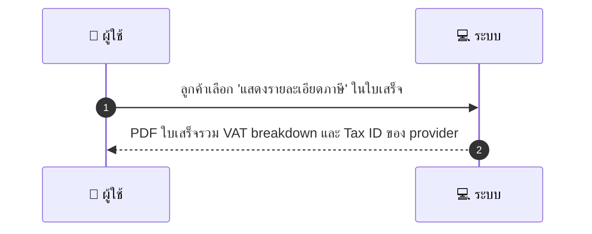
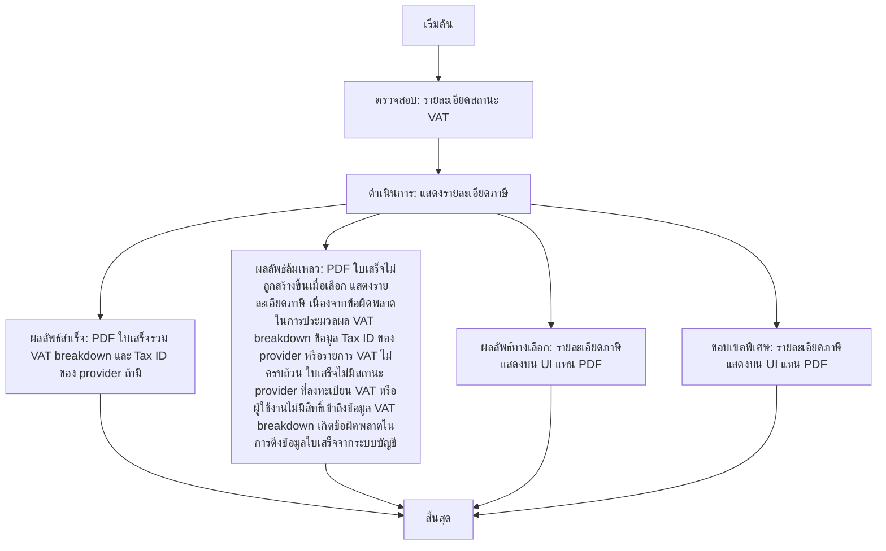

# CUS042 - ขอใบเสร็จแบบมี vat breakdown Tax Breakdown

คำอธิบายเคส ผู้ใช้งานลูกค้าต้องการขอใบเสร็จที่แยกรายการ VAT ตามรายการ พร้อม Tax ID ของ provider หากมี เพื่อใช้งานในการยื่นภาษีและการทำบัญชี ผู้ใช้งานสามารถเลือกแสดงรายละเอียดภาษีบนใบเสร็จ และระบบจะสร้าง PDF พร้อม VAT breakdown หรือจะแสดงรายละเอียดบนหน้า UI หรือส่งออกเป็นไฟล์ CSV/Excel ตามกรณี

## 👤 บทบาท
- ลูกค้า

## 🎯 เป้าหมายของเคส
- ในฐานะ ลูกค้า
- ต้องการ ขอใบเสร็จที่มีรายการ VAT แยกตามรายการ
- เพื่อ เพื่อนำส่งภาษีหรือนำไปใช้ทางบัญชี

## ⚙️ เงื่อนไขก่อนเริ่ม (Precondition)
- ลูกค้าต้องการรายละเอียด VAT

## 🧭 ผลลัพธ์และสถานการณ์
- ✅ ผลลัพธ์ที่คาดหวัง (Success Flow): PDF ใบเสร็จรวม VAT breakdown และ Tax ID ของ provider ถ้ามี  
- ❌ ผลลัพธ์ที่ Failure:  
  - PDF ใบเสร็จไม่ถูกสร้างขึ้นเมื่อเลือก แสดงรายละเอียดภาษี เนื่องจากข้อผิดพลาดในการประมวลผล VAT breakdown  
  - ข้อมูล Tax ID ของ provider หรือรายการ VAT ไม่ครบถ้วน ทำให้ไม่สามารถสร้าง VAT breakdown ได้  
  - ใบเสร็จไม่มีสถานะ provider ที่ลงทะเบียน VAT หรือผู้ใช้งานไม่มีสิทธิ์เข้าถึงข้อมูล VAT breakdown  
  - เกิดข้อผิดพลาดในการดึงข้อมูลใบเสร็จจากระบบบัญชี  
- 🔄 ผลลัพธ์ทางเลือก:  
  - รายละเอียดภาษีแสดงบนหน้า UI แทน PDF  
  - ระบบสามารถส่ง VAT breakdown เป็นไฟล์ CSV/Excel ไปยังผู้ใช้งานทางอีเมล  
  - ใบเสร็จยังใช้งานได้แต่แสดง VAT breakdown แบบสรุปบนหน้าเว็บก่อนดาวน์โหลด PDF  
  - ระบบเสนอทางเลือกให้ผู้ใช้งานดาวน์โหลด PDF ในภายหลังเมื่อข้อมูลครบถ้วน  
- ⚠️ ผลลัพธ์ขอบเขตพิเศษ:  
  - รายละเอียดภาษีแสดงบนหน้า UI แทน PDF  
  - ระบบสามารถส่ง VAT breakdown เป็นไฟล์ CSV/Excel ไปยังผู้ใช้งานทางอีเมล  
  - ใบเสร็จยังใช้งานได้แต่แสดง VAT breakdown แบบสรุปบนหน้าเว็บก่อนดาวน์โหลด PDF  
  - ระบบเสนอทางเลือกให้ผู้ใช้งานดาวน์โหลด PDF ในภายหลังเมื่อข้อมูลครบถ้วน

## ✅ เกณฑ์การยอมรับ (Acceptance Criteria)
- Only for providers registered for VAT
- store tax documents per PDPA and tax law

## ⏱ ลำดับความสำคัญ / SLA
- Priority: P1
- SLA: generate 30s

---

## 🔁 Sequence Diagram  
> แสดงลำดับเหตุการณ์ระหว่าง "ผู้ใช้" กับ "ระบบ"

---

## 🧭 Flowchart Diagram
> แสดงขั้นตอนการทำงานของระบบอย่างเข้าใจง่าย

