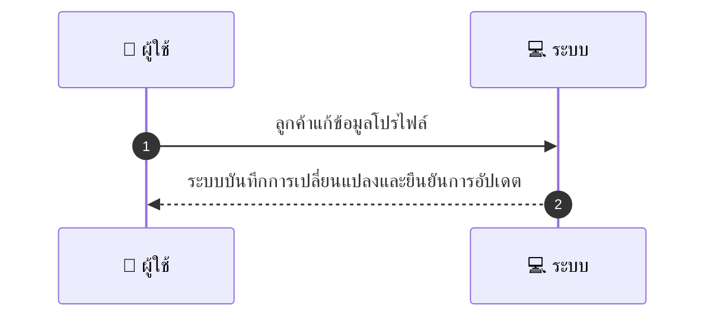
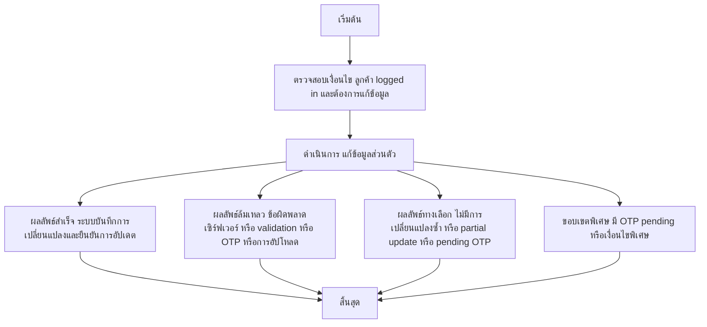

# CUS047 - เปลี่ยนข้อมูลโปรไฟล์ Update Profile

## 👤 บทบาท
- ลูกค้า

## 🎯 เป้าหมายของเคส
- ในฐานะ: ลูกค้า
- ต้องการ: แก้ไขข้อมูลส่วนตัว เช่น ชื่อ อีเมล เบอร์โทร ภาพโปรไฟล์
- เพื่อ: เพื่อให้ข้อมูลติดต่อเป็นปัจจุบัน

## ⚙️ เงื่อนไขก่อนเริ่ม (Precondition)
- ลูกค้า logged in และต้องการแก้ข้อมูล

## 🧭 ผลลัพธ์และสถานการณ์
- ✅ ผลลัพธ์ที่คาดหวัง (Success Flow): ระบบบันทึกการเปลี่ยนแปลงและยืนยันการอัปเดต
- ❌ ผลลัพธ์ที่ Failure:  
  - ไม่สามารถบันทึกการเปลี่ยนแปลงได้เนื่องจากข้อผิดพลาดของเซิร์ฟเวอร์
  - ข้อมูล Email/Phone ไม่ถูกต้องหรือรูปแบบไม่ผ่าน validation
  - การอัปโหลดรูปโปรไฟล์ล้มเหลว ขนาดไฟล์เกินข้อกำหนดหรือชนิดไฟล์ไม่รองรับ
  - OTP verification ล้มเหลวหรือหมดอายุหลังการเปลี่ยน Email/Phone
- 🔄 ผลลัพธ์ทางเลือก:  
  - ไม่มีการเปลี่ยนแปลงใดๆ เนื่องจากข้อมูลที่กรอกซ้ำข้อมูลเดิม
  - อัปเดตบางส่วนสำเร็จ เช่น เปลี่ยนชื่อโดยไม่เปลี่ยน Email/Phone
  - การบันทึกการเปลี่ยนแปลงไว้ชั่วคราวและรอการยืนยัน OTP pending verification
  - มีการเปลี่ยนแปลงที่ตรวจสอบแล้วแต่รอการยืนยันด้วย OTP
- ⚠️ ผลลัพธ์ขอบเขตพิเศษ:  
  - ไม่มีการเปลี่ยนแปลงใดๆ เนื่องจากข้อมูลที่กรอกซ้ำข้อมูลเดิม
  - อัปเดตบางส่วนสำเร็จ เช่น เปลี่ยนชื่อโดยไม่เปลี่ยน Email/Phone
  - การบันทึกการเปลี่ยนแปลงไว้ชั่วคราวและรอการยืนยัน OTP pending verification
  - มีการเปลี่ยนแปลงที่ตรวจสอบแล้วแต่รอการยืนยันด้วย OTP

## ✅ เกณฑ์การยอมรับ (Acceptance Criteria)
- Email/phone changes may trigger re-verification OTP
- profile photo upload limits

## ⏱ ลำดับความสำคัญ / SLA
- Priority: P1
- SLA: update immediate

---

## 🔁 Sequence Diagram  
> แสดงลำดับเหตุการณ์ระหว่าง "ผู้ใช้" กับ "ระบบ"

---

## 🧭 Flowchart Diagram
> แสดงขั้นตอนการทำงานของระบบอย่างเข้าใจง่าย

